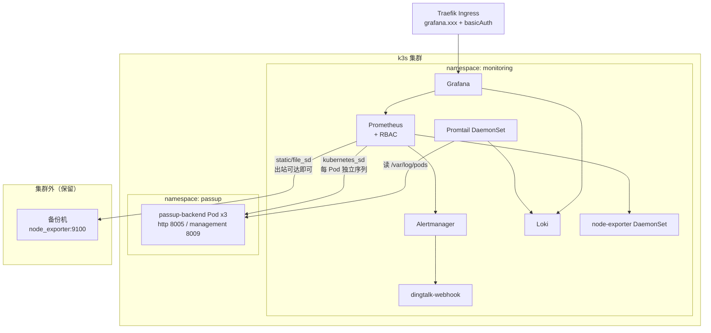

# 可观测性栈迁移至集群内（宿主机 Docker → k3s）

> **文档定位：方案 / 待实施。**
> 记录 PassUp 项目可观测性栈（Prometheus + Grafana + Alertmanager + Loki + Promtail + dingtalk-webhook）
> 从「宿主机 Docker 旁路部署」迁移为「k3s 集群内部署」，以及由此确定的**清单目录归属规则**。
> 「现状」以当前仓库代码为准，「目标」为设想，尚未落地。

## 一、背景：现状与问题

### 1.1 现状：旁路部署

监控栈当前位于 `pass-up.backend/deploy/monitoring/`，用 `docker-compose.monitoring.yml` 跑在**宿主机 Docker** 上，与被监控对象（k3s 集群）是**旁路关系**：

```text
备份机（k8s 之外）                    k3s 节点
  node_exporter:9100  ◀──────┐
                             │     ┌─ Pod(passup-backend) ─┐
                      ┌──────┴─────┤  management 8009       │
                      │ Prometheus │  http 8005             │
                      │ (宿主机)   └────────────────────────┘
                      └──────▲──────  宿主端口映射（仅命中 1 个 Pod）
                             │
        Loki ◀─ Promtail ────┘  读 /var/lib/docker/containers（Docker 运行时）
```

| 组件 | 运行位置 | 采集方式 |
| :--- | :--- | :--- |
| Prometheus / Grafana / Alertmanager / Loki / dingtalk-webhook | 宿主机 Docker | — |
| 备份盘指标 | 备份机 `node_exporter`（systemd，**k8s 之外**） | file_sd 指向 `IP:9100` |
| 后端指标 | 由 entrypoint 生成 `BACKEND_HOST_IP:8009` | 宿主端口映射 |
| 应用日志 | Promtail 读 `/var/lib/docker/containers` | Docker `json-file` 驱动 |

### 1.2 暴露出的三个问题

#### P1｜多副本与「单采集目标」直接冲突（核心）

`k8s/overlays/prod/kustomization.yaml` 把副本数提到 **3**：

```yaml
replicas:
  - name: passup-backend
    count: 3
```

而采集目标是**宿主机的固定端口**：

```yaml
# deploy/monitoring/prometheus/prometheus.yml
- job_name: "passup-backend"
  metrics_path: "/actuator/prometheus"
  file_sd_configs:
    - files: ["/prometheus/targets/passup-backend.json"]   # 内容为 "IP:8009"
```

宿主机端口映射只能命中**其中一个** Pod，且该 Pod 在滚动更新/重启后会漂移。后果：

1. `/actuator/prometheus` 的指标随 Pod 跳变，看板曲线断裂，JVM/HTTP 指标失去意义；
2. `BackendDown` 规则 `up{job="passup-backend"} == 0` **只反映被采到的那一个 Pod**——挂掉 1/3 副本不会告警，告警是否准确取决于「恰好采到了谁」。

> 结论：**多副本下的正确采集只能在集群网络内完成**，这是本次迁移最硬的技术理由，不是目录美观问题。

#### P2｜日志采集与 k8s 运行时错配

Promtail 现在依赖 Docker：

```yaml
# deploy/monitoring/promtail/promtail.yml
scrape_configs:
  - job_name: docker-containers
    docker_sd_configs:
      - host: unix:///var/run/docker.sock
    # ...
      - docker: {}      # 解开 Docker json-file 外壳
```

k3s 的容器运行时是 **containerd**，应用跑在集群里之后，`/var/lib/docker/containers` 下不会有任何 Pod 日志，
`docker_sd_configs` 也发现不到 Pod。日志链路会**整体断掉**。

#### P3｜编排形态错位

同一套栈出现两种运维心智：宿主机 `docker compose up -d` + 集群 `kubectl apply -k`，
升级、回滚、备份的操作方式不统一；且 `deploy/monitoring/` 里的资源限制、重启策略、健康检查都需自行维护，
而复用 k3s 的 Deployment/PVC/Ingress 能力可以直接获得。

### 1.3 触发条件已满足

- **副本数 > 1 已成立**（base 2 / prod 3），P1 从「潜在」变成「正在发生」；
- 集群已有 Traefik Ingress、`local-path` 存储类，具备托管这套栈的条件；
- 集群目前单节点、规模小，栈本身的资源占用可控（见 §5.5）。

## 二、决策：目录归属

### 2.1 归属原则

> **「谁来存、谁来看」跟着 infra 走；「采什么」跟着业务走。**

| 判据 | → `cluster-infra/monitoring/` | → `pass-up.backend/k8s/` |
| :--- | :--- | :--- |
| 与业务是否无关 | 无关（换应用照样用） | 强相关 |
| 生命周期 | 长（跨应用、跨版本） | 随应用发版 |
| 变更频率 | 低 | 高（加业务指标就改） |
| 是否多应用共用 | 是 | 否 |
| 示例 | Prometheus / Loki / Grafana 本体、RBAC、Ingress、PVC、node-exporter DaemonSet | Deployment 的采集注解、management 端口命名 |

### 2.2 为什么栈本体不放 `pass-up.backend/k8s`

- `k8s/` 是**纯 Kustomize 应用清单**，`kubectl apply -k` 一把装完；塞入 compose / Go 服务 / 集群级 RBAC 会破坏目录语义；
- 栈本身与 PassUp 业务无关，未来接入第二个应用时不应复制一份；
- 但业务侧仍**必须**保留「采集契约」（见 §4.2），这是两者的接口面。

### 2.3 为什么不能继续留在宿主机 Docker

P1、P2 是架构性的，靠调参无法解决：只要副本 > 1，宿主端口采集就必然错。

### 2.4 务实修正：告警规则与看板放哪

理想划分是「业务告警规则 / 看板放业务仓」，但在**无 Prometheus Operator**的前提下，
Prometheus 的 `rule_files` 和 Grafana 的 provisioning 都是**文件挂载**，跨仓库挂载无法表达
（除非引入 Kustomize remote base 或 CI 同步，对当前规模属过度设计）。

因此本次采用务实版本：

| 内容 | 落点 | 理由 |
| :--- | :--- | :--- |
| 监控栈全部清单（含 RBAC、Ingress、PVC） | `cluster-infra/monitoring/` | 集群级 |
| 全部告警规则（`storage.yml` 备份盘 + `backend.yml` 业务） | `cluster-infra/monitoring/` | 需与栈同仓才能挂载 |
| 全部 Grafana 看板 JSON | `cluster-infra/monitoring/` | 同上 |
| 业务采集契约（`prometheus.io/scrape` 注解、`management` 端口名） | `pass-up.backend/k8s/base/deployment.yaml` | **业务侧唯一需要改的清单** |
| 日志格式契约（ECS 结构化） | `pass-up.backend` 的 `application-prod.yml` | 应用自身职责 |

> 演进选项：当**第二个应用**接入监控、或引入 Prometheus Operator 后，再把
> `PrometheusRule` / `ServiceMonitor` / 业务看板拆回各业务仓，cluster-infra 只留栈本体。

## 三、目标架构



**唯一保留在集群外的采集目标**是备份机的 `node_exporter`（备份盘挂在备份机上，与 k8s 无关）。
这意味着 Prometheus 必须保留「外部 static target」能力，不能只依赖服务发现。

### 3.1 组件落位

| 组件 | 形态 | 副本 | 说明 |
| :--- | :--- | :--- | :--- |
| Prometheus | StatefulSet（或 Deployment + PVC） | 1 | 单节点无需 HA |
| Grafana | Deployment + PVC | 1 | |
| Alertmanager | Deployment | 1 | |
| dingtalk-webhook | Deployment（自建镜像） | 1 | 复用 `deploy/monitoring/dingtalk/` |
| Loki | StatefulSet + PVC | 1 | 单实例、本地文件系统 |
| Promtail | **DaemonSet** | 每节点 | 从 docker.sock 改为读 pod 日志 |
| node-exporter | **DaemonSet** | 每节点 | 新增，采集节点指标 |
| 备份机 node_exporter | 仍在宿主机（systemd） | — | 不动 |

## 四、目录规划

### 4.1 新增 `cluster-infra/monitoring/`

```text
cluster-infra/
└── monitoring/
    ├── README.md                       # 部署与排障说明（迁移 deploy/monitoring/README.md 主体）
    ├── namespace.yaml                  # namespace: monitoring
    ├── kustomization.yaml
    ├── prometheus/
    │   ├── statefulset.yaml            # + Service + PVC(local-path)
    │   ├── configmap.yaml              # prometheus.yml（kubernetes_sd + 外部 file_sd）
    │   ├── rules-configmap.yaml        # rules/*.yml（含 storage.yml 备份盘规则）
    │   ├── rbac.yaml                   # ClusterRole/ClusterRoleBinding + SA
    │   └── external-targets.yaml       # 集群外目标（ConfigMap，按环境改 IP）
    ├── alertmanager/
    │   ├── deployment.yaml
    │   ├── service.yaml
    │   └── configmap.yaml              # alertmanager.yml（webhook 指向 dingtalk-webhook）
    ├── dingtalk/
    │   ├── deployment.yaml
    │   ├── service.yaml
    │   ├── secret.yaml.example         # DINGTALK_TOKEN / SECRET
    │   └── src/                        # main.go（从 deploy/monitoring/dingtalk 迁入）
    ├── grafana/
    │   ├── deployment.yaml             # + Service + PVC
    │   ├── configmap-provisioning.yaml # datasources + dashboards provider
    │   ├── configmap-dashboards.yaml   # 看板 JSON（app-logs / backup-disk）
    │   └── secret.yaml.example         # GF_SECURITY_ADMIN_PASSWORD
    ├── loki/
    │   ├── statefulset.yaml + service.yaml + PVC
    │   └── configmap.yaml              # loki-config.yml
    ├── promtail/
    │   ├── daemonset.yaml              # 挂 /var/log/pods（见 §5.2）
    │   ├── configmap.yaml              # promtail.yml（kubernetes_sd + cri 阶段）
    │   └── rbac.yaml                   # pod list/watch
    ├── node-exporter/
    │   ├── daemonset.yaml              # hostNetwork + 挂 /proc、/sys、/ 只读
    │   └── service.yaml
    └── ingress.yaml                    # Traefik Ingress + basicAuth Middleware
```

### 4.2 `pass-up.backend/k8s/` 最小改动

只改 `base/deployment.yaml`，给 Pod 模板加采集注解：

```yaml
spec:
  template:
    metadata:
      labels:
        app: passup-backend
      annotations:
        # 声明本 Pod 需要被 Prometheus 抓取（配合 §5.1 的 keep 规则）
        prometheus.io/scrape: "true"
```

端口无需额外声明：Prometheus 通过 **容器端口名 `management`** 识别（`deployment.yaml` 已定义，`service.yaml` 也已暴露）。

另外在 `k8s/README.md` 补一节「监控接入」，说明：

- 指标端点：`/actuator/prometheus`（`management` 端口 8009，仅集群内可达，不暴露 Ingress）；
- 日志：prod 走 ECS JSON（`application-prod.yml` 的 `logging.structured.format.console: ecs`），Promtail 侧解析依赖该格式；
- 采集契约变更时需同步改 `cluster-infra/monitoring/prometheus/configmap.yaml`。

### 4.3 `deploy/monitoring/` 迁移后保留什么

| 文件 | 处置 |
| :--- | :--- |
| 备份机 `node_exporter` 安装说明（README 第一节、systemd 单元） | **保留**（集群外，与本次迁移无关） |
| `dingtalk/main.go` + `Dockerfile` | 保留为镜像构建源，镜像推仓库后由集群引用 |
| `backup/minio/backup.env` 等备份脚本相关 | **保留**（与监控无关） |
| `docker-compose.monitoring.yml`、`promtail.yml`、`prometheus/*`、`grafana/*`、`loki/*`、`alertmanager/*`、`.env.example` | 迁移完成后移到 `deploy/monitoring/legacy/` 或删除，README 标注「已迁至 cluster-infra/monitoring」 |

> 过渡期建议**双栈并行**运行（见 §6 阶段 4），确认新栈数据完整后再下线旧栈，旧栈配置先归档不要立即删。

## 五、关键设计点

### 5.1 服务发现：用 `kubernetes_sd_configs` 替代宿主端口（解决 P1）

无 Prometheus Operator 时，用原生服务发现 + 注解过滤，即可让**每个副本独立成为采集目标**：

```yaml
# cluster-infra/monitoring/prometheus/configmap.yaml
scrape_configs:
  # ---- 集群内：后端应用（自动发现全部副本）----
  - job_name: passup-backend
    metrics_path: /actuator/prometheus
    kubernetes_sd_configs:
      - role: pod
        namespaces:
          names: [passup]              # 只发现 passup 命名空间
    relabel_configs:
      # 1) 只保留声明了采集注解的 Pod
      - source_labels: [__meta_kubernetes_pod_annotation_prometheus_io_scrape]
        action: keep
        regex: "true"
      # 2) 只保留名为 management 的容器端口（业务端口 8005 不抓）
      - source_labels: [__meta_kubernetes_pod_container_port_name]
        action: keep
        regex: management
      # 3) instance 用 Pod 名，3 个副本各自一条 up 序列
      - source_labels: [__meta_kubernetes_pod_name]
        target_label: instance
      - source_labels: [__meta_kubernetes_namespace]
        target_label: namespace
      - source_labels: [__meta_kubernetes_pod_label_app]
        target_label: app

  # ---- 集群外：备份机 node_exporter ----
  - job_name: backup-node-exporter
    file_sd_configs:
      - files: ["/etc/prometheus/external/*.json"]
        refresh_interval: 30s

  # ---- 集群内：节点指标 ----
  - job_name: node-exporter
    kubernetes_sd_configs:
      - role: pod
        namespaces:
          names: [monitoring]
    relabel_configs:
      - source_labels: [__meta_kubernetes_pod_container_port_name]
        action: keep
        regex: metrics
```

配套的 RBAC（Prometheus 需要 list/watch Pod）：

```yaml
apiVersion: rbac.authorization.k8s.io/v1
kind: ClusterRole
metadata:
  name: prometheus
rules:
  - apiGroups: [""]
    resources: [pods, services, endpoints, nodes]
    verbs: [get, list, watch]
  - nonResourceURLs: ["/metrics"]
    verbs: [get]
```

**语义变化（告警规则需同步调整）**：

| 项 | 迁移前 | 迁移后 |
| :--- | :--- | :--- |
| `up{job="passup-backend"}` 序列数 | 1 | 等于副本数（prod 3） |
| `BackendDown`（`up == 0`）含义 | 服务不可达 | **某个副本**不可采集 |
| 整体不可用表达 | 同左 | `count(up{job="passup-backend"} == 1) == 0`（全部失联） |
| 副本不齐表达 | 无法表达 | `count(up{job="passup-backend"} == 1) < 3`（建议新增 warning） |

> 因此 `rules/backend.yml` 除了 `BackendDown`，建议新增「副本数不足」告警，才能覆盖单副本挂掉的情况。
> 单节点集群下副本同节点，节点故障会导致全部失联，`BackendDown` 依然有效。

### 5.2 日志采集：DaemonSet + `/var/log/pods` + `cri` 阶段（解决 P2）

k3s 是 **containerd** 运行时，Pod 日志由 kubelet 写入：

```text
/var/log/pods/<namespace>_<pod-name>_<pod-uid>/<container-name>/0.log
        └── 软链接 → /var/lib/rancher/k3s/agent/containerd/io.containerd.grpc.v1.cri/containers/*/*.log
```

**易错点**：`/var/log/pods` 下是符号链接，DaemonSet 必须**同时**挂载 `containerd` 目录与 `/var/log/pods`，
只挂前者会因软链接悬空而采集不到；这两个目录都是宿主机路径，用 `hostPath`。

```yaml
# cluster-infra/monitoring/promtail/daemonset.yaml（关键部分）
spec:
  template:
    spec:
      serviceAccountName: promtail
      tolerations:
        - operator: Exists          # 单节点下也要容忍 master 污点
      containers:
        - name: promtail
          image: grafana/promtail:3.6.10
          args: ["-config.file=/etc/promtail/promtail.yml"]
          volumeMounts:
            - { name: config, mountPath: /etc/promtail }
            - { name: pods, mountPath: /var/log/pods, readOnly: true }
            - { name: containerd, mountPath: /var/lib/rancher/k3s/agent/containerd, readOnly: true }
            - { name: positions, mountPath: /run/promtail }
      volumes:
        - name: config
          configMap: { name: promtail-config }
        - name: pods
          hostPath: { path: /var/log/pods }
        - name: containerd
          hostPath: { path: /var/lib/rancher/k3s/agent/containerd }
        - name: positions
          hostPath: { path: /run/promtail, type: DirectoryOrCreate }
```

采集配置从 `docker_sd_configs` 换成 `kubernetes_sd_configs`（role: pod），
**`docker: {}` 阶段必须换成 `cri: {}`**（否则 CRI 日志的时间戳/流标记解析不出来）：

```yaml
# cluster-infra/monitoring/promtail/configmap.yaml
server:
  http_listen_port: 9080
positions:
  filename: /run/promtail/positions.yaml

clients:
  # 集群内直连 Service，不再需要 LOKI_HOST_IP 参数化
  - url: http://loki.monitoring.svc.cluster.local:3100/loki/api/v1/push

scrape_configs:
  - job_name: kubernetes-pods
    kubernetes_sd_configs:
      - role: pod
    pipeline_stages:
      # 1) CRI 格式外壳（替代原 docker: {}）
      - cri: {}
      # 2) 解析 Spring Boot ECS 字段（与原配置一致）
      - json:
          expressions:
            level: log.level
            ts: '"@timestamp"'
            service_name: service.name
      # 3) 业务时间戳归一
      - timestamp:
          source: ts
          format: RFC3339Nano
      # 4) level 提为查询标签
      - labels:
          level:
    relabel_configs:
      - source_labels: [__meta_kubernetes_pod_node_name]
        target_label: node
      - source_labels: [__meta_kubernetes_namespace]
        target_label: namespace
      - source_labels: [__meta_kubernetes_pod_name]
        target_label: pod
      - source_labels: [__meta_kubernetes_pod_container_name]
        target_label: container
      - source_labels: [__meta_kubernetes_pod_label_app]
        target_label: app
      # 定位日志文件：/var/log/pods/<uid>_<ns>_<pod>/<container>/*.log
      - source_labels: [__meta_kubernetes_pod_uid, __meta_kubernetes_pod_container_name]
        separator: "/"
        target_label: __path__
        replacement: /var/log/pods/*$1/*.log
```

**LogQL 查询示例同步调整**（README 里的旧写法要改）：

```logql
{namespace="passup", app="passup-backend"} |= "ERROR"
{namespace="passup", app="passup-backend"} | level = "ERROR"
{namespace="passup"}                          # 该命名空间全部日志
```

> `container` 标签在集群里的值不再是 `backend-java`（compose 容器名），
> 而是 Pod 内的容器名 `backend`（`deployment.yaml` 中 `containers[].name`），查询时注意区分。
> `host` 标签由 `NODE_HOST` 环境变量提供，迁移后由 `node` 标签（节点名）替代。

#### 5.2.1 前置条件：prod profile 必须真正启用（否则日志方案跑不通）

**已核实的现状缺陷**：`k8s/base/configmap.yaml` 里激活的是

```yaml
SPRING_PROFILES_ACTIVE: "dev,local"     # 注意不是 prod
```

而 ECS 结构化日志只在 `application-prod.yml` 里开启：

```yaml
# application-prod.yml
logging:
  structured:
    format:
      console: ecs
```

`application-dev.yml` / `application-local.yml` **都没有** `structured` 配置，
且 `dev` 还额外配了 `logging.file.name: logs/app-dev.log`（往容器内文件写，Promtail 采不到）。

两个 overlay 也都没有纠正这一点：

| overlay | 是否覆盖 `SPRING_PROFILES_ACTIVE` |
| :--- | :--- |
| `k8s/overlays/prod/kustomization.yaml` | **否**（`patches` 整段是注释掉的，只覆盖 `images` 与 `replicas`） |
| `k8s/overlays/local/kustomization.example.yaml` | **否**（只 patch 了 DB / Redis / MinIO 地址） |

**后果**（迁移前后都成立）：

1. Pod 实际输出**纯文本日志**，不是 ECS JSON；
2. Promtail 的 `json` 解析阶段拿不到 `log.level` / `@timestamp` → `level` 标签为空；
3. `{...} | level = "ERROR"` 这类按级别过滤的查询**静默失效**（查不出结果且不报错），
   日志时间戳退化为采集时间。

> 也就是说：**当前宿主机栈的「按 level 过滤日志」很可能从一开始就没生效**。
> 迁移前先验证一次：`{container="backend-java"} | level = "ERROR"` 若能查出结果，说明该判断不成立。

**修复方式**（二选一，需与业务侧确认后落进清单）：

- **方案 A（推荐，最小改动）**：在 `overlays/prod` 与 `overlays/local` 各加一段 patch，显式置为 `prod`：

```yaml
patches:
  - target:
      kind: ConfigMap
      name: passup-backend-config
    patch: |-
      - op: replace
        path: /data/SPRING_PROFILES_ACTIVE
        value: prod
```

- **方案 B**：把 `base/configmap.yaml` 的默认值直接改为 `prod`
  （base 面向集群部署，`dev,local` 本就不该作为默认值）。

> **附带发现（同一根因）**：`dev` profile 里 `app.cookie.secure: false`。
> 若生产确实跑在 `dev,local` 上，**Cookie 不会带 `Secure` 属性**。
> 这是一个独立于可观测性的安全问题，建议一并核对。

### 5.3 集群外目标：备份机 node_exporter

备份机不在集群里，仍需 Prometheus 出站抓取。用 ConfigMap 提供 file_sd 目标，避免改主配置：

```yaml
# cluster-infra/monitoring/prometheus/external-targets.yaml
apiVersion: v1
kind: ConfigMap
metadata:
  name: prometheus-external-targets
  namespace: monitoring
data:
  backup-node-exporter.json: |
    [{"targets":["192.168.1.30:9100"],"labels":{"job":"backup-node-exporter"}}]
```

挂载到 `/etc/prometheus/external/`，IP 随环境在 overlay 里替换（延续现有 `overlays/local` 的
「base 占位 + overlay 覆盖」模式）。

**前提**：集群节点能出站访问备份机的 `9100`（分布式是 Prometheus 主动拉取，只要网络可达即可，无需反向放行）。

### 5.4 对外访问：Traefik Ingress + basicAuth

仅 Grafana 需要对外，Prometheus / Alertmanager / Loki **不暴露**（或仅 port-forward 排障）：

```yaml
apiVersion: networking.k8s.io/v1
kind: Ingress
metadata:
  name: grafana
  namespace: monitoring
  annotations:
    traefik.ingress.kubernetes.io/router.entrypoints: web
    traefik.ingress.kubernetes.io/router.middlewares: monitoring-grafana-auth@kubernetescrd
spec:
  ingressClassName: traefik
  rules:
    - host: grafana.your-domain.com
      http:
        paths:
          - path: /
            pathType: Prefix
            backend:
              service:
                name: grafana
                port: { number: 3000 }
```

配套 `traefik.io/v1alpha1` 的 `Middleware` + `Secret`（basicAuth），与现有
`passup-backend-headers` 中间件同一套 CRD 用法。

> 迁移后 Grafana 端口从「宿主 9092 → 容器 3000」变为「Ingress 80/443 → Service 3000」，
> 原 README 的 909x 端口约定作废，需同步更新文档。

### 5.5 存储、资源与内存需求（单节点约束）

单节点 k3s 上，监控栈与业务**共享同一台机器的资源**，必须设限，避免监控把业务挤死。

#### 5.5.1 监控栈资源声明

| 组件 | requests | limits | PVC | 稳态实际占用（估） |
| :--- | :--- | :--- | :--- | :--- |
| Prometheus（~5000 series / 15d） | 200m / 512Mi | 1 / 1Gi | 20Gi | 600~900Mi（compaction 峰值可达 1.2Gi） |
| Loki | 200m / 512Mi | 1 / 1Gi | 20Gi | 400~800Mi |
| Grafana | 100m / 128Mi | 500m / 512Mi | 2Gi | 150~250Mi |
| Alertmanager | 50m / 64Mi | 200m / 256Mi | —（告警无需留存） | 40~70Mi |
| Promtail（DaemonSet） | 50m / 128Mi | 200m / 256Mi | — | 80~150Mi |
| node-exporter（DaemonSet） | 50m / 64Mi | 200m / 128Mi | — | 20~40Mi |
| dingtalk-webhook（Go） | — | — | — | 10~20Mi |
| **合计** | **≈ 1.4 GiB** | **≈ 3.2 GiB** | ~42Gi | **≈ 1.3~2.2 GiB** |

**结论：给监控栈预留 2 GiB 即可。** 其中两项最不确定：

- **Loki**：取决于后端日志量。ECS JSON 每行比纯文本长，3 副本写入量是单容器时的数倍。
  必须配 `limits_config`（`ingestion_rate_mb` + `per_stream_rate_limit`），否则日志暴涨时会一路涨到 limit；
- **Prometheus**：内存与 series 数近似线性，3000~5000 series 对应 512Mi request 是合理起点。

#### 5.5.2 整机内存总账（真正的风险不在监控栈）

同一台服务器上（k3s 系统 + 后端 + 数据层 + 新增监控栈）：

| 项 | 内存估算 |
| :--- | :--- |
| k3s 系统组件（containerd、kubelet、CoreDNS、Traefik、metrics-server） | 0.8~1.2 GiB |
| `passup-backend` × 2（base）/ × 3（prod） | 2~4.5 GiB（视 JVM 实际堆） |
| PostgreSQL + Redis + MinIO | 1.0~1.9 GiB |
| **监控栈（本次新增）** | **1.3~2.2 GiB** |
| **合计** | **约 5~10 GiB** |

> 数据层无论部署在宿主机 Docker（`k8s/README.md` 的现状描述）还是集群内 Pod
> （`PassUp后端部署清单.md` 列出了 `postgres.yaml` / `redis.yaml` / `minio.yaml`，
> 但 `k8s/base/` 下实际不存在这三个文件——**需核对**），
> 都吃同一台机器的内存，总账不变。

**分档建议**：

| 服务器总内存 | 结论 |
| :--- | :--- |
| 4 GiB | **不可行**。加监控栈会挤压业务，必须先把后端 limit 收紧，且监控栈只能上最小配 |
| 8 GiB | **可行下限**。前提是收紧后端 limit（见 §5.5.3）并给监控栈设 ResourceQuota |
| 16 GiB | **推荐**。留出滚动更新（`maxSurge: 1` 会短暂多 1 个副本）与突发余量 |
| 32 GiB+ | 宽裕，可把 Prometheus 保留期从 15d 延长 |

#### 5.5.3 后端 `limits: 8Gi` 是更大的隐患

```yaml
# k8s/base/deployment.yaml
resources:
  requests: { memory: "1Gi" }
  limits:   { memory: "8Gi" }
```

```yaml
# k8s/base/configmap.yaml
JAVA_OPTS: -XX:MaxRAMPercentage=70.0 ...
```

`MaxRAMPercentage=70` + `limit 8Gi` → **JVM 最大堆 5.6 GiB/副本**，prod 3 副本理论峰值 **16.8 GiB**。

单节点上的三个问题：

1. 未配反亲和，3 个副本都落在**同一节点**，物理内存上限就是节点内存；
2. JVM 堆只涨不缩（G1 默认不主动归还），RSS 会在高峰后长期停在高位；
3. limits 之和远超物理内存时，**内核 OOM Killer 挑进程杀**——被杀的不一定是 JVM，
   可能是 PG、containerd 甚至 k3s 组件。

**建议**：`requests: 1Gi` 说明预期的稳态就在 1Gi 左右，那么 `limit` 收到 **2Gi**（堆上限 1.4Gi）足够；
若不便改 limit，就把 `MaxRAMPercentage` 降到 **50**。这一步的收益远大于省监控栈那 1Gi。

#### 5.5.4 落地要点

```yaml
# cluster-infra/monitoring/quota.yaml —— 防止监控栈无限膨胀
apiVersion: v1
kind: ResourceQuota
metadata:
  name: monitoring-quota
  namespace: monitoring
spec:
  hard:
    requests.memory: 3Gi
    limits.memory: 6Gi
    requests.cpu: "2"
    limits.cpu: "8"
```

- 存储类沿用 `local-path`，与业务同理：单节点无迁移需求，够用；
- Prometheus 保留期 `--storage.tsdb.retention.time=15d`，**不要用默认值**（默认无限，磁盘和内存都会涨）；
- 上线前先实测，比估算准：

```bash
free -h                               # 物理内存与可用量
kubectl top nodes                     # 节点实际分配/使用
kubectl top pods -A --sort-by=memory  # 各 Pod 实际 RSS（重点看 passup-backend）
```

> 若 `kubectl top pods` 显示后端每副本实际只用 300~500Mi，那 8Gi 的 limit 就是纯浪费，
> 收到 1.5~2Gi 后整机余量立刻宽松，监控栈可放心上。

**内存紧张时的降级路径**（与 §6 的阶段划分对应）：

| 阶段 | 组件 | 增量内存 |
| :--- | :--- | :--- |
| 1 | Prometheus + node-exporter + Grafana | ~800Mi~1.2Gi |
| 2 | + Alertmanager + dingtalk-webhook | ~60~90Mi |
| 3 | + Loki + Promtail（日志） | ~500~950Mi |

先上阶段 1~2（约 1Gi）就能解决 §1.2 的 P1（多副本采集）与告警链路，日志部分可等内存宽松后再上。

### 5.6 版本与配置管理

沿用现有「版本集中管理」的做法（README「约定」第 2 条），迁移后对应关系：

| 迁移前 | 迁移后 |
| :--- | :--- |
| `.env` 的 `PROMETHEUS_VERSION` 等 | `kustomization.yaml` 的 `images`（或 overlay `images`） |
| `.env` 的 `DINGTALK_TOKEN` | `Secret`（`secret.yaml.example` 模板 + gitignore） |
| `.env` 的 `BACKEND_HOST_IP` / `LOKI_HOST_IP` | **删除**（服务发现取代，不再需要） |
| `.env` 的 `NODE_EXPORTER_HOST_IP` | `prometheus-external-targets` ConfigMap |
| `.env` 的 `NODE_HOST` | **删除**（由 `node` 标签取代） |
| `prometheus/entrypoint.sh`（envsubst 生成 file_sd） | **删除**（k8s 服务发现取代该 workaround） |

镜像拉取：仓库若需认证，复用 `passup-registry-secret` 的模式，在 `monitoring` 命名空间建同样的 secret。

## 六、实施步骤

### 阶段 0：前置确认

```bash
kubectl get nodes -o wide                 # 节点数、IP、运行时
kubectl get storageclass                  # 确认 local-path
kubectl -n kube-system get deploy traefik # 确认 Ingress Controller
free -h                                   # 物理内存余量（监控栈需约 2Gi，见 §5.5）
kubectl top nodes && kubectl top pods -A --sort-by=memory   # 实际用量
kubectl -n passup get cm passup-backend-config -o jsonpath='{.data.SPRING_PROFILES_ACTIVE}'  # 确认 profile
```

同时确认：官方镜像（`prom/prometheus`、`grafana/grafana`、`grafana/loki`、`grafana/promtail`）
能否拉取——k3s 是 containerd，需配置 `registries.yaml` 或走加速（见 `介绍与安装.md` 第七节）。

### 阶段 1：栈本体（不含业务接入）

```bash
cd cluster-infra
kubectl apply -k monitoring/     # namespace + prometheus + grafana + loki + alertmanager
kubectl -n monitoring get pods,pvc,svc
```

验证：`port-forward` 打开 Grafana，确认 Prometheus / Loki 两个数据源已自动 provisioning。

### 阶段 2：接入业务指标（解决 P1）

1. 给 `pass-up.backend/k8s/base/deployment.yaml` 加 `prometheus.io/scrape: "true"` 注解，重新 `apply -k`；
2. 确认 Prometheus Targets 页面出现 **3 个** `passup-backend` 目标且均为 UP：

```bash
kubectl -n passup get pods -l app=passup-backend -o name | wc -l   # 应为 3
```

3. 调整 `rules/backend.yml`：`BackendDown` 之外新增副本不足告警。

### 阶段 3：日志链路切换（解决 P2）

**先决条件**：确认后端 profile 已是 `prod`（见 §5.2.1），否则 ECS 解析不生效，
这一阶段的所有验证都会因「日志是纯文本」而失败。

```bash
kubectl apply -k monitoring/promtail monitoring/loki monitoring/node-exporter
kubectl -n monitoring get ds promtail node-exporter    # DESIRED 应等于节点数
```

验证：

```bash
# Promtail 目标状态
kubectl -n monitoring port-forward ds/promtail 9080:9080
curl http://localhost:9080/targets
```

Grafana Explore 查询 `{namespace="passup"}`，确认能命中且时间戳与业务输出一致（验证 `cri` 阶段生效）。

### 阶段 4：告警链路与并行验证

1. 把 `backend.yml` / `storage.yml` 规则、看板 JSON 导入 ConfigMap；
2. 手动压低阈值触发一次告警，确认 `Alertmanager → dingtalk-webhook → 钉钉` 全链路通；
3. **双栈并行 1~2 周**：旧栈继续跑，对比指标、日志、告警是否一致，重点看「副本维度」数据是否补齐。

### 阶段 5：下线宿主机栈

```bash
cd pass-up.backend/deploy/monitoring
docker compose -f docker-compose.monitoring.yml down   # 保留 volumes 一段时间
```

保留：备份机 `node_exporter`（systemd，不动）、`dingtalk/` 源码、备份脚本。
其余配置归档到 `deploy/monitoring/legacy/`，README 顶部加迁移说明与指向 `cluster-infra/monitoring/README.md` 的链接。

## 七、风险与回滚

| 风险 | 影响 | 应对 |
| :--- | :--- | :--- |
| 镜像拉取失败（无外网/未配加速） | 阶段 1 卡住 | 先确认 `registries.yaml` 或改用可访问的镜像代理 |
| 日志采不到（`cri` / 软链接问题） | 日志断流 | 已并行运行旧栈，逐步切换；先验证 `/var/log/pods` 内容 |
| 监控栈抢占资源影响业务 | 业务抖动 | §5.5 的 limits + ResourceQuota，限制 Loki 写入与 Prometheus 保留期 |
| 备份机 `9100` 不可达 | 备份盘告警失效 | 阶段 0 先 `curl` 验证；不可达则保留旧栈的该 job 或加网络放行 |
| 告警规则语义变更导致漏报 | 故障未发现 | 阶段 2 同步改规则，阶段 4 手动触发验证 |
| `SPRING_PROFILES_ACTIVE` 不是 `prod` | ECS 日志不生效，Loki 按 level 过滤**静默失效** | 见 §5.2.1，阶段 3 前先修 profile 并验证 `level` 标签非空 |
| 后端 `limits: 8Gi` 远超节点内存 | 内核 OOM Killer 可能杀掉 PG / k3s 组件 | 见 §5.5.3，收紧 limit 或降 `MaxRAMPercentage` |
| 日志量突增打爆 Loki | 监控栈反噬业务 | §5.5.1 的 `limits_config` 限流 + §5.5.4 的 ResourceQuota |

**回滚成本低**：旧栈的阶段 5 之前一直在线，回滚只需把 `deployment.yaml` 的注解回退、
旧栈 `docker compose up -d`，数据面（Prometheus/Grafana volumes）未删除即可恢复。

## 八、待确认事项

1. 集群是否已装 Helm / 是否接受纯原生 Kustomize 清单（本方案选原生，与现有 `k8s/` 风格一致、资源占用更小）；
2. 备份机的实际 IP，以及集群节点到备份机 `9100` 的出站可达性；
3. Grafana 对外域名 + basicAuth 账号（是否只在内网开放）；
4. 是否保留宿主机 Grafana 作为长期备用（双栈并行时长）；
5. `cluster-infra` 是否先补 `monitoring/README.md` 与 `.gitignore`（secret 类文件不入库）；
6. 后端 Pod 实际激活的 profile——清单当前为 `dev,local`，需确认生产是否本就走 ECS 日志（见 §5.2.1），
   以及 `app.cookie.secure: false` 是否已在生产生效；
7. 服务器物理内存与实测余量（`free -h` / `kubectl top`），决定监控栈是全量上还是按 §5.5.4 分阶段上；
8. 后端 `limits: 8Gi` 是否可收紧（见 §5.5.3），以及数据层当前位置（宿主 Docker 还是集群内）。

## 九、参考

- [PassUp 后端 K8s 部署清单（Kustomize）](PassUp后端部署清单.md)
- [PassUp 前端 K8s 部署清单（Nginx + MinIO 静态资源）](PassUp前端部署清单.md)
- [Kustomize 介绍](../Kustomize介绍.md)
- [K3s 介绍与安装](介绍与安装.md)
- [可观测性概述](../../devops/observability/概述.md)
- [指标监控 - Prometheus](../../devops/observability/指标监控-prometheus.md)
- [日志方案 - Loki](../../devops/observability/日志方案-loki.md)
- [面板 - Grafana](../../devops/observability/面板-grafana.md)

### 涉及的仓库文件

| 仓库 / 路径 | 作用 |
| :--- | :--- |
| `pass-up.backend/deploy/monitoring/` | 迁移源（现状） |
| `pass-up.backend/k8s/base/deployment.yaml` | 业务侧唯一改动点（采集注解） |
| `pass-up.backend/src/main/resources/application-prod.yml` | 日志 ECS 契约 |
| `pass-up.backend/k8s/service.yaml` | 已暴露 `management` 8009（ServiceMonitor 替代方案的基础） |
| `pass-up.backend/k8s/base/configmap.yaml` | `SPRING_PROFILES_ACTIVE`（日志格式前置条件）、`JAVA_OPTS`（内存相关） |
| `pass-up.backend/k8s/overlays/{prod,local}/kustomization.yaml` | 需补 profile patch（见 §5.2.1） |
| `infra/cluster-infra/monitoring/` | 迁移目标（新增） |
