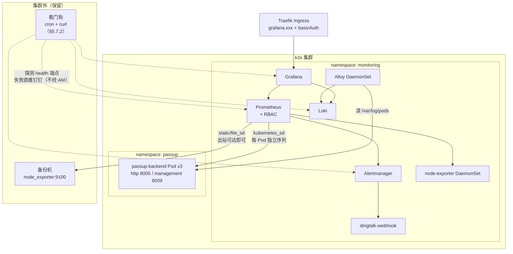

# 可观测性栈迁移至集群内（宿主机 Docker → k3s）

> **文档定位：架构定稿 / 集群内部分已落地（2026-09-23）。**
> 记录 PassUp 项目可观测性栈（Prometheus + Grafana + Alertmanager + Loki + Grafana Alloy + dingtalk-webhook）
> 从「宿主机 Docker 旁路部署」迁移为「k3s 集群内部署」，以及由此确定的**清单目录归属规则**。
> 「现状」以当前仓库代码为准；实施结果见文末 §十。
>
> **集群现状：3 台 server 节点（**实测 7.7 GiB/台**，非 16 GiB），其中 1 台带污点 → 常态只有 2 台承载业务 Pod。**
> 这个前提会改写若干结论，见 §1.4。
>
> **⚠️ 先看清这份文档的完成度。**
>
> **架构定稿 ≠ 配置定稿 ≠ 实施验证完成。** 三者不要混为一谈：
>
> | 层面 | 状态 | 含义 |
> | :--- | :--- | :--- |
> | 架构设计 | ✅ **定稿** | 迁移方向、组件落位、单副本取舍、监控栈放污点节点——不再变 |
> | 组件选型 | ✅ **定稿** | Alloy 替代 Promtail、原生 Prometheus + Kustomize、不引入 Operator |
> | 目录规划 | ✅ **定稿** | `cluster-infra/monitoring` 与业务仓的边界（§2、§4） |
> | 告警模型 | ✅ **定稿** | 三条告警的语义与拆分（§5.1） |
> | **具体 YAML** | ✅ **已落地** | `cluster-infra/monitoring/`，由 `deploy.sh` 从 `config.env` 渲染后 apply |
> | **资源参数** | ✅ **按实测收敛** | 真机 7.7 GiB/台、落点节点仅 24G 可用磁盘 → PVC 收到 8/6/1 Gi（§10.2） |
> | **日志链路** | ✅ **实测通过** | Alloy 容器内能读出 `0.log` 内容，Loki 已收到日志（§10.3） |
> | **HTTPS 条件** | ✅ **已解决（改了方案）** | 不再走 Traefik Ingress，改为 **Grafana 自持 kube-vip VIP + 自终止 TLS**：`https://172.16.0.181/`，自签两级证书，导入 CA 后浏览器无警告（§5.4.2） |
> | **故障演练** | 🔶 **部分完成** | 已真跑 4/5/6/7/9 + **2**（真实滚动发布）；1/3 现已具备条件待补，8 被看门狗阻塞（§10.7） |
> | **业务侧修正** | ✅ **主体完成** | `passup` 已于 2026-09-23 上集群（3 副本）：**多副本采集与 ECS 日志两条验收判据实测通过**；backend `limits` 只收到 2Gi 待负载复测，`topologySpreadConstraints` 未加（§10.9） |
>
> **换句话说**：架构与集群内实施都已定稿并落地；剩下的是**业务侧接入**与**看门狗部署**。
> 本文正文的 YAML 片段仍是**设计意图说明**，实际清单以 `cluster-infra/monitoring/` 为准
> ——两者在资源数字上已有偏差，以落地版为准（§10.2 列了全部偏差）。
>
> **v10 结论（演练与规则修正）**：演练跑出 2 个会**静默失效**的真问题并已修——
> ① `BackendAllDown` 与全部自监控规则在「服务整个消失」时**永远不响**（PromQL 聚合对空向量返回空）；
> ② 抑制规则原写法会**掩盖故障**（critical 压制同组件全部 warning）。
> 另修掉 5 个「配置改了不生效」类的坑（含 `subPath` 挂载永不同步、默认 `resolve_timeout` 误报「已恢复」）。
> 详见 §10.7 / §10.8。
>
> **v9 结论（实施结果）**：集群内监控栈已部署并 `verify` 全绿；落地时发现 4 处环境偏差
> 与 1 处设计修正，见 §十。**下一步是业务侧（阶段 1）+ 看门狗部署。**
>
> **修订 v8（措辞收口）**：把「方案定稿」改为「**架构定稿 / 实施待验证**」，
> 并新增上方**完成度对照表**，明确区分「已定稿」与「待验证」；
> §6 新增 **Alloy 容器内读 `0.log` 提升为第一优先级验证项**。
> **修订 v7（定稿）**：新增 §5.1.1 **扩缩容 checklist**（改 `replicas` 必须同步告警阈值，含阈值对照表）；
> §5.4.1 明确「**证书没就绪就用 `port-forward`，不要先上 HTTP**」；
> §1.5 原则一补「**Loki PVC ≠ 业务数据存储**」；§6 新增落地前 4 件事。
> **修订 v6（实施前收口）**：5 项补充——**新增 §5.5.7 磁盘保护闭环**（限制 + 监控 + 告警）；
> **§5.4.1 Grafana 上线硬条件改为 HTTPS + basicAuth**（basicAuth 不是加密）；
> 阶段 4 新增**日志链路逐层验证**（含 Alloy 容器内读 `0.log`）、
> **`level = "ERROR"` 日志验收判据**、**滚动发布误报演练**。
> **修订 v5（评审收口）**：4 项修正——`local-path` 从「优点」改为「当前规模可接受的单节点约束」；
> `8Gi → 2Gi` 改为「实测后收紧，2Gi 为首选起点」；**新增 §5.7 监控栈自监控 + 集群外看门狗**；
> 阶段 4 加入**真故障演练**。另：`BackendCapacityLow` → `BackendRedundancyLost`（Pod 数 ≠ 容量）。
> **修订 v4（按真实拓扑重算）**：确认 3 台 / 16 GiB / 1 台污点后，重写 §1.4、§5.5.2、§5.5.5、§5.5.6，
> 并修正 §5.1 告警语义（单节点故障会掉 1~2 个副本）。
> **修订 v3（拓扑修正）**：v2 及以前按单节点写，本版首次按 3 节点改写 §5.5。
> **修订 v2（评审后）**：Promtail → Grafana Alloy（**必改**，Promtail 已 EOL）、告警拆分、profile 职责边界、资源数字改口径。
> 各版改动详见文末[附录：修订记录](#附录修订记录)。

## 一、背景：现状与问题

### 1.1 现状：旁路部署

监控栈当前位于 `pass-up.backend/deploy/monitoring/`，用 `docker-compose.monitoring.yml` 跑在**宿主机 Docker** 上，与被监控对象（k3s 集群）是**旁路关系**：

```text
备份机（k8s 之外）                    k3s 节点
  node_exporter:9100  ◀──────┐
                             │     ┌─ Pod(passup-backend) ─┐
                      ┌──────┴─────┤  management 8009       │
                      │ Prometheus │  http 8005             │
                      │ (宿主机)   └────────────────────────┘
                      └──────▲──────  宿主端口映射（仅命中 1 个 Pod）
                             │
        Loki ◀─ Promtail ────┘  读 /var/lib/docker/containers（Docker 运行时）
```

| 组件 | 运行位置 | 采集方式 |
| :--- | :--- | :--- |
| Prometheus / Grafana / Alertmanager / Loki / dingtalk-webhook | 宿主机 Docker | — |
| 备份盘指标 | 备份机 `node_exporter`（systemd，**k8s 之外**） | file_sd 指向 `IP:9100` |
| 后端指标 | 由 entrypoint 生成 `BACKEND_HOST_IP:8009` | 宿主端口映射 |
| 应用日志 | Promtail 读 `/var/lib/docker/containers` | Docker `json-file` 驱动 |

### 1.2 暴露出的三个问题

#### P1｜多副本与「单采集目标」直接冲突（核心）

`k8s/overlays/prod/kustomization.yaml` 把副本数提到 **3**：

```yaml
replicas:
  - name: passup-backend
    count: 3
```

而采集目标是**宿主机的固定端口**：

```yaml
# deploy/monitoring/prometheus/prometheus.yml
- job_name: "passup-backend"
  metrics_path: "/actuator/prometheus"
  file_sd_configs:
    - files: ["/prometheus/targets/passup-backend.json"]   # 内容为 "IP:8009"
```

宿主机端口映射只能命中**其中一个** Pod，且该 Pod 在滚动更新/重启后会漂移。后果：

1. `/actuator/prometheus` 的指标随 Pod 跳变，看板曲线断裂，JVM/HTTP 指标失去意义；
2. `BackendDown` 规则 `up{job="passup-backend"} == 0` **只反映被采到的那一个 Pod**——挂掉 1/3 副本不会告警，告警是否准确取决于「恰好采到了谁」。

> 结论：**多副本下的正确采集只能在集群网络内完成**，这是本次迁移最硬的技术理由，不是目录美观问题。

#### P2｜日志采集与 k8s 运行时错配

Promtail 现在依赖 Docker：

```yaml
# deploy/monitoring/promtail/promtail.yml
scrape_configs:
  - job_name: docker-containers
    docker_sd_configs:
      - host: unix:///var/run/docker.sock
    # ...
      - docker: {}      # 解开 Docker json-file 外壳
```

k3s 的容器运行时是 **containerd**，应用跑在集群里之后，`/var/lib/docker/containers` 下不会有任何 Pod 日志，
`docker_sd_configs` 也发现不到 Pod。日志链路会**整体断掉**。

这条错配有两个层次，第二个层次是本方案原稿遗漏的：

**(a) 运行时错配**：`docker_sd_configs` + `docker: {}` 阶段只对 Docker `json-file` 日志有效，
k3s 下必须换成 `kubernetes_sd_configs` + `cri: {}`（或 Alloy 的等价组件）。

**(b) 选型本身已过期**：**Promtail 于 2026-03-02 达到 EOL，已停止维护**，
最后一个版本停在 `3.6.11`（当前栈用的 `3.6.10` 就在这条冻结线上）。
Loki 官方文档的采集入口已整体指向 Grafana Alloy，后续功能开发只在 Alloy 中进行。

> 如果这次迁移只是「把宿主机那套原样搬进集群」，沿用 Promtail 尚可接受。
> 但本方案的目标是让 `cluster-infra/monitoring` 成为**长期基础设施**（未来接入第二个应用时不复制第二套栈），
> 那么以一个 EOL 组件作为新栈的日志采集层，等于在第一天就埋下技术债。
> 因此日志采集层改选 **Grafana Alloy**，理由与配置见 §5.2.1。

#### P3｜编排形态错位

同一套栈出现两种运维心智：宿主机 `docker compose up -d` + 集群 `kubectl apply -k`，
升级、回滚、备份的操作方式不统一；且 `deploy/monitoring/` 里的资源限制、重启策略、健康检查都需自行维护，
而复用 k3s 的 Deployment/PVC/Ingress 能力可以直接获得。

### 1.3 触发条件已满足

- **副本数 > 1 已成立**（base 2 / prod 3），P1 从「潜在」变成「正在发生」；
- 集群已有 Traefik Ingress、`local-path` 存储类，具备托管这套栈的条件；
- 集群已是 **3 台 server 节点（16 GiB/台）**，其中 **1 台打了污点**专门留给辅助组件——监控栈正好该落在那台上（见 §1.4、§5.5.5）。

### 1.4 集群现状：3 台 server 节点，其中 1 台带污点

本方案 v2 及以前是按**单节点**写的（§5.5 原标题就是「单节点约束」）。实际情况是：

| 项 | 实际 |
| :--- | :--- |
| 节点数 | **3 台，都是 server**（control-plane + embedded etcd） |
| 每台内存 | **16 GiB** |
| 可调度性 | **1 台带污点**，业务 Pod 正常不往上调度 → **常态只有 2 台承载业务** |
| 故障兜底 | 2 台无污点节点都挂时，业务 Pod **能漂移到污点节点** |

> **「常态只有 2 个可调度节点」是本方案最重要的前提**，它直接推翻/改写了下面几处结论：

| 结论 | 单节点（v2 的假设） | 实际：3 台 / 2 台可调度 |
| :--- | :--- | :--- |
| 副本分布 | 3 副本必然同节点 | 3 副本分散到 2 台 → **必然有一台跑 2 个**（§5.5.6） |
| 硬反亲和 | — | **绝对不能加**：3 副本 + `required` 反亲和 + 只有 2 个可调度节点 → 第 3 个 Pod **常态就 Pending**，不是「滚动更新才卡」（§5.5.6） |
| `BackendReplicaDown` 的地位 | — | **主告警**；单节点故障会掉 1~2 个副本（§5.1） |
| `BackendAllDown` | 节点故障即触发，是主告警 | 退化为「2 台都挂且 Pod 尚未漂移完成」的事件（§5.1） |
| 监控栈落点 | 只能和业务挤同一台 | **落到带污点的节点**——那台本来就是留给辅助组件的（§5.5.5） |
| backend `8Gi` limit | 3 × 5.6Gi = 16.8Gi 打爆唯一那台 | **2 副本同节点 × 8Gi = 16Gi = 该节点全部物理内存**（§5.5.3） |
| `local-path` 存储 | 够用 | PV 绑定节点、Pod 钉死；但监控栈本来就该固定在一台，**反而变成优点**（§5.5.5） |
| k3s 系统开销 | 1 份 | **3 份**（3 台都是 server，各跑 apiserver / etcd / controller，§5.5.2） |

> 「能漂移到污点节点」**不等于**它可以当常规节点用。按仓库既有策略（`Service流量分配机制.md`）：
> 那台是**弱节点**，只跑监控/日志等轻量组件；业务 Pod 漂过去是**灾难降级**，不是常态。
> 所以本方案不把它算进业务的常规容量，只在故障矩阵里体现（§5.5.5）。

### 1.5 两条贯穿全案的设计原则

后面很多取舍都从这两条推出来，先立在这里，避免被当成「将就」：

**原则一：监控数据可以丢，业务数据不能丢。**

```text
业务数据                         监控数据
  PostgreSQL / Redis / MinIO       Prometheus TSDB / Loki chunks
  → 高优先级，要备份、要保护         → 可丢失、可重建
  → 丢了影响用户                    → 丢了只是「这段时间看不见」
```

所以本方案不追求监控栈 HA（§5.5.5），这不是「做不到」，是**刻意不做**：
为监控数据上分布式存储 / Thanos，成本远大于收益。

> **推论（要明确写下来，避免被误用）**：
>
> ```text
> Loki 的 PVC ≠ 业务数据存储
> ```
>
> 它只存日志。**PVC 损坏 → 历史日志可能丢失 → 不影响业务数据**，
> 这个结果是本方案**主动接受**的，不是待修的缺陷。
> 因此不要把 Loki / Prometheus 的 PVC 纳入业务备份范围，也不要为了「保住日志」
> 去引入分布式存储——那会把复杂度抬到与收益不匹配的量级（§5.5.5）。
> 真正的业务数据在 PostgreSQL / Redis / MinIO，备份策略与本节无关。

**原则二：监控栈不得反噬业务。**

监控是「辅助设施」，任何情况下都不应该成为业务的故障源：

| 场景 | 必须保证 |
| :--- | :--- |
| 监控栈内存涨爆 | 不能挤占业务 Pod（§5.5.1 的 limits + ResourceQuota） |
| 监控栈占满磁盘 | 不能写满节点磁盘导致业务 Pod 被驱逐（保留期 + 配额 + **磁盘告警**，§5.5.7） |
| 日志量突增 | 不能把 Loki 拖垮再连累节点（§5.5.1 的 `limits_config` 限流） |
| 监控栈全挂 | **业务照常运行**（这正是把监控栈放到污点节点的原因之一，§5.5.5） |

> 这两条也是「迁移策略必须双栈并行」的根据（§6 阶段 4）：
> 新栈没验证通过就停旧栈，等于同时失去指标、日志、告警三个观测面。

## 二、决策：目录归属

### 2.1 归属原则

> **「谁来存、谁来看」跟着 infra 走；「采什么」跟着业务走。**

| 判据 | → `cluster-infra/monitoring/` | → `pass-up.backend/k8s/` |
| :--- | :--- | :--- |
| 与业务是否无关 | 无关（换应用照样用） | 强相关 |
| 生命周期 | 长（跨应用、跨版本） | 随应用发版 |
| 变更频率 | 低 | 高（加业务指标就改） |
| 是否多应用共用 | 是 | 否 |
| 示例 | Prometheus / Loki / Grafana 本体、RBAC、Ingress、PVC、node-exporter DaemonSet | Deployment 的采集注解、management 端口命名 |

### 2.2 为什么栈本体不放 `pass-up.backend/k8s`

- `k8s/` 是**纯 Kustomize 应用清单**，`kubectl apply -k` 一把装完；塞入 compose / Go 服务 / 集群级 RBAC 会破坏目录语义；
- 栈本身与 PassUp 业务无关，未来接入第二个应用时不应复制一份；
- 但业务侧仍**必须**保留「采集契约」（见 §4.2），这是两者的接口面。

### 2.3 为什么不能继续留在宿主机 Docker

P1、P2 是架构性的，靠调参无法解决：只要副本 > 1，宿主端口采集就必然错。

### 2.4 务实修正：告警规则与看板放哪

理想划分是「业务告警规则 / 看板放业务仓」，但在**无 Prometheus Operator**的前提下，
Prometheus 的 `rule_files` 和 Grafana 的 provisioning 都是**文件挂载**，跨仓库挂载无法表达
（除非引入 Kustomize remote base 或 CI 同步，对当前规模属过度设计）。

因此本次采用务实版本：

| 内容 | 落点 | 理由 |
| :--- | :--- | :--- |
| 监控栈全部清单（含 RBAC、Ingress、PVC） | `cluster-infra/monitoring/` | 集群级 |
| 全部告警规则（`backend.yml` 业务 + `storage.yml` 备份盘与磁盘 + `self.yml` 监控栈自监控） | `cluster-infra/monitoring/` | 需与栈同仓才能挂载 |
| 全部 Grafana 看板 JSON | `cluster-infra/monitoring/` | 同上 |
| 集群外看门狗脚本（§5.7.2） | `cluster-infra/monitoring/watchdog/` | 与备份脚本同类：**集群外兜底**，必须独立于被监控对象 |
| 业务采集契约（`prometheus.io/scrape` 注解、`management` 端口名）+ 副本拓扑分布 | `pass-up.backend/k8s/base/deployment.yaml` | **业务侧唯一需要改的清单**（3 节点下多一项拓扑约束，见 §5.5.6） |
| 日志格式契约（ECS 结构化） | `pass-up.backend`（生产 profile 所在文件，当前为 `application-prod.yml`） | 应用自身职责，profile 名由业务仓决定（见 §5.2.4） |

> 演进选项：当**第二个应用**接入监控、或引入 Prometheus Operator 后，再把
> `PrometheusRule` / `ServiceMonitor` / 业务看板拆回各业务仓，cluster-infra 只留栈本体。

## 三、目标架构



**唯一保留在集群外的采集目标**是备份机的 `node_exporter`（备份盘挂在备份机上，与 k8s 无关）。
这意味着 Prometheus 必须保留「外部 static target」能力，不能只依赖服务发现。

另外，**备份机还承担「监控栈看门狗」职责**（§5.7.2）——它是监控栈自身故障时的唯一通知出口，
必须留在集群外，否则会和被监控对象一起挂掉。

### 3.1 组件落位

| 组件 | 形态 | 副本 | 说明 |
| :--- | :--- | :--- | :--- |
| Prometheus | StatefulSet（或 Deployment + PVC） | 1 | 3 节点下仍单副本，理由与落点见 §5.5.5 |
| Grafana | Deployment + PVC | 1 | 同上，被 `local-path` 钉在某一节点 |
| Alertmanager | Deployment | 1 | 无状态，可自由调度 |
| dingtalk-webhook | Deployment（自建镜像） | 1 | 复用 `deploy/monitoring/dingtalk/` |
| Loki | StatefulSet + PVC | 1 | 单实例、本地文件系统，同 §5.5.5 |
| Grafana Alloy | **DaemonSet** | 每节点（含污点节点，需 toleration） | 日志采集，替代 EOL 的 Promtail（见 §5.2.1） |
| node-exporter | **DaemonSet** | 每节点（含污点节点，需 toleration） | 新增，采集节点指标 |
| 备份机 node_exporter | 仍在宿主机（systemd） | — | 不动 |
| **看门狗**（`watchdog.sh`） | 宿主机 `cron` / `systemd timer` | — | **集群外**，监控栈自身的唯一通知兜底（§5.7.2） |

> Alloy 本身也能通过 `prometheus.exporter.unix` 直接产出节点指标，理论上可以省掉 node-exporter 这个 DaemonSet。
> **本次不做这个合并**：采集端职责单一更利于排障，且 node-exporter 是成熟稳定的小组件，合并收益（省 ~30Mi）不值得引入耦合。

**两类组件的调度行为不同，要分开理解**：

```text
DaemonSet（Alloy / node-exporter）      Deployment/StatefulSet（Prometheus/Loki/Grafana）
  每节点一个，自动跟随                   单副本，只落在某一台
  3 台 = 3 个实例                        3 台 ≠ 3 个实例（别以为「3 节点就有 3 份监控」）
  需带污点节点的 toleration 才上得去      节点故障 → 副本无法漂移（local-path 钉住，§5.5.5）
```

> 特别提醒：**Prometheus / Loki 不会因为集群有 3 台就自动变高可用**。
> 单副本仍是单副本，只是「挂掉时不再连累业务」（业务在别的节点上跑着）。
> 本方案建议把它固定到那台带污点的节点——既不抢业务资源，业务节点故障时也还能发得出告警（§5.5.5）。

## 四、目录规划

### 4.1 新增 `cluster-infra/monitoring/`

```text
cluster-infra/
└── monitoring/
    ├── README.md                       # 部署与排障说明（迁移 deploy/monitoring/README.md 主体）
    ├── namespace.yaml                  # namespace: monitoring
    ├── kustomization.yaml
    ├── prometheus/
    │   ├── statefulset.yaml            # + Service + PVC(local-path)
    │   ├── configmap.yaml              # prometheus.yml（kubernetes_sd + 外部 file_sd）
    │   ├── rules-configmap.yaml        # rules/*.yml（backend.yml + storage.yml[备份盘+磁盘] + self.yml 自监控）
    │   ├── rbac.yaml                   # ClusterRole/ClusterRoleBinding + SA
    │   └── external-targets.yaml       # 集群外目标（ConfigMap，按环境改 IP）
    ├── alertmanager/
    │   ├── deployment.yaml
    │   ├── service.yaml
    │   └── configmap.yaml              # alertmanager.yml（webhook 指向 dingtalk-webhook）
    ├── dingtalk/
    │   ├── deployment.yaml
    │   ├── service.yaml
    │   ├── secret.yaml.example         # DINGTALK_TOKEN / SECRET
    │   └── src/                        # main.go（从 deploy/monitoring/dingtalk 迁入）
    ├── grafana/
    │   ├── deployment.yaml             # + Service + PVC
    │   ├── configmap-provisioning.yaml # datasources + dashboards provider
    │   ├── configmap-dashboards.yaml   # 看板 JSON（app-logs / backup-disk）
    │   └── secret.yaml.example         # GF_SECURITY_ADMIN_PASSWORD
    ├── loki/
    │   ├── statefulset.yaml + service.yaml + PVC
    │   └── configmap.yaml              # loki-config.yml
    ├── alloy/
    │   ├── daemonset.yaml              # 挂 /var/log/pods + containerd（见 §5.2.2）
    │   ├── configmap.yaml              # config.alloy（discovery.kubernetes + loki.source.file）
    │   └── rbac.yaml                   # pod list/watch
    ├── node-exporter/
    │   ├── daemonset.yaml              # hostNetwork + 挂 /proc、/sys、/ 只读
    │   └── service.yaml
    ├── watchdog/                       # 集群外看门狗（部署到备份机，见 §5.7.2）
    │   └── watchdog.sh                 # curl 各组件健康端点，失败直接推钉钉
    └── ingress.yaml                    # Traefik Ingress + basicAuth Middleware
```

### 4.2 `pass-up.backend/k8s/` 最小改动

只改 `base/deployment.yaml`，给 Pod 模板加采集注解：

```yaml
spec:
  template:
    metadata:
      labels:
        app: passup-backend
      annotations:
        # 声明本 Pod 需要被 Prometheus 抓取（配合 §5.1 的 keep 规则）
        prometheus.io/scrape: "true"
```

端口无需额外声明：Prometheus 通过 **容器端口名 `management`** 识别（`deployment.yaml` 已定义，`service.yaml` 也已暴露）。

**3 节点下还要在同一个 `deployment.yaml` 补一段拓扑分布约束**（否则 3 副本可能挤在一台，
`BackendReplicaDown` 的告警语义就不成立），完整写法与「为什么不能用硬反亲和」见 §5.5.6。

另外在 `k8s/README.md` 补一节「监控接入」，说明：

- 指标端点：`/actuator/prometheus`（`management` 端口 8009，仅集群内可达，不暴露 Ingress）；
- 日志：生产环境必须输出 ECS JSON（`logging.structured.format.console: ecs`），Alloy 侧的 `stage.json` 解析依赖该格式；
- 副本分布：3 副本需分散在 3 个节点（`topologySpreadConstraints`，软约束）；
- 采集契约变更时需同步改 `cluster-infra/monitoring/prometheus/configmap.yaml`。

### 4.3 `deploy/monitoring/` 迁移后保留什么

| 文件 | 处置 |
| :--- | :--- |
| 备份机 `node_exporter` 安装说明（README 第一节、systemd 单元） | **保留**（集群外，与本次迁移无关） |
| `dingtalk/main.go` + `Dockerfile` | 保留为镜像构建源，镜像推仓库后由集群引用 |
| `backup/minio/backup.env` 等备份脚本相关 | **保留**（与监控无关） |
| `docker-compose.monitoring.yml`、`promtail.yml`、`prometheus/*`、`grafana/*`、`loki/*`、`alertmanager/*`、`.env.example` | 迁移完成后移到 `deploy/monitoring/legacy/` 或删除，README 标注「已迁至 cluster-infra/monitoring」 |

> 过渡期建议**双栈并行**运行（见 §6 阶段 4），确认新栈数据完整后再下线旧栈，旧栈配置先归档不要立即删。
>
> **注意**：`promtail.yml` 属于「不迁移」的文件——Alloy 的配置是**重写**而非转换（见 §5.2.1），
> 只作为对照参考归档。`promtail` 容器与 `docker-compose.promtail.yml` 在旧栈下线时一并停止。

## 五、关键设计点

> **关于本章的 YAML 片段**：它们是**示例，用于说明设计意图**，不是可直接 `kubectl apply` 的完整清单。
> 实施时需要按集群实际情况补齐：资源命名、镜像 tag、存储类、证书、Secret、命名空间标签等。
> 文中所有「定稿」只针对**设计**，不针对**具体配置**（见文首的完成度对照表）。

### 5.1 服务发现：用 `kubernetes_sd_configs` 替代宿主端口（解决 P1）

无 Prometheus Operator 时，用原生服务发现 + 注解过滤，即可让**每个副本独立成为采集目标**：

```yaml
# cluster-infra/monitoring/prometheus/configmap.yaml
scrape_configs:
  # ---- 集群内：后端应用（自动发现全部副本）----
  - job_name: passup-backend
    metrics_path: /actuator/prometheus
    kubernetes_sd_configs:
      - role: pod
        namespaces:
          names: [passup]              # 只发现 passup 命名空间
    relabel_configs:
      # 1) 只保留声明了采集注解的 Pod
      - source_labels: [__meta_kubernetes_pod_annotation_prometheus_io_scrape]
        action: keep
        regex: "true"
      # 2) 只保留名为 management 的容器端口（业务端口 8005 不抓）
      - source_labels: [__meta_kubernetes_pod_container_port_name]
        action: keep
        regex: management
      # 3) instance 用 Pod 名，3 个副本各自一条 up 序列
      - source_labels: [__meta_kubernetes_pod_name]
        target_label: instance
      - source_labels: [__meta_kubernetes_namespace]
        target_label: namespace
      - source_labels: [__meta_kubernetes_pod_label_app]
        target_label: app

  # ---- 集群外：备份机 node_exporter ----
  - job_name: backup-node-exporter
    file_sd_configs:
      - files: ["/etc/prometheus/external/*.json"]
        refresh_interval: 30s

  # ---- 集群内：节点指标 ----
  - job_name: node-exporter
    kubernetes_sd_configs:
      - role: pod
        namespaces:
          names: [monitoring]
    relabel_configs:
      - source_labels: [__meta_kubernetes_pod_container_port_name]
        action: keep
        regex: metrics
```

> **暂不采集 kubelet。** kubelet 的 `/metrics` 能提供 `kubelet_volume_stats_*`（按 PVC 看用量），
> 但它需要额外的 `role: node` job + TLS/RBAC 处理，且该指标在 K8s 1.34 起对 CSI 卷有可用性回归
> （[k8s#133961](https://github.com/kubernetes/kubernetes/issues/133961)）。
> 磁盘告警因此**主走 node-exporter 的文件系统指标**（§5.5.7）——
> 在 `local-path` 下 PV 就是节点目录，两者本来就是同一个文件系统，不需要 kubelet。
> 只有确实想看「按 PVC 维度」的用量时，再补 kubelet job。

配套的 RBAC（Prometheus 需要 list/watch Pod）：

```yaml
apiVersion: rbac.authorization.k8s.io/v1
kind: ClusterRole
metadata:
  name: prometheus
rules:
  - apiGroups: [""]
    resources: [pods, services, endpoints, nodes]
    verbs: [get, list, watch]
  - nonResourceURLs: ["/metrics"]
    verbs: [get]
```

**语义变化（告警规则需同步调整）**：

| 项 | 迁移前 | 迁移后 |
| :--- | :--- | :--- |
| `up{job="passup-backend"}` 序列数 | 1 | 等于副本数（prod 3） |
| 原 `BackendDown`（`up == 0`）含义 | 服务不可达 | **某个副本**不可采集 |
| 整体不可用表达 | 同左 | `count(up{job="passup-backend"} == 1) == 0`（全部失联） |
| 副本不齐表达 | 无法表达 | `count(up{job="passup-backend"} == 1) < 3`（副本不足） |

**告警命名同步拆分**：迁移后 `BackendDown` 这个名字本身已经不够准确——
它只能表达「某一个副本采不到」，而真正需要区分的是两种故障。因此拆成两条：

```yaml
# cluster-infra/monitoring/prometheus/rules/backend.yml
# ⚠️ 本文件的副本数阈值（3）仅对应 prod overlay。
#    扩缩容（3→4）或 base/local 环境（2/1 副本）使用本规则时，必须同步修改阈值。
groups:
  - name: app-availability
    rules:
      # ① 全部副本失联 —— 服务整体不可用（承接原 BackendDown 的 critical 语义）
      - alert: BackendAllDown
        expr: count(up{job="passup-backend"} == 1) == 0
        for: 2m
        labels:
          severity: critical
          component: backend
        annotations:
          summary: "backend 全部副本失联"
          description: "passup-backend 所有副本均无法被采集（持续 2 分钟），服务整体不可用，请立即检查。"

      # ② 副本不足 —— 服务仍可用，但冗余已丢失（原方案完全漏掉的情况）
      - alert: BackendReplicaDown
        expr: count(up{job="passup-backend"} == 1) < 3
        for: 5m
        labels:
          severity: warning
          component: backend
        annotations:
          summary: "backend 副本数不足"
          description: "当前仅 {{ $value }} 个副本可采集（期望 3 个）。滚动更新期间可忽略，持续 5 分钟以上需检查。"
```

> **关于写死的阈值 `3`**：这是有意的务实选择，不是疏忽。
> 更「正确」的做法是让期望副本数来自 kube-state-metrics 的
> `kube_deployment_spec_replicas`，但**当前规模不值得为此多引入一个组件**。
> 折中办法：把阈值集中在 `backend.yml` 顶部（如上注释），并**严格执行 §5.1.1 的扩缩容 checklist**。
> 等到多环境都要独立阈值时，再考虑用 Kustomize overlay 按环境生成规则文件。

> **真实拓扑下的语义变化（重要）**：常态只有 **2 台**承载业务，3 副本分散后是 **2:1** 分布。因此：
>
> - **单台节点宕机 → 掉 1 个或 2 个副本**（取决于挂的是「跑 2 个的那台」还是「跑 1 个的那台」），业务仍在服务；
> - 此时触发的是 `BackendReplicaDown`（warning）——它从「补充告警」升级为**主告警**；
> - `BackendAllDown` 退化为「2 台都挂、且 Pod 还没漂移到污点节点」这个窗口期的事件。
>
> 也就是说：**迁移前那条 `up == 0` 规则在真实拓扑下几乎永远不会响**，
> 而最常见的故障（一台机器挂了）它完全无感——这正是本方案要修的核心问题之一。

**第三条（本拓扑下建议启用）**：单节点故障**可能一次掉 2 个副本**（只剩 1 个）。
「副本不足」这一个 warning 无法区分「掉 1 个」和「掉 2 个」，所以值得单独报 critical：

```yaml
      # ③ 冗余已丢失 —— 只剩 1 个副本（或更少）
      - alert: BackendRedundancyLost
        expr: count(up{job="passup-backend"} == 1) <= 1
        for: 2m
        labels:
          severity: critical
          component: backend
        annotations:
          summary: "backend 冗余已丢失（仅剩 {{ $value }} 个副本）"
          description: "3 个副本中仅剩 {{ $value }} 个可采集。服务仍在运行，但已无冗余，再挂一台即彻底不可用，请立即排查其余节点。"
```

> **命名说明**：这条告警**不叫 `BackendCapacityLow`**——因为 **Pod 数不等于服务容量**。
> 「1 个 Pod 跑在 CPU 10%」和「1 个 Pod 跑在 CPU 100%」是完全不同的容量状态，
> 而这条规则只能看到 Pod 数。叫 `BackendRedundancyLost` 描述的是它**真正测到的东西**：
> 「冗余没了」，而不是「容量不够了」。真正的容量问题应该由延迟/错误率指标来表达。
>
> 是否启用取决于业务能承受多大降级。**在本拓扑（2 个可调度节点、3 副本）下建议启用**：
> 只剩 1 个副本时再挂一台就彻底不可用。
> 若三条同时启用，建议在 Alertmanager 配 `inhibit_rules`，让 critical 触发时抑制同源的 warning。

#### 5.1.1 扩缩容 checklist（改 `replicas` 时必须同步执行）

> ⚠️ **本节是硬性操作规则，不是补充说明。** 三条告警的阈值里都写死了 `3`，
> 它是**当前 prod overlay 的副本数**，不是从任何地方动态读来的。
> 只改 `kustomization.yaml` 的 `replicas` 而不同步告警，会得到这个后果：
>
> ```text
> 业务已扩容到 4 副本
>         ↓
> 监控仍认为期望是 3
>         ↓
> 4 个全在跑 → count(up==1) = 4，三条规则都不响（"看起来正常"）
> 挂掉 1 个   → count = 3，仍然不响  ← 已经掉了一个副本，却没有任何告警
> ```
>
> **扩容方向会静默失去告警能力**（漏报），这比缩容方向的误报危险得多。

**改 `replicas` 时，以下三处必须同步：**

| # | 位置 | 要改什么 |
| :--- | :--- | :--- |
| 1 | `k8s/overlays/prod/kustomization.yaml` | `replicas: count: N` |
| 2 | `cluster-infra/monitoring/prometheus/rules/backend.yml` | `BackendReplicaDown` 的 `< 3` → `< N` |
| 3 | 同上 | `BackendRedundancyLost` 的 `<= 1` → 按新副本数重定（见下表） |

**阈值对照表（直接查，不要现场推）**：

| `replicas` | `BackendReplicaDown` | `BackendRedundancyLost` | 说明 |
| :--- | :--- | :--- | :--- |
| 2（base / local） | `< 2` | 不启用 | 只剩 1 个即为最小可用，谈不上「冗余丢失」 |
| 3（当前 prod） | `< 3` | `<= 1` | 2:1 分布；掉 1 个告警，掉 2 个报 critical |
| **4**（建议评估） | `< 4` | `<= 2` | 2:2 分布；掉 1 个告警，掉 2 个报 critical |

> **4 副本的取舍**：只有 2 个可调度节点时，`replicas: 4` 得到 **2:2** 分布——
> 任意一台挂掉都还剩 2 个副本（而不是 3 副本时的「可能只剩 1 个」）。
> 16 GiB/台完全放得下（§5.5.2 A）。属业务侧决策，见 §8 第 14 项。

**同时要改的（易漏）**：

- **`BackendAllDown` 无需改**——它是 `count(up == 1) == 0`，与副本数无关；
- **`topologySpreadConstraints` 无需改**——`maxSkew: 1` 是相对的，4 副本 / 2 节点自动变成 2:2；
- **`maxUnavailable: 0` / `maxSurge: 1` 无需改**；
- 若改了 `limits.memory`，回到 §5.5.3 重新核一遍节点内存账。

> **这条规则什么时候可以取消**：等引入 kube-state-metrics、改由
> `kube_deployment_spec_replicas` 驱动阈值后，本节自动失效（§5.1 已写明升级条件）。
> 在那之前，**这份 checklist 是唯一的防漏报手段**——`backend.yml` 顶部的注释只是提醒，
> 注释不会被 review 拦住，checklist 会。

### 5.2 日志采集：Alloy DaemonSet + `/var/log/pods`（解决 P2）

#### 5.2.1 选型修正：Promtail → Grafana Alloy

**Promtail 已于 2026-03-02 达到 EOL，不再维护**（Grafana 官方公告），最后一个版本停在 `3.6.11`；
Loki 官方文档的采集入口已整体指向 Alloy，后续功能开发只在 Alloy 中进行。

原稿直接采用 `grafana/promtail:3.6.10`。若本次只是「搬家」尚可接受，但本方案要把
`cluster-infra/monitoring` 做成**长期基础设施**（未来接入第二个应用时不复制第二套栈），
用一个 EOL 组件当新栈的日志采集层不合适。因此采集层改为 **Grafana Alloy**：

```text
k3s
 ├── Prometheus
 ├── Grafana
 ├── Alertmanager
 ├── Loki
 └── Alloy DaemonSet       ← 日志采集（替代 Promtail）
```

| 项 | Promtail（原稿） | Grafana Alloy（修正后） |
| :--- | :--- | :--- |
| 维护状态 | **EOL（2026-03-02）**，末版 3.6.11 | 活跃维护（当前 `v1.19.2`，2026-08） |
| 定位 | Loki 专用采集 agent | OpenTelemetry Collector 发行版，日志/指标/链路一体 |
| 配置语法 | YAML（`scrape_configs` + `pipeline_stages`） | Alloy 语法（`组件 "标签" { }` 声明式数据流） |
| 镜像 | `grafana/promtail:3.6.10`（冻结） | `grafana/alloy:v1.19.2` |
| 资源占用 | 较低（~80~150Mi） | **略高**（~120~250Mi，OTel 发行版基础开销更大），见 §5.5.1 |
| 迁移成本 | — | 配置需重写；但本方案是**新建**而非迁移，成本≈0 |

> **保留项**：Loki 本体不动（仍为 `grafana/loki:3.6.10`）。Alloy 只替换采集端，
> Loki 的存储、查询、Grafana 数据源配置全部不变，**看板与 LogQL 查询无需改写**。

**需要注意的副作用**：Alloy 自身暴露的 meta-monitoring 指标名与 Promtail 不同
（`promtail_*` → `alloy_*`）。当前没有针对采集端的看板/告警，所以迁移无痛；
若以后新增，需用新指标名。

#### 5.2.2 日志链路

k3s 是 **containerd** 运行时，Pod 日志由 kubelet 写入宿主机：

```text
k3s Pod stdout/stderr
        ↓
/var/log/pods/<namespace>_<pod-name>_<pod-uid>/<container-name>/0.log
        └── 软链接 → /var/lib/rancher/k3s/agent/containerd/io.containerd.grpc.v1.cri/containers/*/*.log
        ↓
Alloy DaemonSet（discovery.kubernetes → discovery.relabel → local.file_match
                  → loki.source.file → loki.process → loki.write）
        ↓
Loki Service（loki.monitoring.svc.cluster.local:3100）
        ↓
Grafana
```

**易错点（改用 Alloy 后依然存在）**：`/var/log/pods` 下是**符号链接**，
DaemonSet 必须**同时**挂载 `containerd` 目录与 `/var/log/pods`，只挂前者会因软链接悬空而采集不到；
这两个都是宿主机路径，用 `hostPath`。

> **另一种选择：`loki.source.kubernetes`（可省掉 hostPath）**
> Alloy 提供 `loki.source.kubernetes`，直接通过 kubelet 的 Pod 日志接口读取，
> 不挂宿主机目录、也不关心 containerd 路径——**更贴近 Kubernetes 的标准抽象**。
>
> | | 文件采集（本方案选用） | `loki.source.kubernetes` |
> | :--- | :--- | :--- |
> | 依赖 | `/var/log/pods` 布局、containerd 目录、软链接行为 | kubelet 日志接口（k8s 抽象） |
> | 排障直观性 | **高**：ssh 上去 `tail` 同一个文件即可 | 中：要穿过 kubelet API |
> | 受 k3s / containerd 版本变化影响 | **会**（目录结构变了就要改挂载） | 不会 |
> | RBAC | 只需 pod list/watch | 需 `nodes/log`（或 `nodes/proxy`）权限 |
>
> **本方案选文件采集，理由是可观察性与排障直观，不是因为它「更正确」。**
> 每个 Alloy 只读自己所在节点的日志，语义直白；出问题时能直接在宿主机确认「文件里到底有没有这行日志」。
> 代价是承担了 containerd 目录结构这个**基础设施实现细节**。
>
> **切换时机**（任一满足即可换，配置改动很小）：节点数明显增加、k3s 大版本升级、
> 或 containerd 日志目录路径发生变化。

```yaml
# cluster-infra/monitoring/alloy/daemonset.yaml（关键部分）
spec:
  template:
    spec:
      serviceAccountName: alloy
      tolerations:
        - operator: Exists          # k3s server 节点默认不设污点；保留该容忍，以防后续给控制面加 taint
      containers:
        - name: alloy
          image: grafana/alloy:v1.19.2
          args:
            - run
            - /etc/alloy/config.alloy
            - --storage.path=/var/lib/alloy/data
            - --server.http.listen-addr=0.0.0.0:12345
          env:
            # ⚠️ 关键：Alloy 不会自动把发现范围限制到本节点。
            # discovery.kubernetes 的 node 字段选择器依赖 HOSTNAME，
            # 而容器里默认的 HOSTNAME 是 Pod 名，必须用 downward API 覆盖成节点名。
            - name: HOSTNAME
              valueFrom:
                fieldRef: { fieldPath: spec.nodeName }
          ports:
            - { name: http, containerPort: 12345 }   # Alloy UI / 排障
          volumeMounts:
            - { name: config, mountPath: /etc/alloy }
            - { name: pods, mountPath: /var/log/pods, readOnly: true }
            - { name: containerd, mountPath: /var/lib/rancher/k3s/agent/containerd, readOnly: true }
            - { name: storage, mountPath: /var/lib/alloy/data }
      volumes:
        - name: config
          configMap: { name: alloy-config }
        - name: pods
          hostPath: { path: /var/log/pods }
        - name: containerd
          hostPath: { path: /var/lib/rancher/k3s/agent/containerd }
        - name: storage
          hostPath: { path: /var/lib/alloy/data, type: DirectoryOrCreate }
```

> `--storage.path` 是 Alloy 的 positions 文件位置（对应 Promtail 的 `positions.filename`）。
> 这里同样落宿主机 `hostPath`，否则 Pod 重建后会从头重读日志、产生重复。

采集配置从 Promtail 的 `docker_sd_configs` + `docker: {}` 改写为 Alloy 组件流
（`cri` 阶段对应 `stage.cri`，`json` 阶段对应 `stage.json`）：

```alloy
// cluster-infra/monitoring/alloy/configmap.yaml → config.alloy
logging {
  level  = "info"
  format = "logfmt"
}

// 1) 发现 Pod；selectors 把范围限制到本节点（依赖上面的 HOSTNAME）
discovery.kubernetes "pods" {
  role = "pod"

  selectors {
    role  = "pod"
    field = "spec.nodeName=" + coalesce(sys.env("HOSTNAME"), constants.hostname)
  }
}

// 2) k8s 元数据 → Loki 标签，并定位日志文件
discovery.relabel "pods" {
  targets = discovery.kubernetes.pods.targets

  rule {
    source_labels = ["__meta_kubernetes_pod_node_name"]
    target_label  = "node"
  }
  rule {
    source_labels = ["__meta_kubernetes_namespace"]
    target_label  = "namespace"
  }
  rule {
    source_labels = ["__meta_kubernetes_pod_name"]
    target_label  = "pod"
  }
  rule {
    source_labels = ["__meta_kubernetes_pod_container_name"]
    target_label  = "container"
  }
  rule {
    source_labels = ["__meta_kubernetes_pod_label_app"]
    target_label  = "app"
  }
  // 定位日志文件：/var/log/pods/<ns>_<pod>_<uid>/<container>/*.log
  rule {
    source_labels = ["__meta_kubernetes_pod_uid", "__meta_kubernetes_pod_container_name"]
    separator     = "/"
    replacement   = "/var/log/pods/*$1/*.log"
    target_label  = "__path__"
  }
}

// 3) 按 __path__ 匹配宿主机上的真实文件
local.file_match "pods" {
  path_targets = discovery.relabel.pods.output
}

// 4) 读文件 → 流水线 → 推 Loki
loki.source.file "pods" {
  targets    = local.file_match.pods.targets
  forward_to = [loki.process.pods.receiver]
}

loki.process "pods" {
  forward_to = [loki.write.local.receiver]

  // CRI 日志外壳（替代 Promtail 的 cri: {} 阶段）
  stage.cri {}

  // 解析 Spring Boot ECS JSON（与原配置一致）
  stage.json {
    expressions = {
      level        = "log.level",
      ts           = "\"@timestamp\"",
      service_name = "service.name",
    }
  }

  // 业务时间戳归一
  stage.timestamp {
    source = "ts"
    format = "RFC3339Nano"
  }

  // level 提为查询标签
  stage.labels {
    values = {
      level = "",
    }
  }
}

// 5) 直连集群内 Loki Service，不再需要 LOKI_HOST_IP
loki.write "local" {
  endpoint {
    url = "http://loki.monitoring.svc.cluster.local:3100/loki/api/v1/push"
  }
}
```

**LogQL 查询示例同步调整**（README 里的旧写法要改）：

```logql
{namespace="passup", app="passup-backend"} |= "ERROR"
{namespace="passup", app="passup-backend"} | level = "ERROR"
{namespace="passup"}                          # 该命名空间全部日志
```

> `container` 标签在集群里的值不再是 `backend-java`（compose 容器名），
> 而是 Pod 内的容器名 `backend`（`deployment.yaml` 中 `containers[].name`），查询时注意区分。
> `host` 标签由 `NODE_HOST` 环境变量提供，迁移后由 `node` 标签（节点名）替代。

#### 5.2.3 前置条件：日志格式契约（当前未满足）

**已核实的现状缺陷**：`k8s/base/configmap.yaml` 里激活的是

```yaml
SPRING_PROFILES_ACTIVE: "dev,local"     # 注意不是 prod
```

而 ECS 结构化日志只在 `application-prod.yml` 里开启：

```yaml
# application-prod.yml
logging:
  structured:
    format:
      console: ecs
```

`application-dev.yml` / `application-local.yml` **都没有** `structured` 配置，
且 `dev` 还额外配了 `logging.file.name: logs/app-dev.log`（往容器内文件写，采集端读不到）。

两个 overlay 也都没有纠正这一点：

| overlay | 是否覆盖 `SPRING_PROFILES_ACTIVE` |
| :--- | :--- |
| `k8s/overlays/prod/kustomization.yaml` | **否**（`patches` 整段是注释掉的，只覆盖 `images` 与 `replicas`） |
| `k8s/overlays/local/kustomization.example.yaml` | **否**（只 patch 了 DB / Redis / MinIO 地址） |

**后果**（迁移前后都成立）：

1. Pod 实际输出**纯文本日志**，不是 ECS JSON；
2. Alloy 的 `stage.json` 拿不到 `log.level` / `@timestamp` → `level` 标签为空；
3. `{...} | level = "ERROR"` 这类按级别过滤的查询**静默失效**（查不出结果且不报错），
   日志时间戳退化为采集时间。

> 也就是说：**当前宿主机栈的「按 level 过滤日志」很可能从一开始就没生效**。
> 迁移前先验证一次：`{container="backend-java"} | level = "ERROR"` 若能查出结果，说明该判断不成立。

#### 5.2.4 职责边界：谁决定 profile 名

这里容易写错方向——**「生产用哪个 profile」是业务仓库的决定，不是监控方案的决定。**

```text
业务仓库（pass-up.backend）              监控（cluster-infra/monitoring）
  决定生产 profile 叫什么          →        只要求日志满足 ECS JSON 契约
  （prod / production / 自定义）              （stage.json 依赖 log.level、@timestamp）
```

因此本方案**不规定** `SPRING_PROFILES_ACTIVE` 必须等于 `prod`，只提出两条契约：

1. 生产环境的 Pod **必须**激活一个开启了 `logging.structured.format.console: ecs` 的 profile；
2. 该 profile **不能**同时启用 `logging.file.name`（日志写进容器内文件，采集端读不到）。

这样以后 profile 改名，监控设计不需要跟着改。

**修复方式**（由业务侧决定 profile 名后落进清单，二选一）：

- **方案 A（推荐，最小改动）**：在 `overlays/prod` 与 `overlays/local` 各加一段 patch，显式指定生产 profile：

```yaml
patches:
  - target:
      kind: ConfigMap
      name: passup-backend-config
    patch: |-
      - op: replace
        path: /data/SPRING_PROFILES_ACTIVE
        value: <生产 profile 名>     # 例如 prod
```

- **方案 B**：把 `base/configmap.yaml` 的默认值改为生产 profile
  （base 面向集群部署，`dev,local` 本就不该作为默认值）。

> **附带发现（同一根因）**：`dev` profile 里 `app.cookie.secure: false`。
> 若生产确实跑在 `dev,local` 上，**Cookie 不会带 `Secure` 属性**。
> 这是一个独立于可观测性的安全问题，建议一并核对。

### 5.3 集群外目标：备份机 node_exporter

备份机不在集群里，仍需 Prometheus 出站抓取。用 ConfigMap 提供 file_sd 目标，避免改主配置：

```yaml
# cluster-infra/monitoring/prometheus/external-targets.yaml
apiVersion: v1
kind: ConfigMap
metadata:
  name: prometheus-external-targets
  namespace: monitoring
data:
  backup-node-exporter.json: |
    [{"targets":["192.168.1.30:9100"],"labels":{"job":"backup-node-exporter"}}]
```

挂载到 `/etc/prometheus/external/`，IP 随环境在 overlay 里替换（延续现有 `overlays/local` 的
「base 占位 + overlay 覆盖」模式）。

**前提**：集群节点能出站访问备份机的 `9100`（分布式是 Prometheus 主动拉取，只要网络可达即可，无需反向放行）。

### 5.4 对外访问：Traefik Ingress + basicAuth

仅 Grafana 需要对外，Prometheus / Alertmanager / Loki **不暴露**（或仅 port-forward 排障）：

```yaml
apiVersion: networking.k8s.io/v1
kind: Ingress
metadata:
  name: grafana
  namespace: monitoring
  annotations:
    traefik.ingress.kubernetes.io/router.entrypoints: web
    traefik.ingress.kubernetes.io/router.middlewares: monitoring-grafana-auth@kubernetescrd
spec:
  ingressClassName: traefik
  rules:
    - host: grafana.your-domain.com
      http:
        paths:
          - path: /
            pathType: Prefix
            backend:
              service:
                name: grafana
                port: { number: 3000 }
```

配套 `traefik.io/v1alpha1` 的 `Middleware` + `Secret`（basicAuth），与现有
`passup-backend-headers` 中间件同一套 CRD 用法。

> 迁移后 Grafana 端口从「宿主 9092 → 容器 3000」变为「Ingress 80/443 → Service 3000」，
> 原 README 的 909x 端口约定作废，需同步更新文档。

#### 5.4.1 上线条件：HTTPS + basicAuth（两者都要，不是二选一）

**`basicAuth` 不是加密。** 它只是把 `用户名:密码` 做 Base64 放在 `Authorization` 头里——
Base64 是编码不是加密，**任何能抓包的人都能直接还原出明文密码**。

所以：

```text
HTTP + basicAuth      → 密码在链路上是明文（Base64 等同明文）  ❌ 不算受保护
HTTPS + basicAuth     → 密码在 TLS 之内传输，basicAuth 才有意义  ✅
HTTPS（无 basicAuth） → 传输安全，但任何能访问域名的人都进得来   ⚠️ 不推荐
```

上面示例里的 `router.entrypoints: web` 是 **HTTP**。若当前 Traefik 只开了 `web`（80），
等于 Grafana 挂在「明文 + basicAuth」状态。

**正式上线的硬条件**：

| 条件 | 说明 |
| :--- | :--- |
| Ingress 走 **HTTPS**（`entrypoints: websecure` + TLS 证书） | 前置。否则 basicAuth 形同虚设 |
| 保留 basicAuth | 应用层鉴权，防「能连上就能看」 |
| Grafana 自身密码**不复用** basicAuth 的账号 | 两道独立凭据，避免一处泄露全线穿透 |

```yaml
# 满足 HTTPS 条件的写法（示例）
metadata:
  annotations:
    traefik.ingress.kubernetes.io/router.entrypoints: websecure
    traefik.ingress.kubernetes.io/router.middlewares: monitoring-grafana-auth@kubernetescrd
    traefik.ingress.kubernetes.io/router.tls: "true"
```

**若证书暂时没准备好：用 `port-forward`，不要先上 HTTP。**

> ⚠️ **不要「先上 `web` 以后再改 HTTPS」。** 这个「以后」在实践中几乎不会到来——
> Ingress 一旦上线就成了别人书签里的地址，改 `websecure` 会变成一次「有中断风险的变更」，
> 于是一拖再拖，Grafana 就长期停在明文状态。
>
> 证书没就绪时的正确做法：
>
> ```bash
> kubectl -n monitoring port-forward svc/grafana 3000:3000
> # 本地浏览器访问 http://localhost:3000，不需要 Ingress、不暴露任何端口
> ```
>
> 排障完全够用，且**零暴露面**。等证书就绪再一次性上 `websecure + TLS + basicAuth`。

**若确实只能 HTTP**（例如证书短期无法就绪、又需要多人访问），必须**显式标注**，不能默认它已受保护：

> ⚠️ 内网临时访问，未启用 TLS：basicAuth 凭据在链路上以 Base64 明文传输。
> 仅限内网、且不作为长期状态；HTTPS 就绪后立即切换。

这一条要写进 `monitoring/README.md` 和 §8 待确认事项——
它属于「上线前必须回答」的问题，而不是「以后有空再说」。

> **硬边界：HTTP 的 Grafana 不得暴露到公网。** 内网临时访问是权衡，
> 公网明文暴露是事故。若发现只能公网访问且暂无证书，就用 `port-forward`（或跳板机）顶住。

#### 5.4.2 落地修正：改为「Grafana 自持 VIP + 自终止 TLS」，不走 Traefik Ingress

本节 §5.4 / §5.4.1 写的是 **Traefik Ingress + basicAuth**。落地时（2026-09-23）
改成了另一条路，这里如实记下偏离与理由。

**问题**：Traefik 按 **Host / Path** 路由，**不看请求打到了哪个 IP**。
所以「给 Traefik 多绑一个 IP」并不能让「那个 IP 就是 Grafana」——
从那个 IP 进来的请求照样要靠 Host 匹配，等于要求**每个客户端配 hosts 文件**。

而且 Traefik 的默认自签证书是 `CN=TRAEFIK DEFAULT CERT`，SAN 是一串随机哈希
（实测：`DNS:7728c2519e38...traefik.default`），**和实际访问的主机名/IP 完全对不上**。
浏览器必然硬报错，而且**导入信任也治不好** —— 是名字不匹配，不是不受信任。

**改法**：让 Grafana 自己拿一个 kube-vip 的 VIP，并自己终止 TLS。

```text
客户端 ──https──▶ 172.16.0.181 (kube-vip 宣告) ──▶ Grafana Pod（容器内 HTTPS:3000）
```

| 项 | 做法 |
| :--- | :--- |
| IP 从哪来 | 集群里独立的 DaemonSet **`kube-vip-services`**（`cp_enable=false`、`svc_enable=true`）——Traefik 的 `172.16.0.180` 就是它给的。**它没有地址池**，只认 Service 上的 `kube-vip.io/loadbalancerIPs` 注解，所以 IP 写死在 `config.env` |
| 证书 | 自签**两级**（迷你 CA + 叶子）。叶子 SAN 同时含 `DNS:grafana.local` 与 `IP:172.16.0.181`；客户端导入 `ca.crt` 一次后**浏览器无警告** |
| 为什么不用单张自签证书 | 自签叶子证书（自己签自己）缺 `basicConstraints CA:TRUE`，部分系统**不允许把它当根证书导入** → 警告永远消不掉 |
| 连带改动 | Grafana 容器端口名 `http`→`https`；三个探针加 `scheme: HTTPS`；Prometheus 的 grafana job 加 `scheme: https` + `insecure_skip_verify`。**漏改的现象是 `GrafanaDown` 一直响**，看起来像 Grafana 挂了，其实是采集配置没跟上 |
| 新增阶段 | `./deploy.sh tls`（生成证书 + 建 Secret，幂等） |

**代价（如实记下）**：TLS 由 Grafana 自己终止，就**没有 Traefik 的 basicAuth 那一层**了。
§5.4.1 的硬条件「HTTPS + basicAuth」在这里只剩 HTTPS。

判断：Grafana 自己的登录（强口令、`GF_AUTH_ANONYMOUS_ENABLED=false`、
`GF_USERS_ALLOW_SIGN_UP=false`）本身就是一道门，在内网 + 加密的前提下可以接受。
§5.4.1 那张表里的「HTTPS（无 basicAuth）→ ⚠️ 不推荐」是**公网语境**下的判断；
本次是内网（172.16.0.0/24）自用，取「一个 IP 直接开、无证书警告」的便利。

**如果以后要求 basicAuth**：`optional/ingress.yaml` 保留了 Traefik 那条路，
代价是客户端要配 hosts 且证书警告治不好（原因见上）。

> 顺带修正 §5.4.1 结尾那条 port-forward 命令：Grafana 现在容器里跑的是 HTTPS，
> 所以是 `port-forward svc/grafana 3000:443` 然后访问 `https://localhost:3000`。
> （Service 已不再暴露 3000 端口。）

> **关联阅读**：关于「这个 VIP 会不会漂移」「VIP 在是否等于服务可用」
> 「为什么 Ingress 的 `host` 不能写 IP 而 Service 的 `loadBalancerIP` 可以」，
> 见 [Ingress / Service / Traefik 入口的关系](../原理与选型/Ingress与Service与Traefik入口的关系.md) 第七~十节。
> 一句话结论：**`.181` 会漂移**（`externalTrafficPolicy: Cluster`，三台节点任意一台都能持有），
> **但 Grafana 是单副本钉在 k3 —— k3 挂了 VIP 还在，服务却已经不可用。**

### 5.5 存储、资源与内存需求（3 台 server 节点）

**3 节点下的资源账要分两个视角看，否则会算错**：

```text
集群总量视角                          单节点视角（更关键）
  Prometheus / Loki / Grafana 单副本    监控栈的单实例 Pod 只落在「其中一台」上
  只占 1 份，不是 3 份            →     该节点要同时扛：k3s server + 业务副本 + 监控栈
  backend 3 副本各占 1 份               →  只要有一台不够，就会出现驱逐 / OOMKill
```

下面 §5.5.1 是**集群里监控栈的总量**，§5.5.2 是**「最坏那台节点」的账**。
§5.5.7 单独讲**磁盘**——它是监控栈唯一能直接伤害业务 Pod 的资源维度（§1.5 原则二）。

#### 5.5.1 监控栈资源声明（初始规划值）

> **下面这些数字是「初始规划值」，不是结论值。**
> 实际占用由两个变量主导：Prometheus 取决于 `series 数 × scrape interval × retention`；
> Loki 取决于 `日志量 × 标签基数 × retention`。
> 表里的数字只用来**开局申请额度**，上线后必须用 §5.5.4 的实测命令校准。

| 组件 | 形态 | requests | limits | PVC | 初始规划占用 |
| :--- | :--- | :--- | :--- | :--- | :--- |
| Prometheus（~5000 series / 15d） | 单副本 | 200m / 512Mi | 1 / 1Gi | 20Gi | 600~900Mi（compaction 峰值可达 1.2Gi） |
| Loki | 单副本 | 200m / 512Mi | 1 / 1Gi | 20Gi | 400~800Mi |
| Grafana | 单副本 | 100m / 128Mi | 500m / 512Mi | 2Gi | 150~250Mi |
| Alertmanager | 单副本 | 50m / 64Mi | 200m / 256Mi | —（告警无需留存） | 40~70Mi |
| dingtalk-webhook（Go） | 单副本 | — | — | — | 10~20Mi |
| **单实例小计** | **集群里只有 1 份** | **≈ 1.2 GiB** | **≈ 2.8 GiB** | ~42Gi | **≈ 1.2~2.0 GiB** |
| Grafana Alloy | DaemonSet **× 3 节点** | 100m / 128Mi | 500m / 512Mi | — | 120~250Mi / 节点 |
| node-exporter | DaemonSet **× 3 节点** | 50m / 64Mi | 200m / 128Mi | — | 20~40Mi / 节点 |
| **DaemonSet 小计** | **每节点 1 份** | **≈ 0.19 GiB / 节点** | **≈ 0.63 GiB / 节点** | — | **≈ 0.14~0.29 GiB / 节点** |
| **集群合计** | | **≈ 1.8 GiB** | **≈ 4.7 GiB** | ~42Gi | **≈ 1.6~2.9 GiB** |

**结论**：单实例部分初始按 **2 GiB** 规划（它在集群里只占一份，落在某一台上）；
DaemonSet 部分按 **0.3 GiB/节点** 规划。上线后以 `kubectl top`、Prometheus TSDB 数据量、
Loki ingestion 实测为准再收敛。（改用 Alloy 后采集端比 Promtail 略重，上限相应抬高约 100Mi。）

其中两项最不确定：

- **Loki**：取决于后端日志量。ECS JSON 每行比纯文本长，3 副本写入量是单容器时的数倍。
  必须配 `limits_config`（`ingestion_rate_mb` + `per_stream_rate_limit`），否则日志暴涨时会一路涨到 limit；
- **Prometheus**：内存与 series 数近似线性，3000~5000 series 对应 512Mi request 是合理起点。

#### 5.5.2 单节点内存账（16 GiB/台，按节点角色分开算）

3 台都是 16 GiB，但**承担的角色不同**，必须分开算：

```text
业务节点 × 2（无污点）                  污点节点 × 1
  k3s server 组件                       k3s server 组件
  backend 副本（3 个摊到 2 台 → 2:1）     监控栈（单实例）
  Alloy + node-exporter                 Alloy + node-exporter
  （数据层，若在这台）                    （不跑业务 Pod）
```

**A. 业务节点（跑 2 个副本的那台，最坏情况）**

| 项 | 估算 | 说明 |
| :--- | :--- | :--- |
| k3s server 组件 | 0.8~1.2 GiB | 3 台都是 server，每台都有这一份 |
| `passup-backend` × 2 | 2~3 GiB | limit 收紧到 2Gi 后，每副本实际 1~1.5 GiB |
| Alloy + node-exporter | 0.15~0.3 GiB | DaemonSet |
| **小计** | **约 3.0~4.5 GiB / 16 GiB** | **余量充足（约 70% 空闲）** |
| （若数据层也在这台） | +1.0~1.9 GiB | 合计仍 ≤ 6.4 GiB，可接受 |

**B. 污点节点（监控栈落点）**

| 项 | 估算 | 说明 |
| :--- | :--- | :--- |
| k3s server 组件 | 0.8~1.2 GiB | |
| 监控栈单实例 | 1.2~2.0 GiB | Prometheus + Loki + Grafana + Alertmanager + dingtalk |
| Alloy + node-exporter | 0.15~0.3 GiB | DaemonSet |
| **小计** | **约 2.2~3.5 GiB / 16 GiB** | **非常宽裕** |

**C. 故障降级：2 台业务节点都挂，Pod 漂移到污点节点**

| 项 | 估算 |
| :--- | :--- |
| k3s server + 监控栈 + DaemonSet | 2.2~3.5 GiB |
| backend × 3（全挤这一台） | 3~4.5 GiB（limit 收紧后） |
| **合计** | **约 5.2~8.0 GiB / 16 GiB** → 扛得住 ✓ |

> ⚠️ **前提是 limit 已经收紧。** 若 `limit` 仍是 8Gi，3 个副本全漂到污点节点 = 理论上限 **24 GiB > 16 GiB**，
> 会把监控栈和 k3s server 一起拖死——**降级时连监控都没了，等于盲飞**。见 §5.5.3。
>
> 另一个前提：**「能漂移」这件事本身要成立**。污点节点要能接收业务 Pod，需要二者之一：
> ① 污点 effect 是 `PreferNoSchedule`（软约束，自动兜底）；
> ② 污点是 `NoSchedule`，且**业务 Deployment 里写了对应 toleration**。
> 若两者都不满足，2 台业务节点全挂时业务 Pod 会**一直 Pending**（`Untolerated taint`），不会自动降级——
> 这一点在阶段 0.1 必须查清（§6）。

**结论：16 GiB/台对这套架构属于「宽裕」档**，不需要为省内存做妥协（Prometheus 保留期可以放宽到 30d）。
真正的约束不是内存总量，而是 **① 单 Pod 的 limit 上限、② 副本的调度分布**。

> 数据层位置仍需确认：`k8s/README.md` 描述的是宿主机 Docker；
> `PassUp后端部署清单.md` 里列了 `postgres.yaml` / `redis.yaml` / `minio.yaml`，
> 但 `k8s/base/` 下**实际不存在**这三个文件（已核对）→ 判断为**仍跑在宿主机 Docker**。
> 需确认它在哪台机器上，以决定是否把它所在节点排除出监控栈候选（§5.5.5）。

#### 5.5.3 后端 `limits: 8Gi`：3 节点下危害降低，但仍是首要隐患

```yaml
# k8s/base/deployment.yaml
resources:
  requests: { memory: "1Gi" }
  limits:   { memory: "8Gi" }
```

```yaml
# k8s/base/configmap.yaml
JAVA_OPTS: -XX:MaxRAMPercentage=70.0 ...
```

`MaxRAMPercentage=70` + `limit 8Gi` → **JVM 最大堆 5.6 GiB/副本**。

**在真实拓扑下，这个问题比「单节点」时代只轻了一点**：

| | 单节点（v2 的假设） | 实际：3 台 / 2 台可调度 |
| :--- | :--- | :--- |
| 副本分布 | 3 个挤 1 台 | **2 台，2:1 分布** → 有一台跑 **2 个** |
| 单节点 limits 之和 | 3 × 8Gi = 24 GiB | **2 × 8Gi = 16 GiB** |
| 该节点物理内存 | （视机器） | **16 GiB** |
| 结论 | 理论峰值 16.8 GiB，打爆唯一那台 | **理论峰值 16 GiB = 恰好等于该节点全部物理内存** |

**只要那 2 个副本同时把堆吃满，这台节点的内存就被 100% 占满**，
而 k3s server、Alloy、数据层（若在）都还要内存——**必然触发驱逐 / OOMKill**。

降级时更糟：2 台业务节点都挂 → 3 个副本全漂到污点节点 → 理论上限 **24 GiB > 16 GiB**，
**连监控栈一起拖死**，故障期间反而看不到任何指标（§5.5.2 C）。

即便不考虑极端情况，还有两个问题不会自动消失：

1. JVM 堆只涨不缩（G1 默认不主动归还），RSS 会在高峰后长期停在高位；
2. limits 之和超过节点内存时，**内核 OOM Killer 挑进程杀**——被杀的不一定是 JVM，
   可能是同节点的 PG、containerd 甚至 k3s server 组件。

> 顺带一个隐性坑：3 副本摊到 2 台，**每台的 `requests` 之和只有 2 GiB**，
> 而 k3s 调度器只看 `requests` 不看 `limits`（`Service流量分配机制.md` 已记录）——
> 调度器会认为这台很空闲，**实际却可能被 limit 内的膨胀吃满**。
> 这是 `requests` 与 `limits` 差距过大（1Gi vs 8Gi）的典型后果。

**怎么定这个 limit？不要只从 `requests: 1Gi` 反推。**
PassUp 不是普通 CRUD 服务——它带 **WebSocket 长连接、实时音频、AI 对话、虚拟线程、Redis**，
内存画像与典型 CRUD 差别很大。

因此 **`2Gi` 是「首选起点」，不是结论**。正确做法是先实测再定：

```bash
# ① 看实际 RSS（要在真实负载下，不是空闲时）
kubectl top pods -A --sort-by=memory | grep passup-backend

# ② 覆盖这几种场景各读一次（PassUp 的内存峰值大概率出现在这些时刻）
#    - 正常 CRUD 请求
#    - 一次完整 AI 面试（WebSocket + 实时音频 + LLM 流式输出）
#    - 多路并发面试
#    - 长会话跑满之后（观察 RSS 是否随 GC 回落，还是只涨不缩）

# ③ 据此定档（示例判据，不是硬规则）
#    稳态 RSS ≈ 500Mi   → limit 2Gi（留约 4 倍余量）
#    稳态 RSS ≈ 1Gi     → limit 3Gi
#    稳态 RSS > 1.5Gi   → limit 4Gi，并回头查是否存在泄漏
```

**不要只看 JVM Heap。** Java 容器里最常见的误判是「Heap 看着没满，容器却 OOM 了」——
因为 limit 里还要装 Metaspace、Direct Memory、线程栈、Netty/WebSocket 的堆外缓冲、JVM 自身开销。
定档时要同时看这三个指标：

| 指标 | 说明 |
| :--- | :--- |
| `container_memory_working_set_bytes` | **决定会不会被 OOMKill 的是它**，不是 heap |
| `jvm_memory_used_bytes` | 堆内实际使用 |
| `jvm_memory_max_bytes` | 堆上限（由 `MaxRAMPercentage` × limit 决定） |

> 经验判据：`container_memory_working_set_bytes` 应稳定低于 `limit` 的 **70~80%**，
> 留出的空间是给堆外内存和突发分配的。

若不便改 `limit`，退而求其次是先把 `MaxRAMPercentage` 从 **70 降到 50**——
同样能把堆上限压下来，且不必动资源声明。

**这一项仍然决定实施顺序。** 单 Pod 能吃到 8Gi 的风险，大于监控栈多吃 1~2Gi。
因此实施顺序调整为：

```text
① 先实测后端真实内存（覆盖 AI 面试等峰值场景）
② 据此收紧 backend limit（2Gi 起步，按实测调整）
③ 再部署完整 monitoring
```

而不是「先把 monitoring 全量铺上去，再回头观察资源」。否则在内存本就不宽裕的机器上，
新栈会先吃掉余量，等出问题时无法区分是「监控栈太重」还是「后端 limit 太松」——
两者都会表现为节点内存告急，但修复动作完全不同。

#### 5.5.4 落地要点

**先明确两个层级的职责分工**——它们解决的不是同一个问题，不能互相替代：

| 手段 | 约束对象 | 解决的问题 |
| :--- | :--- | :--- |
| Pod 级 `resources.limits`（§5.5.1 表） | **单个 Pod** | 限制某个组件（如 Loki）最多能吃多少，防止单组件失控 |
| namespace 级 `ResourceQuota` | **整个 monitoring namespace** | 限制监控栈**总量**，防止「每个组件都不超标、加起来超标」 |

`limits.memory: 1Gi` 管不住「5 个 Pod 各吃 1Gi」；ResourceQuota 也管不住
「Loki 一个 Pod 吃掉整个 namespace 的额度」。两者需要同时存在。

```yaml
# cluster-infra/monitoring/quota.yaml —— 防止监控栈整体无限膨胀
apiVersion: v1
kind: ResourceQuota
metadata:
  name: monitoring-quota
  namespace: monitoring
spec:
  hard:
    requests.memory: 3Gi
    limits.memory: 6Gi
    requests.cpu: "2"
    limits.cpu: "8"
```

- 存储类沿用 `local-path`：**这是当前规模下的务实选择，不是优点**——它带来的可用性代价见 §5.5.5；
- Prometheus 保留期 `--storage.tsdb.retention.time=15d`，**不要用默认值**（默认无限，磁盘和内存都会涨）；
- 上线前先实测，比估算准：

```bash
free -h                               # 物理内存与可用量
kubectl top nodes                     # 各节点实际分配/使用（3 台都要看）
kubectl top pods -A --sort-by=memory  # 各 Pod 实际 RSS（重点看 passup-backend）
kubectl get pods -A -o wide           # 确认 Pod 实际落在哪些节点
```

> 若 `kubectl top pods` 显示后端每副本实际只用 300~500Mi，那 8Gi 的 limit 就是纯浪费，
> 收到 1.5~2Gi 后整机余量立刻宽松，监控栈可放心上。

**内存紧张时的降级路径**（与 §6 的阶段划分对应）：

| 阶段 | 组件 | 增量内存（集群总量） |
| :--- | :--- | :--- |
| 1 | Prometheus + node-exporter + Grafana | ~800Mi~1.2Gi |
| 2 | + Alertmanager + dingtalk-webhook | ~60~90Mi |
| 3 | + Loki + Grafana Alloy（日志） | ~520~1050Mi |

先上阶段 1~2（约 1Gi）就能解决 §1.2 的 P1（多副本采集）与告警链路，日志部分可等内存宽松后再上。

#### 5.5.5 监控栈落点与可用性取舍

3 节点**不会**让 Prometheus / Loki 自动变高可用——它们仍是**单副本**。
本节要分开说清两件事：**落点选哪里**（这是收益）和 **`local-path` 意味着什么**（这是代价）。

##### A. 落点：放那台带污点的节点

本集群的拓扑提供了一个很自然的答案——**那台带污点的节点本来就是留给辅助组件的**。
仓库既有策略（`Service流量分配机制.md` §六）：

> 「弱节点打污点，业务 Pod 不调度上去，**弱节点只跑监控、日志等轻量组件**」

监控栈落到那台，有两个明确收益：

| 收益 | 说明 |
| :--- | :--- |
| 不抢业务资源 | 监控栈（1.2~2.0 GiB）完全不占两台业务节点的内存 |
| **监控不再和业务同归于尽** | 业务节点宕机时监控仍在运行 → **告警发得出去**。这是最关键的一点 |

##### B. 代价：`local-path` + 单副本 = 监控栈本身不是高可用

> ⚠️ **不要把「PV 绑定节点」说成优点。** 它和「落点固定」是两件事：
> 前者是**可用性损失**，后者是**部署意图**。混在一起会让后来维护的人误以为这是有意优化过的设计。

```text
污点节点（单点）
 ├─ Prometheus ─┐
 ├─ Loki       ├─→ local-path → 该节点本地磁盘
 └─ Grafana    ┘
        │
        └─ 这台机器整机故障：
              Prometheus ❌   Loki ❌   Grafana ❌   历史数据 ❌
```

**准确定位应该是**：

> 当前规模下，为了简单和资源可控，**接受监控栈单节点单副本以及 `local-path` 的节点绑定；
> 监控系统本身不追求 HA**（依据 §1.5 原则一：监控数据可丢失、可重建）。

`local-path` 的绑定行为本身要提前知道：

```text
local-path = 节点本地目录
   ↓ 首次调度时（volumeBindingMode: WaitForFirstConsumer）
PV 带上该节点的 nodeAffinity
   ↓
Pod 被「钉」在这个节点上，永远不会漂移
   ↓
该节点宕机 → Pod 无法在其他节点重建 → 监控中断
   → 若强行删 PVC 重建，历史指标/日志丢失
```

| 问题 | 结论 |
| :--- | :--- |
| 监控中断 = 业务中断吗？ | **不是**。业务在另外 2 台正常跑，只是这段时间「看不见」（§1.5 原则二） |
| 会丢数据吗？ | 不会（只要不删 PVC）。节点恢复后 Pod 回来继续写原 PV |
| 值得做 HA 吗？ | **不值得**。Prometheus HA 需要远程存储（Thanos / Mimir）或分布式存储，成本远大于收益 |
| 那要做什么？ | ① 落点写进 README；② 把「监控中断」纳入值守预期；③ 备份 Prometheus/Loki 的 PV；④ **补集群外的看门狗**（§5.7） |

> **一句话记住这块盘的性质**：`Loki / Prometheus 的 PVC 不是业务数据存储`（§1.5 原则一）。
> 它坏了，丢的是「这段时间看不见」，不是用户数据。所以：
> 不要把它纳入业务备份范围，也不要为了保住日志去上分布式存储。

**故障矩阵（监控放污点节点）**：

| 故障 | 业务 | 监控 |
| :--- | :--- | :--- |
| 无故障 | 3 副本在 2 台（2:1） | 正常 |
| 业务节点 A 挂 | 掉 1~2 个副本，Pod 重调度到 B（必要时漂到污点节点） | **不受影响，且能发出告警** ✓ |
| 业务节点 B 挂 | 同上 | **不受影响** ✓ |
| 两个业务节点都挂 | Pod 漂移到污点节点（3 个挤一台，见 §5.5.2 C） | 不受影响 ✓ |
| 污点节点挂 | 不受影响 | **监控中断**（`local-path` 钉住，Pod 无法漂移） |
| 污点节点 + 1 业务节点挂 | 剩 1 节点扛 3 副本 | 中断 |

**配置：把监控栈固定到污点节点**

```yaml
# cluster-infra/monitoring/kustomization.yaml
# 1) 给节点打标（一次性）：kubectl label node <污点节点> node-role=infra
# 2) 单实例组件固定到该节点；若污点 effect 是 NoSchedule，还需补 tolerations
patches:
  - target:
      kind: StatefulSet
      name: prometheus
    patch: |-
      - op: add
        path: /spec/template/spec/nodeSelector
        value: { node-role: infra }
      - op: add
        path: /spec/template/spec/tolerations
        value:
          - key: <taint-key>          # 用 kubectl get nodes -o custom-columns=... 查
            operator: Exists
            effect: NoSchedule
```

> - Alertmanager / dingtalk-webhook 是无状态的，**不需要**跟着钉住；
>   把 Prometheus / Loki / Grafana 三个有 PVC 的固定在 infra 节点即可。
> - **DaemonSet 也要检查 toleration**：Alloy / node-exporter 本来就该每节点一个，
>   但如果它们的 Pod 模板没带该污点的 toleration，就**不会调度到污点节点上**——
>   结果是**那台节点的日志和节点指标全都采不到**，而且很容易被忽略。
>   验证：`kubectl -n monitoring get ds alloy node-exporter` 的 DESIRED 应等于 **3**（不是 2）。

#### 5.5.6 业务副本的拓扑分布（2 个可调度节点下的正确姿势）

**3 个副本 + 2 个可调度节点**，所以目标是 **2:1 分布**（而不是 1:1:1）。
默认调度器按资源水位和打分挑选，仍可能把 3 个全塞进同一台，所以要显式声明分布意图：

```yaml
# pass-up.backend/k8s/base/deployment.yaml
spec:
  template:
    spec:
      topologySpreadConstraints:
        - maxSkew: 1
          topologyKey: kubernetes.io/hostname
          whenUnsatisfiable: ScheduleAnyway     # 软约束，必须，见下方说明
          labelSelector:
            matchLabels:
              app: passup-backend
```

**⚠️ 关键坑：绝对不能用 `required` 级硬反亲和。**

用 `requiredDuringSchedulingIgnoredDuringExecution`（或 `whenUnsatisfiable: DoNotSchedule`）时，
调度器要求「每个节点最多 1 个副本」——但**可调度节点只有 2 个、副本有 3 个**，
于是**第 3 个副本会永久 Pending**。这不是「滚动更新时才卡」，是**常态就卡**：

```text
3 replicas / 2 个可调度节点 + required anti-affinity on hostname
  → node-A: 1 个 ✓    node-B: 1 个 ✓    node-C: 第 3 个 ✗ Pending
     （node-C 有污点，且 Pod 未声明 toleration）
  → 服务实际只有 2 副本可用，且 Deployment 永远处于「未就绪」
```

| 方案 | 结果 |
| :--- | :--- |
| `ScheduleAnyway`（软约束）+ 现有 `maxSurge: 1` | ✅ **推荐**。常态 2:1；更新时允许短暂倾斜 |
| `DoNotSchedule`（硬约束）+ `maxSurge: 1` | ❌ 常态就有 1 个 Pending，发布还会再卡一次 |
| `DoNotSchedule`（硬约束）+ `maxSurge: 0, maxUnavailable: 1` | ⚠️ 勉强可行（2 节点正好 1:1），但容量降到 2/3 且先删后建 |

> `maxSkew: 1` 的含义是「任意两台节点的副本数差不超过 1」。3 副本分到 2 台 → **2:1**，正好满足。
> 若 `replicas` 提到 4，就变成每台 2 个。
>
> **顺带一个决策点**：既然只有 2 个可调度节点，`replicas: 3` 的冗余其实只有 1 个副本的量级
> （一台挂掉后剩 1~2 个）。若业务对容量敏感，可考虑把 **`replicas` 调到 4**（2:2 分布）——
> 16 GiB/台完全放得下（见 §5.5.2 A）。这属业务侧决策，本方案不强制。

#### 5.5.7 磁盘保护：限制 + 监控 + 告警（防止监控栈写满节点磁盘）

§5.5.4 给了「限制」（retention + ingestion limit + ResourceQuota），但**只有限制是不够的**。
磁盘这条链路的风险不是「Loki 内存吃多了」，而是：

```text
Loki PVC 满
   ↓
Loki 无法写入（丢弃 / 报错）
   ↓
（若没限流）日志在节点上继续堆积
   ↓
节点磁盘继续增长
   ↓
业务 Pod 被 kubelet 驱逐（DiskPressure）   ← 这才是真正反噬业务的地方
```

所以要形成闭环：**限制（§5.5.4） + 监控 + 告警**，而不是设一个 20Gi 然后等它满。

**① 主告警：走 node-exporter 的节点文件系统指标（推荐，零新增依赖）**

原因很直接：**`local-path` 的 PV 就是节点上的普通目录**（默认
`/var/lib/rancher/k3s/storage/`），它和业务 Pod 共享同一个文件系统。
所以「PV 满」和「节点满」在 `local-path` 下是同一件事，
而**业务真正受害的是后者**——node-exporter 已经在采，不需要任何新组件。

```yaml
# cluster-infra/monitoring/prometheus/rules/storage.yml
groups:
  - name: storage
    rules:
      # ① 节点磁盘（覆盖 local-path 与业务共享的文件系统）
      - alert: NodeDiskFillingUp
        expr: |
          node_filesystem_avail_bytes{job="node-exporter", fstype=~"ext4|xfs"}
            / node_filesystem_size_bytes{job="node-exporter", fstype=~"ext4|xfs"} < 0.30
        for: 15m
        labels: { severity: warning, component: storage }
        annotations:
          summary: "节点磁盘剩余不足 30%：{{ $labels.instance }}"
          description: "挂载点 {{ $labels.mountpoint }} 剩余 {{ $value | humanizePercentage }}。local-path 的 PV 与业务共享该文件系统。"

      - alert: NodeDiskCritical
        expr: |
          node_filesystem_avail_bytes{job="node-exporter", fstype=~"ext4|xfs"}
            / node_filesystem_size_bytes{job="node-exporter", fstype=~"ext4|xfs"} < 0.15
        for: 5m
        labels: { severity: critical, component: storage }
        annotations:
          summary: "节点磁盘剩余不足 15%：{{ $labels.instance }}"
          description: "业务 Pod 即将面临 DiskPressure 驱逐风险，优先清理 Loki / Prometheus 数据。"

      # ② 备份盘（沿用原 storage.yml 的职责）
      #    ...备份机 node_exporter 的既有规则不变
```

> **阈值口径**：`avail < 30%` ⇔「已用 > 70%」，`avail < 15%` ⇔「已用 > 85%」，
> 与评审建议的 70% / 85% 一致，只是用「剩余量」表达更贴合 node-exporter 的指标形态。
> 若 `/var/lib/rancher/k3s/storage` 是独立挂载点，把 `mountpoint` 收窄到它更精确；
> 若它就在 `/` 上（k3s 默认如此），保持上面的写法即可——**它本来就是一体的**。

**② 补充：PVC 使用率（需要先解决采集源，见下方说明）**

```yaml
      # ③ PVC 使用率（依赖 kubelet 指标，启用前先看下方「采集源」说明）
      - alert: MonitoringVolumeFillingUp
        expr: |
          kubelet_volume_stats_used_bytes{namespace="monitoring"}
            / kubelet_volume_stats_capacity_bytes{namespace="monitoring"} > 0.70
        for: 15m
        labels: { severity: warning, component: monitoring }
        annotations:
          summary: "PVC 使用率超过 70%：{{ $labels.persistentvolumeclaim }}"

      - alert: MonitoringVolumeCritical
        expr: |
          kubelet_volume_stats_used_bytes{namespace="monitoring"}
            / kubelet_volume_stats_capacity_bytes{namespace="monitoring"} > 0.85
        for: 5m
        labels: { severity: critical, component: monitoring }
        annotations:
          summary: "PVC 使用率超过 85%：{{ $labels.persistentvolumeclaim }}"
```

**采集源说明（这条不能省，否则规则恒为空）**：

`kubelet_volume_stats_*` 由 kubelet 暴露，而**本方案的 Prometheus 目前不采集 kubelet**
（只有 pod / node-exporter 两个 job，见 §5.1）。要用 ② 必须先补一个 `role: node` 的 kubelet job
（含 TLS 与 RBAC 处理）。另外该指标在 **K8s 1.34 起对 CSI 卷存在可用性回归**
（[k8s#133961](https://github.com/kubernetes/kubernetes/issues/133961)），需要先在集群上实测确认能取到。

因此：

| 方案 | 依赖 | 建议 |
| :--- | :--- | :--- |
| **① node-exporter 文件系统告警** | 已有 job，**零新增** | ✅ **必做**。它覆盖的正是「反噬业务」那条路径 |
| ② PVC 使用率告警 | 需新增 kubelet job + 版本可用性验证 | 可选。想要「按 PVC 维度」看用量时再加 |

> 结论：**先把 ① 做掉**（它已经能回答「磁盘会不会写满、会不会影响业务」），
> ② 属于锦上添花——它的价值是定位「是哪个 PVC 涨得快」，不是「会不会出事」。

### 5.6 版本与配置管理

沿用现有「版本集中管理」的做法（README「约定」第 2 条），迁移后对应关系：

| 迁移前 | 迁移后 |
| :--- | :--- |
| `.env` 的 `PROMETHEUS_VERSION` 等 | `kustomization.yaml` 的 `images`（或 overlay `images`） |
| `.env` 的 `PROMTAIL_VERSION=grafana/promtail:3.6.10` | `images` 中的 `grafana/alloy:v1.19.2`（**选型变更**，见 §5.2.1） |
| `.env` 的 `DINGTALK_TOKEN` | `Secret`（`secret.yaml.example` 模板 + gitignore） |
| `.env` 的 `BACKEND_HOST_IP` / `LOKI_HOST_IP` | **删除**（服务发现取代，不再需要） |
| `.env` 的 `NODE_EXPORTER_HOST_IP` | `prometheus-external-targets` ConfigMap |
| `.env` 的 `NODE_HOST` | **删除**（由 `node` 标签取代） |
| `prometheus/entrypoint.sh`（envsubst 生成 file_sd） | **删除**（k8s 服务发现取代该 workaround） |

镜像拉取：仓库若需认证，复用 `passup-registry-secret` 的模式，在 `monitoring` 命名空间建同样的 secret。

### 5.7 监控栈自身的健康监控（谁来看守看守者）

**这是本方案原稿的缺口**：迁移后如果只看业务指标，会出现这种局面——

```text
Alloy 挂了      → 日志断流        → 但你不知道 Alloy 挂了
Loki 挂了       → 查不到日志      → 你以为是「这段时间没日志」
Prometheus 挂了 → 所有告警都没了  → 你以为是「一切正常」
```

#### 5.7.1 集群内的自监控规则

在 `rules/self.yml` 里补一组最小集合即可，不需要做复杂：

> **与 §5.5.7 的分工**：本节管「监控栈**组件**是否活着」（`up` 类指标）；
> **磁盘类告警**（`NodeDiskFillingUp` / `MonitoringVolumeFillingUp`）放在 `storage.yml`（§5.5.7）——
> 它们同属「监控栈自监控」，但指标来源不同（node-exporter / kubelet），分文件更好维护。

```yaml
# cluster-infra/monitoring/prometheus/rules/self.yml
groups:
  - name: monitoring-self
    rules:
      # ① 采集端（Alloy）挂了 → 日志会断流，但业务完全无感
      - alert: AlloyDown
        expr: up{job="alloy"} == 0
        for: 5m
        labels: { severity: warning, component: monitoring }
        annotations:
          summary: "Alloy 采集端失联"
          description: "{{ $labels.instance }} 的 Alloy 无法被采集（5 分钟），该节点日志将断流。"

      # ② Loki 不可用 → 日志写入/查询失效
      - alert: LokiUnavailable
        expr: up{job="loki"} == 0
        for: 5m
        labels: { severity: warning, component: monitoring }
        annotations:
          summary: "Loki 不可用"
          description: "Loki 无法被采集，日志查询会失败（`/ready` 的深度检查由 §5.7.2 的看门狗负责）。"

      # ③ Alertmanager 挂了 → 告警发不出去（最隐蔽的一种）
      - alert: AlertmanagerDown
        expr: up{job="alertmanager"} == 0
        for: 5m
        labels: { severity: critical, component: monitoring }
        annotations:
          summary: "Alertmanager 失联"
          description: "Alertmanager 无法被采集，告警将无法送达钉钉。"

      # ④ 通用兜底：任何 target 掉了（覆盖上面没列到的）
      - alert: PrometheusTargetMissing
        expr: up == 0
        for: 10m
        labels: { severity: warning, component: monitoring }
        annotations:
          summary: "采集目标失联：{{ $labels.job }}"
          description: "{{ $labels.instance }}（job={{ $labels.job }}）已 10 分钟不可采集。"
```

配套动作：把 Alloy / Loki / Alertmanager 自身也纳入采集范围——
给它们的 Pod 模板加 `prometheus.io/scrape: "true"` 注解（或建独立 job）。

#### 5.7.2 关键盲区：Prometheus 自己挂了，它发不出告警

上面 ①~④ 条**全都由 Prometheus 自己评估**。所以：

```text
Prometheus 挂 → 规则不再评估 → 没有任何告警 → 看起来「一切正常」
```

这个盲区**无法靠集群内规则解决**，必须有一个**集群外的看门狗**：

```text
备份机（k8s 之外，已有 node_exporter）
   └─ cron / systemd timer：每 5 分钟 curl 一次
        - http://<污点节点>:9090/-/healthy     Prometheus
        - http://<污点节点>:3100/ready         Loki
        - http://<污点节点>:9093/-/healthy     Alertmanager
        - https://<grafana域名>/api/health     Grafana（走 Ingress）
      任一失败 → 直接 POST 钉钉 webhook（不经过 Alertmanager）
```

| 要点 | 说明 |
| :--- | :--- |
| 必须**不经过** Alertmanager | 否则 Alertmanager 挂了它也不响 |
| 必须**不在**被监控的集群里 | 否则污点节点整机故障时它也一起挂（§5.5.5） |
| 复用已有资产 | 备份机已在集群外、已有 node_exporter，加个脚本即可 |
| 不需要做复杂 | 一个 shell + `curl` + 钉钉 webhook，20 行足够 |

> 看门狗脚本建议放 `cluster-infra/monitoring/watchdog/`（部署到备份机），
> 与备份脚本同类性质——都是「集群外兜底」。
> 它也顺带覆盖了 §5.5.5 里「污点节点整机故障 → 监控中断」这个场景的**通知**问题：
> 监控中断本身发不出告警，但看门狗会发现并推钉钉。

## 六、实施步骤

> 顺序遵循一条原则：**业务侧修正（阶段 1）先于监控栈部署（阶段 2~3）**。
> 理由见 §5.5.3——单 Pod 能吃到 8Gi 的风险大于监控栈那 2Gi；
> 先把监控铺上去会吃掉内存余量，出问题时无法区分是「监控栈太重」还是「后端 limit 太松」。

#### 落地前先做这 4 件事

架构讨论到此为止，**不要再扩大范围**（不引入 Operator / kube-state-metrics / Thanos / Loki distributed / OTel）。
真正该开始的是下面 4 件事，按顺序：

| # | 做什么 | 对应阶段 | 为什么排这个顺序 |
| :--- | :--- | :--- | :--- |
| **1** | **实测 backend 内存**（覆盖 AI 面试 / WebSocket / 音频流 / 多并发 session） | 阶段 0 + 1.1 | **最优先**。3 台只有 16 GiB，而 3 个副本常态只能落在 2 台业务节点上——backend 的 limit 比监控栈多吃几百 MiB 重要得多 |
| **2** | **修生产 profile + ECS 日志契约** | 阶段 1.2 | 不修的话 Loki 能收到日志但 `level` 标签为空，按级别过滤**静默失效**（§5.2.3） |
| **3** | **确认备份机 `9100` 可达 + Grafana 的 HTTPS 条件** | 阶段 0 + 3.5 | 前者决定备份盘告警与看门狗能否落地；后者是 Grafana 上线的硬条件（§5.4.1） |
| **4** | **按阶段 0 → 6 实施，并认真做故障演练** | 全部 | 演练不是走过场——§6 阶段 4 的 9 项里，有 3 项（监控栈自身故障）是「以为有覆盖、其实没有」的重灾区 |

> 第 1 项的关键提醒：**不要现在直接把 `8Gi` 改死成 `2Gi`**。
> `2Gi` 是候选起点，不是设计前提（§5.5.3）。先压测拿数据，再决定是 2Gi / 3Gi 还是更高。

#### ⭐ 第一优先级验证项：Alloy 能否读到 `0.log`

**这是全案最可能「YAML 看起来完全正确、实际就是没日志」的地方**，
也是**唯一一个必须在部署当天就验证、不能等到验收**的点（§5.2.2、§6 阶段 4.3）：

```bash
# 1) 先确认软链接在宿主机上存在，并记下它指向哪里
kubectl -n passup get pods -o wide          # 找到 Pod 所在节点
# 在该节点上：
ls -l /var/log/pods/<ns>_<pod>_<uid>/<backend>/0.log

# 2) 决定性判据：在 Alloy 容器里把这个文件读出来
kubectl -n monitoring exec ds/alloy -- \
  cat /var/log/pods/<ns>_<pod>_<uid>/<backend>/0.log | tail -3
```

| 结果 | 说明 | 下一步 |
| :--- | :--- | :--- |
| 有内容输出 | ✅ 挂载正确 + 软链接可解析 + 内容可读，链路 ②→③ 通了 | 继续验 `loki.source.file` 读取进度与 `loki.write` |
| 文件不存在 | 挂载路径不对 | 检查 DaemonSet 的 `hostPath`（`/var/log/pods` **和** containerd 目录都要挂） |
| 存在但读不出内容（软链接悬空） | containerd 目录没挂进来 | 补挂 `/var/lib/rancher/k3s/agent/containerd` |

> **为什么它比 Prometheus 那部分更值得优先验**：
> Prometheus 走 k8s API 服务发现，配错了 Targets 页面直接显示 DOWN，**会自己喊**；
> 而 Alloy 的文件采集配错了是**静默的**——Pod 全 Running、Alloy 日志无报错、Grafana 上只是「没数据」，
> 和「这段时间业务本来就没打日志」长得一模一样。所以只能靠这条命令主动证伪。

### 阶段 0：前置确认（只读，不改任何东西）

```bash
# ① 节点与污点（最关键：拿到 taint 的 key / effect，后面配 toleration 要用）
kubectl get nodes -o wide
kubectl get nodes -o custom-columns='NAME:.metadata.name,TAINTS:.spec.taints'
kubectl describe node <污点节点> | grep -A3 Taints

# ② 现有业务副本落在哪几台（判断是否已分散）
kubectl -n passup get pods -o wide

# ③ 资源与存储
kubectl top nodes && kubectl top pods -A --sort-by=memory   # 逐台看实际用量
free -h                                                     # 逐台看物理内存
kubectl get storageclass                                    # 确认 local-path
kubectl -n kube-system get deploy traefik                   # 确认 Ingress Controller

# ④ 后端配置
kubectl -n passup get cm passup-backend-config -o jsonpath='{.data.SPRING_PROFILES_ACTIVE}'
```

**要确认的五件事**：

| 要确认的 | 为什么 |
| :--- | :--- |
| **污点的 key 与 effect**（`NoSchedule` 还是 `PreferNoSchedule`） | 决定监控栈和 DaemonSet 要不要写 `tolerations`（§5.5.5）：`PreferNoSchedule` 不需要；`NoSchedule` 必须写 |
| **污点节点作为故障兜底是否成立** | 2 台业务节点都挂时，业务 Pod 靠「软污点」还是「toleration」漂过去？若都不成立，故障时会一直 Pending（§5.5.2 C） |
| **现有 3 副本的落点** | 若已 2:1 分散，`topologySpreadConstraints` 可加可不加；若 3 个挤一台，**必须加**（§5.5.6） |
| **数据层在哪台机器** | 判断是否把它所在节点排除出监控栈候选（§5.5.5）。仓库里没有 PG/Redis/MinIO 清单，判断是宿主机 Docker |
| **每台磁盘容量** | 决定 Prometheus/Loki 的 PVC 大小（§5.5.1 按 20Gi + 20Gi + 2Gi 规划） |

同时确认：官方镜像（`prom/prometheus`、`grafana/grafana`、`grafana/loki`、`grafana/alloy`）
能否拉取——k3s 是 containerd，需配置 `registries.yaml` 或走加速（见 `介绍与安装.md` 第七节）。
**注意 3 台节点都要能拉**（DaemonSet 会在每台起容器）。

### 阶段 1：业务侧修正（监控栈部署的先决条件）

三件事都在 `pass-up.backend` 仓库里改，改完再动监控栈。

#### 1.1 收紧 backend memory limit

```bash
# 实测要覆盖峰值场景：正常请求 / 一次完整 AI 面试 / 多路并发 / 长会话跑满之后
kubectl top pods -A --sort-by=memory | grep passup-backend
```

- 按 §5.5.3 的判据定档：**`2Gi` 是首选起点，不是结论**；
- 同时看 `container_memory_working_set_bytes` / `jvm_memory_used_bytes` / `jvm_memory_max_bytes`，
  **不要只看 heap**——Java 容器最常见的误判就是「heap 没满但容器 OOM」；
- 改完 `kubectl apply -k k8s/overlays/prod`，观察一个发布周期确认无 OOMKill（`kubectl describe pod` 看 `Last State`）。

#### 1.2 修生产日志 ECS 契约

按 §5.2.4 在 `overlays/{prod,local}` 补 profile patch（或改 `base/configmap.yaml` 默认值）。
要求见 §5.2.3：**生产必须输出 ECS JSON，且不能同时开 `logging.file.name`**。

验证（不能省，否则阶段 3 会全线失败）：

```bash
kubectl -n passup logs deploy/passup-backend --tail=1
# 期望看到 {"@timestamp":..., "log.level":..., "service.name":...} 形态的 JSON
# 若是纯文本 → 回到 §5.2.4 修 profile
```

#### 1.3 加拓扑分布约束 + 采集注解

按 §5.5.6 加 `topologySpreadConstraints`（**软约束 `ScheduleAnyway`**），同时加采集注解：

```yaml
spec:
  template:
    metadata:
      annotations:
        prometheus.io/scrape: "true"
    spec:
      topologySpreadConstraints:
        - maxSkew: 1
          topologyKey: kubernetes.io/hostname
          whenUnsatisfiable: ScheduleAnyway
          labelSelector:
            matchLabels:
              app: passup-backend
```

```bash
kubectl apply -k k8s/overlays/prod
kubectl -n passup get pods -l app=passup-backend -o wide
# 期望：NODE 列是 2 个不同的业务节点，计数 2:1；若出现 3:0 → 约束没生效
```

> 验证分布这一步不要跳过：如果 3 个副本全挤在同一台，`BackendReplicaDown` 就退化成
> 「单节点故障即全部失联」，告警语义与设计不符；而且那台的内存风险翻倍（§5.5.3）。

### 阶段 2：指标栈（Prometheus + node-exporter + Grafana）

先只上指标链路，把 §1.2 的 P1（多副本采集）解决掉，不掺日志。

```bash
cd cluster-infra

# 1) 给污点节点打标（一次性），供监控栈 nodeSelector 使用
kubectl label node <污点节点> node-role=infra

# 2) 只上指标部分（清单里已含 nodeSelector + tolerations，见 §5.5.5）
kubectl apply -k monitoring/prometheus monitoring/node-exporter monitoring/grafana
kubectl -n monitoring get pods,pvc,svc -o wide
```

验证：

1. **单实例组件全部落在 `<污点节点>`**（看 `-o wide` 的 NODE 列）；
2. Prometheus Targets 页面出现 **3 个** `passup-backend` 目标（每个 Pod 一条独立 `up` 序列）
   + **3 个** node-exporter，且均为 UP —— 这就是本次迁移要解决的核心问题；
3. 确认 Prometheus 的 PVC 已 `Bound`，且 PV 的 nodeAffinity 与 Pod 所在节点一致；
4. 把落点节点名写进 `monitoring/README.md`——以后排障不用再猜。

### 阶段 3：日志与告警栈（Alloy + Loki + Alertmanager + 钉钉 + 自监控）

```bash
kubectl apply -k monitoring/alloy monitoring/loki monitoring/alertmanager monitoring/dingtalk
kubectl -n monitoring get ds alloy node-exporter    # DESIRED 应等于 3（含污点节点，不是 2）
```

> ⚠️ 若 DESIRED 只有 2，说明 DaemonSet 的 Pod 模板缺污点节点的 `tolerations`（§5.5.5）——
> 后果是**污点节点的日志和节点指标全都采不到**，而且 Grafana 上看不出任何异常。

**3.1 验证日志链路**

> ⭐ **先做 §6「第一优先级验证项」那条命令**（`exec ds/alloy -- cat .../0.log`）。
> 它是整条日志链路的**前置判据**——不通过就没必要往下看 Alloy UI 和 Grafana。

```bash
# Alloy 自带 UI（默认端口 12345），比 Promtail 的 /targets 更直观
kubectl -n monitoring port-forward ds/alloy 12345:12345
```

浏览器打开 `http://localhost:12345`，重点看两处：

- `discovery.kubernetes.pods` 的 targets **只包含本节点 Pod**（验证 `HOSTNAME` 覆盖生效，否则会重复采集/空转）；
- `loki.source.file.pods` 的读取进度在推进，`loki.write.local` 无报错。

Grafana Explore 查询 `{namespace="passup"}`，确认能命中且时间戳与业务输出一致（验证 `stage.cri` 生效）；
再查 `{namespace="passup"} | level = "ERROR"`，确认 `level` 标签非空（验证 ECS 契约生效）。

**3.2 导入告警规则与看板**

- 把 `backend.yml` / `storage.yml` / **`self.yml`（§5.7.1 自监控）** 与看板 JSON 导入 ConfigMap；
- 按 §5.1 启用 `BackendAllDown`（critical）+ `BackendReplicaDown`（warning）+ `BackendRedundancyLost`（critical）；
- **`storage.yml` 里补磁盘告警**：`NodeDiskFillingUp`（warning）+ `NodeDiskCritical`（critical），见 §5.5.7 ①；
- 给 Alloy / Loki / Alertmanager 的 Pod 也加 `prometheus.io/scrape: "true"`，让自监控规则有数据源。

**3.3 验证告警链路**

手动压低阈值触发一次，确认 `Prometheus → Alertmanager → dingtalk-webhook → 钉钉` 全链路通。

**3.4 部署集群外看门狗（§5.7.2）**

把 `watchdog/watchdog.sh` 放到备份机，配 systemd timer / cron 每 5 分钟执行一次。

**3.5 暴露 Grafana（先确认 HTTPS 条件，再上 Ingress）**

```bash
# 先确认 Traefik 是否已有 websecure entrypoint（没有就先别上 Ingress）
kubectl -n kube-system get svc traefik -o yaml | grep -A3 ports
```

- **有 HTTPS** → Ingress 走 `websecure` + TLS（§5.4.1），basicAuth 才有意义；
- **只有 HTTP** → 要么先补 TLS，要么在 `monitoring/README.md` 显式标注
  「内网临时访问、未启用 TLS，basicAuth 凭据为 Base64 明文」。
  **不能默认它已受保护。**

### 阶段 4：双栈并行 + 故障演练

**4.1 双栈并行 1~2 周**

旧栈继续跑，对比指标、日志、告警是否一致，重点看「副本维度」数据是否补齐。

**4.2 故障演练（本阶段的核心，不能只做「看着正常」的验证）**

| # | 演练 | 预期 |
| :--- | :--- | :--- |
| 1 | 删掉 1 个 backend Pod | 副本自动补回；`BackendReplicaDown` **不应**误报（`for: 5m` 覆盖重建窗口） |
| 2 | **做一次真实滚动发布**（`kubectl rollout restart deploy/passup-backend`） | **验证 `BackendReplicaDown` 不因发布误报**——这是最容易被忽略的误报来源（见下方说明） |
| 3 | 模拟业务节点宕机（`systemctl stop k3s-agent` 或关机） | 掉 1~2 个副本 → 触发 `BackendReplicaDown`；Pod 在另一节点重建；**监控不受影响且告警发得出去** |
| 4 | 停掉 Alloy（⚠️ **不能用 `kubectl scale ds`** —— DaemonSet 没有 scale 子资源；用 `kubectl -n monitoring patch ds alloy --type=merge -p '{"spec":{"template":{"spec":{"nodeSelector":{"drill":"disabled"}}}}}'`，恢复用 `nodeSelector:null`） | 触发 `AlloyCoverageShort`（target 整体消失走的是这条，不是 `AlloyDown`）；Grafana 上该节点日志停止增长 |
| 5 | 停掉 Loki | 触发 `LokiUnavailable`；**业务不受影响**（验证 §1.5 原则二） |
| 6 | 停掉 Alertmanager | 集群内规则**发不出**告警 → 由 §5.7.2 的看门狗推钉钉（验证兜底有效） |
| 7 | 停掉 Prometheus | 同上：所有集群内告警静默，看门狗必须报出来。⚠️ 还要确认**没有**收到假的「已恢复」（`global.resolve_timeout` 必须显式设大，见 §10.7） |
| 8 | 停掉污点节点（或 `kubectl drain`） | 业务不受影响；**监控中断**，看门狗报「Prometheus 不可达」 |
| 9 | **把 Loki 磁盘压到告警线**（推荐改阈值：临时把 `for` 改 `1m`、阈值改 `0.95`/`0.99`，**验完必须改回来**；不建议真写数据） | 触发 `NodeDiskFillingUp` / `NodeDiskCritical`（§5.5.7），并确认 critical 抑制了同 `instance`+`mountpoint` 的 warning |

> 演练 6~8 是这套设计里最容易「以为有覆盖、其实没有」的部分：
> **监控栈自己挂了，它的告警系统也一起挂了**。看门狗是唯一兜底，必须真的演练一次。

**关于演练 2：为什么滚动发布要单独演练**

`count(up{job="passup-backend"} == 1) < 3` 统计的是「当前能被 scrape 的 target 数」，
**不等于**「Deployment 期望的副本数」。滚动更新期间必然出现：

```text
旧 Pod terminating（已摘出 Service / 已停止被 scrape）
新 Pod 尚未 Ready（还没进 target 列表）
        ↓
瞬间 count = 2 甚至更少
        ↓
BackendReplicaDown 可能误报
```

文档用 `for: 5m` 缓解这个问题——**但「缓解」必须被验证，不能靠推理**。
`maxSurge: 1` / `maxUnavailable: 0` 的配置下，正常发布窗口通常短于 5 分钟，
所以预期是**不误报**。演练时要确认这一点，并记录实际最长窗口；
若发现会误报，再调 `for`（或引入 kube-state-metrics，见 §5.1）。

**4.3 日志链路逐层验证（本迁移最容易「Pod 全 Running 但 Grafana 没日志」的地方）**

§5.2 的 `/var/log/pods` + containerd 软链接是整条链路里最脆的一环。
**不要只验证「能看到日志」**，要按层拆开，每层都能独立确认：

```text
① backend stdout
        ↓
② 节点上的 /var/log/pods/<ns>_<pod>_<uid>/<container>/0.log
        ↓
③ Alloy 的 discovery.kubernetes.pods / loki.source.file.pods
        ↓
④ Loki 收到并入库
        ↓
⑤ Grafana Explore 能查到
```

| 层 | 怎么验 | 失败时的典型现象 |
| :--- | :--- | :--- |
| ① 应用输出 | `kubectl -n passup logs deploy/passup-backend --tail=1` | 应用自己没打日志（与迁移无关） |
| ② **文件存在 + 软链接** | 在**该 Pod 所在节点**上：`ls -l /var/log/pods/<ns>_<pod>_<uid>/<container>/` | **软链接指向的 containerd 路径没挂进 Alloy 容器** → 文件在宿主机上，容器里读不到 |
| ③ Alloy 侧 | `kubectl -n monitoring port-forward ds/alloy 12345:12345` → 看 `discovery.kubernetes.pods` 是否**只含本节点 Pod**、`loki.source.file.pods` 读取进度是否推进、`loki.write.local` 有无报错 | 节点选择器没生效（会重复采集）；或 positions / 挂载路径不对 |
| ④ Loki 侧 | `curl` Loki 的 `/ready` + 在 Grafana 里按时间范围查 | Loki 存储/限流问题 |
| ⑤ 查询 | Grafana Explore 查 `{namespace="passup"}` | 标签与预期不符 |

**关键动作：第 ② 层必须在节点上真看一次软链接**

```bash
# 在 Pod 所在节点执行（k3s 是 containerd，日志是软链接）
ls -l /var/log/pods/<ns>_<pod>_<uid>/<container>/
# 0.log -> /var/lib/rancher/k3s/agent/containerd/io.containerd.grpc.v1.cri/containers/<id>/<id>.log

# 再进 Alloy 容器确认「两个目录都挂进来了、软链接能解析」
kubectl -n monitoring exec ds/alloy -- ls -l /var/log/pods/<ns>_<pod>_<uid>/<container>/
kubectl -n monitoring exec ds/alloy -- cat /var/log/pods/<ns>_<pod>_<uid>/<container>/0.log | tail -3
```

> 上面最后一条命令是**决定性判据**：它同时验证了「挂载正确」+「软链接可解析」+「内容可读」。
> 只要它在 Alloy 容器里能输出内容，链路 ②→③ 就是通的；反之 Grafana 上永远查不到。

**4.4 日志验收判据：必须用 `level` 过滤，不能只确认「有日志」**

```logql
# ① 能看到日志（基础）
{namespace="passup", app="passup-backend"}

# ② 能按级别过滤（真正的验收标准）
{namespace="passup", app="passup-backend"} | level = "ERROR"
```

| 判据 | 含义 | 不通过说明什么 |
| :--- | :--- | :--- |
| ① 有结果 | 链路通了 | 链路问题（看 4.3 逐层定位） |
| ② **能过滤出 ERROR** | **ECS 契约生效、`stage.json` 解析成功、`level` 标签非空** | 生产 profile 没启用 ECS（§5.2.3）——**日志「能看到」但结构是错的** |

> ⚠️ **只有 ① 通过不算验收完成。** 「能看到日志」和「日志结构正确」是两件事：
> 若应用输出的是纯文本，`stage.json` 解析不到任何字段，`level` 标签为空，
> ① 照样能查到日志，② 却恒为空——而按级别过滤的看板/告警会**静默失效**（不报错、只是永远没数据）。

**4.5 验收判据（全部通过才算阶段 4 完成）**

```text
✓ Prometheus 能看到 3 个 backend target，且能按 Pod 区分
✓ Grafana 能按 level 过滤日志（{namespace="passup", app="passup-backend"} | level = "ERROR" 有结果）
✓ 日志链路 ①~⑤ 逐层验证通过（含 Alloy 容器内能读到 0.log 内容）
✓ 一次真实滚动发布：BackendReplicaDown 不误报
✓ 钉钉能收到 backend / 备份盘 / 监控自身 / 磁盘 四类告警
✓ 停掉任一业务节点：业务可用，且告警准确（不误报、不静默）
✓ 停掉监控栈任一组件：能被检出（集群内规则或看门狗）
✓ 磁盘告警闭环有效（压到阈值能触发）
```

### 阶段 5：下线宿主机栈

```bash
cd pass-up.backend/deploy/monitoring
docker compose -f docker-compose.monitoring.yml down   # 保留 volumes 一段时间
```

**确认双栈数据一致、且阶段 4 的演练全部通过后**再执行。
保留：备份机 `node_exporter`（systemd，不动）、`dingtalk/` 源码、备份脚本。

### 阶段 6：归档 legacy

- 其余配置移到 `deploy/monitoring/legacy/`（或删除）；
- `deploy/monitoring/README.md` 顶部加迁移说明 + 指向 `cluster-infra/monitoring/README.md` 的链接；
- 注意 `promtail.yml` 属于「**不迁移**」的文件（Alloy 配置是重写而非转换，见 §4.3），只作为对照归档。

## 七、风险与回滚

| 风险 | 影响 | 应对 |
| :--- | :--- | :--- |
| 镜像拉取失败（无外网/未配加速） | 阶段 1 卡住 | 先确认 `registries.yaml` 或改用可访问的镜像代理（新增 `grafana/alloy` 也需可达） |
| 日志采不到（`stage.cri` / 软链接问题） | 日志断流 | 已并行运行旧栈，逐步切换；先验证 `/var/log/pods` 内容 |
| Alloy 发现全集群 Pod（漏配节点选择器） | 重复采集 + apiserver 负载升高 | DaemonSet 用 downward API 把 `HOSTNAME` 覆盖为节点名（§5.2.2）；或改用 `discovery.kubelet` |
| Alloy 与 Promtail 的配置语义差异导致解析失效 | `level` 标签为空，按级别过滤静默失效 | 阶段 3 用 `{namespace="passup"} \| level = "ERROR"` 显式验证，不能只确认「有日志」 |
| 监控栈抢占业务节点资源 | 业务抖动 | 监控栈固定到污点节点，完全不占业务节点（§5.5.5） |
| **3 副本挤在同一台**（漏配拓扑约束） | 单节点故障即全部失联、告警语义不符、内存风险翻倍 | 阶段 2 用 `-o wide` 确认 2:1 分布；补 `topologySpreadConstraints`（§5.5.6） |
| **误用 `required` 硬反亲和** | 3 副本 / 2 个可调度节点 → 第 3 个 Pod **常态就 Pending** | 必须用 `whenUnsatisfiable: ScheduleAnyway` 软约束（§5.5.6） |
| **DaemonSet 缺污点 toleration** | 污点节点的日志 + 节点指标全采不到，且 Grafana 上看不出异常 | 阶段 3 检查 `get ds` 的 DESIRED 应为 **3**（§5.5.5） |
| 污点节点故障（`local-path` 钉住） | 监控中断，但**业务不受影响**；Pod 无法漂移 | 明确落点并写进 README；备份 PV；接受该取舍（§5.5.5） |
| 备份机 `9100` 不可达 | 备份盘告警失效 | 阶段 0 先 `curl` 验证；不可达则保留旧栈的该 job 或加网络放行 |
| 告警规则语义变更导致漏报 | 故障未发现 | 阶段 2 按 §5.1 拆成 `BackendAllDown` / `BackendReplicaDown`，阶段 4 手动触发验证 |
| 生产 profile 未启用 ECS 结构化日志 | ECS 日志不生效，Loki 按 level 过滤**静默失效** | 见 §5.2.3，阶段 3 前先修 profile 并验证 `level` 标签非空 |
| 后端 `limits: 8Gi` 远超节点内存 | 该节点上内核 OOM Killer 可能杀掉 PG / k3s server 组件 | 见 §5.5.3，**在阶段 0.2 先收紧 limit，再部署监控栈** |
| 日志量突增打爆 Loki | 监控栈反噬业务 | §5.5.1 的 `limits_config` 限流 + §5.5.4 的 ResourceQuota |
| **磁盘写满反噬业务**（Loki PVC 涨满 → 节点磁盘满 → 业务 Pod 被 `DiskPressure` 驱逐） | 这是监控栈唯一能**直接**伤害业务 Pod 的路径 | 三层闭环：retention + ingestion limit（§5.5.4）→ `NodeDiskFillingUp` / `NodeDiskCritical`（§5.5.7）→ 阶段 4 演练 9 压阈值验证 |
| **Grafana 走 HTTP + basicAuth** | basicAuth 凭据以 Base64 明文过链路，等同未保护 | §5.4.1 把「HTTPS + basicAuth」定为上线硬条件；证书未就绪时**用 `port-forward`**，不要先上 `web` |
| **为图方便把 HTTP 的 Grafana 暴露到公网** | 凭据 + 监控数据（含业务指标/日志）全部明文可读 | §5.4.1 硬边界：内网临时访问是权衡，**公网明文暴露是事故**；只能公网访问且无证书时用 `port-forward` / 跳板机 |
| **扩容后漏改告警阈值**（改 `replicas` 没同步 `backend.yml`） | **静默漏报**：业务已到 4 副本、监控仍认为 3，挂掉 1 个时三条规则都不响 | 严格执行 §5.1.1 扩缩容 checklist（含阈值对照表）；注释不够，必须是章节 |
| **滚动发布导致 `BackendReplicaDown` 误报**（`count(up==1)` ≠ Deployment 期望副本数） | 告警疲劳，真故障被淹没 | `for: 5m` 缓解；阶段 4 演练 2 **真跑一次发布**确认，并记录最长窗口 |
| **监控栈自身故障无法自报**（Prometheus / Alertmanager 挂了，它的告警系统也一起挂） | 看起来「一切正常」，实际三个观测面全静默 | §5.7.2 集群外看门狗兜底；阶段 4 演练 6~8 **必须真的做一次**，不能只靠推理 |
| 看门狗本身失效（备份机宕机 / 脚本挂了 / 钉钉 token 过期） | 兜底链路断裂，回到「静默」状态 | 看门狗纳入备份机既有巡检；钉钉 token 到期需与 `dingtalk/secret.yaml` 的轮换一起记 |
| 监控栈自监控规则本身漏配（如 Alloy 未暴露 metrics） | `AlloyDown` 恒为 `up==0` 或恒为无数据，规则失效 | 阶段 3 部署后**主动停一次 Alloy** 验证告警真能响（§6 阶段 4 演练 4） |

**回滚成本低**：旧栈的阶段 5 之前一直在线，回滚只需把 `deployment.yaml` 的注解回退、
旧栈 `docker compose up -d`，数据面（Prometheus/Grafana volumes）未删除即可恢复。

## 八、待确认事项

1. 集群是否已装 Helm / 是否接受纯原生 Kustomize 清单（本方案选原生，与现有 `k8s/` 风格一致、资源占用更小）；
2. 备份机的实际 IP，以及集群节点到备份机 `9100` 的出站可达性；
3. Grafana 对外域名 + basicAuth 账号，以及**当前 Traefik 是否已开 HTTPS**（`websecure` entrypoint + 证书）。
   **这是上线硬条件**（§5.4.1）：只有 HTTP 时 basicAuth 等同明文，必须先补 TLS，
   或明确标注「内网临时访问、未启用 TLS」；
4. 是否保留宿主机 Grafana 作为长期备用（双栈并行时长）；
5. `cluster-infra` 是否先补 `monitoring/README.md` 与 `.gitignore`（secret 类文件不入库）；
6. 后端 Pod 实际激活的 profile——清单当前为 `dev,local`，需由业务侧确认生产 profile 名（见 §5.2.4），
   并确认它满足 ECS 日志契约（§5.2.3）；另外 `app.cookie.secure: false` 是否已在生产生效；
7. **污点的 key 与 effect**：是 `NoSchedule` 还是 `PreferNoSchedule`？
   决定监控栈与两个 DaemonSet 要不要写 `tolerations`（§5.5.5）。
   `kubectl get nodes -o custom-columns='NAME:.metadata.name,TAINTS:.spec.taints'` 可查；
8. **数据层在哪台机器**：仓库里没有 PG / Redis / MinIO 的 k8s 清单（已核对），判断为仍跑在宿主机 Docker——
   需确认落在哪台，以决定是否把它排除出监控栈候选（§5.5.5）；
9. **每台磁盘容量**：决定 Prometheus / Loki 的 PVC 大小（§5.5.1 暂按 20Gi + 20Gi + 2Gi 规划）；
10. 后端 `limits: 8Gi` 是否可收紧（见 §5.5.3，**这是阶段 0.2 的前置**）——
    本拓扑下「2 个副本同节点 × 8Gi = 16Gi」正好等于该节点全部物理内存，这一项比监控栈那 2Gi 重要得多；
11. 日志采集层确认改用 Grafana Alloy（替代已 EOL 的 Promtail，见 §5.2.1）——需确认新增
    `grafana/alloy:v1.19.2` 镜像在 **3 台都能拉取**；
12. **是否接受监控栈固定到污点节点**（§5.5.5），以及「该节点故障时监控中断、业务不受影响」这一取舍；
13. 现有 3 副本的实际落点，以及是否同意在 `deployment.yaml` 加 `topologySpreadConstraints`（§5.5.6，**软约束**）；
14. `replicas` 是否要从 3 提到 **4**（2:2 分布）——只有 2 个可调度节点时，`replicas: 3` 的冗余偏薄，
    一台挂掉可能只剩 1 个副本（§5.5.6）。**无论定几，改完必须走 §5.1.1 的扩缩容 checklist**
    （同步 `backend.yml` 的两处阈值，否则会漏报）；
15. **看门狗部署位置**（§5.7.2）：备份机是否长期在线、能否访问污点节点的 `9090` / `3100` / `9093`
    与 Grafana 域名；以及备份机上用什么定时器（`cron` vs `systemd timer`）。
    这是监控栈自监控的**唯一兜底**，没有它就不算做完 §5.7；
16. 看门狗推送用的钉钉 token：复用现有 `dingtalk` 的 token，还是单独建一个（建议单独建，
    避免业务告警 token 轮换时把兜底链路一起改坏）；
17. **磁盘告警的口径**（§5.5.7）：`/var/lib/rancher/k3s/storage` 是独立挂载点还是就在 `/` 上？
    决定 `NodeDiskFillingUp` 的 `mountpoint` 要不要收窄。若在 `/` 上（k3s 默认），保持不限 `mountpoint`；
18. **是否需要按 PVC 维度的用量**（§5.5.7 ②）：若要，则需新增 kubelet 采集 job
    （`role: node` + TLS/RBAC），并先实测 `kubelet_volume_stats_*` 在当前 k8s 版本可用
    （K8s 1.34 起 CSI 卷有回归）。默认**不启用**，先用 node-exporter 的文件系统告警。

## 九、参考

- [PassUp 后端 K8s 部署清单（Kustomize）](PassUp后端部署清单.md)
- [PassUp 前端 K8s 部署清单（Nginx + MinIO 静态资源）](PassUp前端部署清单.md)
- [Kustomize 介绍](../../Kustomize介绍.md)
- [K3s 介绍与安装](介绍与安装.md)
- [Ubuntu 高可用部署](Ubuntu高可用部署.md)（3 台 server + embedded etcd 的集群规划）
- [K3s Service 流量分配机制与异构集群](Service流量分配机制.md)（**污点节点定位为「只跑监控/日志」的依据**）
- [节点污点（Taint）与容忍（Toleration）](节点污点与容忍.md)（`NoSchedule` vs `PreferNoSchedule`、故障兜底语义）
- [可观测性概述](../../../devops/observability/概述.md)
- [指标监控 - Prometheus](../../../devops/observability/指标监控-prometheus.md)
- [日志方案 - Loki](../../../devops/observability/日志方案-loki.md)
- [面板 - Grafana](../../../devops/observability/面板-grafana.md)
- [从 Promtail 迁移到 Grafana Alloy](https://grafana.com/docs/alloy/latest/set-up/migrate/from-promtail/)（含 `alloy convert` 命令）
- [discovery.kubernetes](https://grafana.com/docs/alloy/latest/reference/components/discovery/discovery.kubernetes/)（DaemonSet 下必须限制节点，见 §5.2.2）
- [Promtail EOL 公告](https://community.grafana.com/t/promtail-end-of-life-eol-march-2026-how-to-migrate-to-grafana-alloy-for-existing-loki-server-deployments/159636)（2026-03-02 停止维护）
- [k8s#133961 CSI volume statistics missing](https://github.com/kubernetes/kubernetes/issues/133961)（K8s 1.34 起 `kubelet_volume_stats_*` 对 CSI 卷的回归，见 §5.5.7）

### 涉及的仓库文件

| 仓库 / 路径 | 作用 |
| :--- | :--- |
| `pass-up.backend/deploy/monitoring/` | 迁移源（现状） |
| `pass-up.backend/k8s/base/deployment.yaml` | 业务侧唯一改动点（采集注解 + 拓扑分布约束）；`limits: 8Gi` 需收紧 |
| `pass-up.backend/src/main/resources/application-prod.yml` | 日志 ECS 契约 |
| `pass-up.backend/k8s/service.yaml` | 已暴露 `management` 8009（ServiceMonitor 替代方案的基础） |
| `pass-up.backend/k8s/base/configmap.yaml` | `SPRING_PROFILES_ACTIVE`（日志格式前置条件）、`JAVA_OPTS`（内存相关） |
| `pass-up.backend/k8s/overlays/{prod,local}/kustomization.yaml` | 需补 profile patch（见 §5.2.4） |
| `infra/cluster-infra/monitoring/` | 迁移目标（新增） |

---

## 十、实施结果（2026-09-23）

集群内部分已落地：`infra` 仓库的 `cluster-infra/monitoring/`，一条 `./deploy.sh all`。
本节记录**实际落地与本文正文的差异**，正文里对不上的数字以本节为准。

### 10.1 落地形态

| 组件 | 形态 | 落点 | 说明 |
| :--- | :--- | :--- | :--- |
| Prometheus | StatefulSet + PVC 8Gi | `k3` | `kubernetes_sd_configs` 替代宿主端口，P1 的修法 |
| Loki | StatefulSet + PVC 6Gi | `k3` | 补了 retention + 限流（原配置都没有） |
| Grafana | Deployment + PVC 1Gi | `k3` | 默认不暴露，只走 port-forward |
| Alertmanager | Deployment（emptyDir） | `k3` | 见 §10.5 的设计修正 |
| dingtalk-webhook | Deployment（自建镜像） | `k3` | 走代理出网，见 §10.2 |
| node-exporter | DaemonSet | 每节点（含污点节点） | 磁盘告警的数据源 |
| Grafana Alloy | DaemonSet | 每节点（含污点节点） | 替代 EOL 的 Promtail |

**与正文的一处形式差异**：正文 §6 写的是 `kubectl apply -k monitoring/prometheus ...`，
实际落地改为 **`deploy.sh` 从 `config.env` 渲染清单后 apply**（与同级的 `k3s-ha/` 同一套做法）。
原因：落点节点名、污点 key、PVC 大小、镜像版本、代理地址这些环境事实会出现在十几个文件里，
`kustomize` 表达不了「跨文件的同一事实」，而渲染 + 单一 `config.env` 可以。
**清单与脚本一起才是唯一事实来源**，不要绕过脚本直接 `kubectl apply -f`（会带着 `__INFRA_NODE__` 字面量进集群）。

### 10.2 环境偏差（正文按 16 GiB / 磁盘充裕写的，真机对不上）

| 项 | 正文假设 | 真机实测 | 落地处理 |
| :--- | :--- | :--- | :--- |
| 单机内存 | 16 GiB | **7.7 GiB** | ResourceQuota `3Gi/6Gi` → `2Gi/6Gi`；Prometheus limit `1Gi` → **1.5Gi**（正文同表又写「compaction 峰值 1.2Gi」，1Gi 会被 OOMKill） |
| 落点节点磁盘 | 20+20+2 = 42Gi | **仅 24G 可用**（总 39G，已用 13G） | PVC → `Prometheus 8Gi / Loki 6Gi / Grafana 1Gi = 15Gi` |
| 业务侧 | `passup` 有 3 副本 | **集群里还没有 `passup`** | 阶段 1 与多副本采集验收阻塞，见 §10.4 |
| 集群外目标 | 备份机 node_exporter | 备份机 IP 未知 | `BACKUP_NODE_EXPORTER_IP` 留空，该 job 无目标 |
| 出网 | 未提及 | **集群无外网** | dingtalk-webhook 走 `HTTPS_PROXY=172.16.0.222:7897`（Go 的 `ProxyFromEnvironment` 自动生效），否则钉钉发不出去 |

> PVC 容量的依据：Prometheus 按 5000 series / 15s 间隔估算实际只需 1~2Gi，8Gi 有 4 倍冗余；
> Loki 6Gi 配合限流与 15d 保留期。**磁盘保护闭环（§5.5.7）已生效**：
> 落点节点实测可用 20.2Gi，若被写到 15% 以下会触发 `NodeDiskCritical`。

### 10.3 验证结果

`./deploy.sh verify` 全绿，逐项：

```text
✓ 单实例组件（prometheus/loki/grafana/alertmanager/dingtalk）全部落在 k3
✓ node-exporter / alloy 的 DESIRED = 3（含污点节点，不是 2）
✓ 三个 PVC 全部 Bound（8Gi / 6Gi / 1Gi）
✓ Prometheus 10 个 target 全部 UP：
    node-exporter 3（每节点一条）· alloy 3 · loki 1 · alertmanager 1 · prometheus 1 · grafana 1
✓ 决定性判据通过：Alloy 容器内能读出 /var/log/pods/.../0.log 的内容（软链接已解析）
✓ Loki 已收到日志（namespace: kube-system、monitoring）
✓ 17 条告警规则已加载
✓ Alertmanager 配置通过 amtool 校验，且运行中的配置与挂载文件一致（5 条抑制规则）
✓ Prometheus 运行中的采集配置与挂载文件一致（8 个 job）
✓ 覆盖判据的节点数基线 EXPECTED_NODES=3 与当前节点数一致
✓ Grafana 专属 VIP 172.16.0.181 已分配，且经 VIP 的 HTTPS 访问通（§5.4.2）
✓ 钉钉链路端到端打通（真实告警触发后钉钉收到 firing 与 resolved）
```

**关于「决定性判据」**（§6 第一优先级验证项）：实测结论是
**`/var/log/pods` + `/var/lib/rancher/k3s/agent/containerd` 两个 hostPath 都挂上就能读到**，
与正文 §5.2.2 的预判一致。这是整条链路里唯一「配错了也不报错」的地方，已固化进 `verify` 阶段。

**关于 `passup-backend` 目标数 = 0**：不是故障，是集群里还没有该命名空间的业务 Pod。
这条要等阶段 1 才能验证 —— 它正是本次迁移的核心目标（§1.2 P1）。

### 10.4 未完成 / 阻塞

| # | 项 | 状态 / 阻塞原因 | 解阻条件 |
| :--- | :--- | :--- | :--- |
| 1 | **阶段 1 业务侧修正** | ✅ 主体完成（2026-09-23，见 §10.9）。`passup` 已上集群 3 副本，采集注解与 ECS 日志契约都已生效 | — |
| 2 | 多副本采集验收、`\| level = "ERROR"` 日志验收 | ✅ **两项都实测通过**（§10.9） | — |
| 3 | **故障演练 2**（真实滚动发布） | ✅ 已完成，无误报（§10.7） | — |
| 4 | **故障演练 1 / 3**（删 Pod / 业务节点宕机） | ⬜ 已具备条件，未做 | 补跑即可 |
| 5 | backend `limits` 定稿 | ⬜ 已从 8Gi 收到 2Gi，**待真实负载复测**（AI 面试 / WebSocket / 音频流 / 并发 session） | 压测后定稿 |
| 6 | `topologySpreadConstraints` | ⬜ 未加。业务节点只有 2 台，加约束要确认不会导致 Pod Pending | — |
| 7 | **集群外看门狗** | ⬜ 脚本已就绪，但 Prometheus/Loki/Alertmanager 都是 ClusterIP、集群外访问不到；备份机 IP 也未知 | 先定暴露方式 + 拿到备份机地址 |
| 8 | **故障演练 8**（停污点节点） | ⬜ 验证目标是「看门狗报 Prometheus 不可达」，而看门狗未部署（见 #7） | 同 #7 |
| 9 | 备份盘告警 | ⬜ `BACKUP_NODE_EXPORTER_IP` 未填 | 填上备份机 IP |
| 10 | 双栈并行 / 下线宿主机旧栈 | ⬜ 前置条件未完成 | 阶段 4 通过 |

> **演练 4 / 5 / 6 / 7 / 9 已执行完毕**（2026-09-23），结果见 §10.7。
> 其中演练 6 / 7 **实证了监控栈自身的盲区**，这正是 #4 不能一直悬着的直接依据。

### 10.5 一处设计修正：Alertmanager / dingtalk 也钉在落点节点

§5.5.5 原文说这两个组件无状态、「**不需要**跟着钉住」。那句话的依据（没有 PVC）没错，
但漏了一层：**它们是告警路径本身的一部分**。

```text
Prometheus（钉在辅助节点）评估出告警
     ↓
Alertmanager（若飘在业务节点）路由      ← 业务节点一挂，链路在这里断掉
     ↓
dingtalk-webhook（若飘在业务节点）发送
```

辅助节点的全部价值就是「业务节点宕机时监控仍在运行、**告警发得出去**」。
只钉 Prometheus 而让 Alertmanager 飘在业务节点上，等于把这个价值原地抵消。
两个组件合计只占 ~96Mi，钉过去的成本可以忽略。

**代价（如实记下）**：辅助节点整机故障时，告警路径**全断**。这个场景集群内无解，
只能靠集群外看门狗兜底（§5.7.2）——所以第 10.4 节第 4 项不能一直悬着。

### 10.6 落地时踩到的三个坑

| # | 现象 | 根因 | 修法 |
| :--- | :--- | :--- | :--- |
| 1 | Grafana 反复重启，永远起不来 | Grafana 13 首次启动要跑一大批 DB migration（空库上实测 3 分钟以上），而 liveness 探针 `initialDelaySeconds: 30` 等不及就判死；重启后又从头跑 migration → 死循环 | 加**宽裕的 `startupProbe`**（`failureThreshold: 60 × period 5s` = 最多 300s），startup 通过前 readiness/liveness 都不生效 |
| 2 | 日志采集静默失效（Pod 全 Running，Grafana 没数据） | 正文 §5.2.2 的 `discovery.relabel` 片段把两个 `source_labels` 直接拼接（`uid/container` → `/var/log/pods/*$1/*.log`），得到 `*<uid><container>*.log`，**容器名后面少了路径分隔**；glob 的 `*` 不跨 `/`，匹配不到 `<container>/0.log` | 用 `regex = "(.+)/(.+)"` 显式分组：`replacement = "/var/log/pods/*$1/$2/*.log"` |
| 3 | `verify` 在「目标数为 0」时整个脚本被打死 | 脚本开了 `set -euo pipefail`，而 `grep -o` 无匹配返回 1，`grep ... \| wc -l` 的管道整体失败 → errexit | 计数管道统一带 `\|\| true`，并对空值兜底 `${n:-0}` |

> 坑 2 值得单独记住：**它不报错**。Alloy 正常、Pod 正常、日志文件也在，只是采集不到——
> 和「这段时间本来就没日志」长得一模一样。所以 §6 那条决定性判据必须跑，不能靠推理。

### 10.7 故障演练结果（2026-09-23，演练 4/5/6/7/9）

**演练不是走过场**——下面每条都是真跑出来的，过程中抓到 2 个会「静默失效」的真问题。

| # | 演练 | 结果 | 关键证据 |
| :--- | :--- | :--- | :--- |
| 2 | 真实滚动发布（后端上集群后补做） | ✅ 通过，**不误报** | 5 分钟窗口内每 15s 采样 `count(up{job="passup-backend"} == 1)`：基线 3 → 全程未跌破 3（surge 时短暂到 4）→ 无任何 `Backend*` 告警 |
| 4 | 停 Alloy（3 个全停） | ✅ 通过 | alloy target 数 0 → `AlloyCoverageShort` firing → 钉钉收到 `firing` + `resolved` |
| 5 | 停 Loki | ✅ 通过 | `LokiUnavailable` firing（走 `absent()` 分支）→ 钉钉收到 |
| 6 | 停 Alertmanager | ✅ **盲区实证** | Prometheus 里 `AlertmanagerDown \| critical \| firing`，但适配器日志从停机起**一条都没有** |
| 7 | 停 Prometheus | ⚠️ **抓到真问题** | 全部告警静默；且约 3 分钟后收到 **3 条假的「已恢复」** |
| 9 | 压磁盘阈值 | ✅ 通过 | 8 条磁盘告警 firing，钉钉**只收到 4 条 `NodeDiskCritical`** —— 抑制规则按 `instance`+`mountpoint` 正确压掉 warning，无过度抑制 |

**演练 5 与 4 是本次规则修正的决定性验证**：这两条在修正前**永远不会响**（见 §10.8）。

**演练 7 抓到的真问题 —— 假的「告警恢复通知」**

Alertmanager 的 `global.resolve_timeout` 默认 5m，语义是「这么久没再收到这条告警的更新，
就当作它已经恢复了」。而 **Prometheus 一停机就不再发送任何更新**：

```text
12:41:22  停掉 Prometheus
12:44:33  收到假的 resolved：BackendAllDown
12:44:52  收到假的 resolved：BackupDiskMountMissing
12:45:08  收到假的 resolved：BackendReplicaDown
```

**这比静默更糟**：静默只是没消息，这个**主动告诉你「一切正常」**，而实际上你已经失去了全部监控。
修法：显式设 `global.resolve_timeout: 1h`。**没有副作用** —— 真正的恢复由 Prometheus
**显式**发 resolved 通知（带 `EndsAt`），Alertmanager 收到即生效，不受这个值影响。

**演练 9 的附带收获**：它同时验证了 §10.8 里新写的抑制规则 ——
两条磁盘规则都被人为压到触发后，`NodeDiskFillingUp`(warning) 与 `NodeDiskCritical`(critical)
在 Prometheus 里各 4 条 firing，而钉钉只收到 4 条 critical，warning 被按
`instance` + `mountpoint` 精确压掉。既没有漏抑制，也没有过度抑制。

**未执行的演练**：1 / 2 / 3 被 `passup` 未上集群挡住；8 的验证目标（看门狗报
Prometheus 不可达）依赖看门狗部署 —— 而 k3 一挂 5 个单实例组件全没这一点，
`verify` 的落点检查已静态证明，演练 7 也已给出「监控全断」的实测结论。

**顺带修正正文 §6 阶段 4 的两处命令错误**：

| 原文 | 问题 | 正确做法 |
| :--- | :--- | :--- |
| `kubectl -n monitoring scale ds alloy --replicas=0` | **DaemonSet 没有 scale 子资源**，报 `the server could not find the requested resource` | `kubectl -n monitoring patch ds alloy --type=merge -p '{"spec":{"template":{"spec":{"nodeSelector":{"drill":"disabled"}}}}}'`；恢复用 `nodeSelector:null` |
| 演练 9「把 Loki 磁盘压到告警线」 | 真写数据到 70% 又慢又危险 | 临时把 `for` 改 `1m`、阈值改 `0.95`/`0.99`，**验完必须改回来** |

### 10.8 两处规则语义修正（都是「以为有覆盖、其实没有」）

这两条都是**实测发现**的，不是评审推出来的。

**修正 1：PromQL 聚合对空向量返回空，不是 0**

```text
count(up{job="X"} == 1) == 0   →   空 == 0   →   空   →   永远不响
count(up{job="X"} == 1) <  3   →   空 <  3   →   空   →   永远不响
up{job="X"} == 0               →   空        →   空   →   永远不响
```

Pod 被删 / 被 scale 到 0 / 节点被 drain 时，target 从服务发现里移除，
Prometheus **连 `up` 序列都不再产生**。于是「**服务整个没了**」——
最该告警的那个场景，恰恰是这类表达式唯一漏掉的场景。规则看起来完全正确、
Prometheus 也不报错，只是永远静默。

实测确认（`/api/v1/query`）：

```text
count(up{job="nonexistent"} == 1)      →  {"result":[]}   空结果
count(up{job="passup-backend"} == 1)   →  {"result":[]}   空结果
count(up{job="alloy"})                 →  3              有目标时正常
```

受影响的规则：`BackendAllDown` / `BackendReplicaDown` / `BackendRedundancyLost`、
`AlloyDown` / `LokiUnavailable` / `AlertmanagerDown` / `GrafanaDown` / `PrometheusTargetMissing`
—— **业务侧最关键的 `BackendAllDown` 和监控栈全部自监控规则都在内**。

修法按「失效形态」分开表达：

| 形态 | 写法 |
| :--- | :--- |
| (甲) 目标还在、但采不到 | `up{job="X"} == 0`（带 `instance`，能定位是哪台） |
| (乙) 目标整个消失 · 单实例 | `absent(up{job="X"})` |
| (乙) 目标整个消失 · 多副本 | `(count(up{job="X"}) or vector(0)) < 期望数` |

多副本作业刻意用 `count(up{job="X"})`（服务发现里的 target 数）而不是
`count(up{job="X"} == 1)`（健康的 target 数），这样两种形态互斥、不重复告警：
1 个 Pod 采不到只响 `XxxDown`，1 个 Pod 被删只响 `XxxCoverageShort`。

另外补了两条原来**完全缺失**的规则：`NodeExporterDown` / `NodeExporterCoverageShort`。
node-exporter 掉线时 `node_filesystem_*` 变陈旧 → 磁盘告警表达式为空 → 不报错也不告警，
**磁盘保护静默失效**——正是 §5.5.7「磁盘写满反噬业务」那条链路的盲点。

**修正 2：抑制规则不能写成「critical 压制同组件 warning」**

原写法：

```yaml
# ✗ 已否决
inhibit_rules:
  - source_matchers: ['severity = "critical"']
    target_matchers: ['severity = "warning"']
    equal: ["component"]
```

`component` 是按「组件」分的粗粒度标签，和「告警族」并不重合，于是会**掩盖故障**：

- **跨族误伤**：`AlertmanagerDown`(critical, monitoring) 抑制
  `AlloyDown` / `LokiUnavailable` / `GrafanaDown` / `PrometheusTargetMissing`
  （全是 warning, monitoring）——一个故障盖住另外四个互不相干的故障，
  而这四个恰恰是「日志断流」「日志查不到」这类最需要被告知的静默失效；
- **静默蔓延**：以后任何新增的 monitoring critical 都会**无声地**开始掩盖同组件 warning，
  加规则的人不会收到任何提示；
- **维度缺失**：磁盘告警带 `instance` / `mountpoint`，不按这两个标签对齐的话，
  k1 的磁盘告急会把 k2 的磁盘预警一并压掉。

改为**逐族显式列举**，只保留两种关系：

| 关系 | 例子 | `equal` |
| :--- | :--- | :--- |
| 同一故障源的程度升级 | `NodeDiskCritical` → `NodeDiskFillingUp` | `instance` + `mountpoint` |
| 同一故障源的程度升级（无维度） | `BackendAllDown\|BackendRedundancyLost` → `BackendReplicaDown` | 不能写（`count()` 聚合后没有标签） |
| 具体告警覆盖通用兜底 | `AlloyDown` 等 → `PrometheusTargetMissing` | `instance` + `job` |

> 一个已知的小瑕疵：Alertmanager 重启后所有告警被当成新告警重新入组，
> 而 Prometheus 的 `ResendDelay`（默认 1m）让不同告警的重发时间错开，
> 可能出现 target 组先于 source 组刷出 → 泄漏一条 `BackendReplicaDown`。
> 稳态下不会：`BackendAllDown` 的 `for: 2m` 必然早于 `BackendReplicaDown` 的 `for: 5m`。
> 影响是重启后可能多一条 warning，不影响正确性。

### 10.9 业务侧接入结果（2026-09-23）

`passup` 后端已部署进 k3s（`passup` 命名空间，3 副本，2 个在 k2、1 个在 k1）。
**§1.2 P1 与 §6 阶段 4.4 这两条一直被阻塞的验收判据，现在都实测通过了。**

#### 验收判据一：多副本指标采集（§1.2 P1，本次迁移的核心目标）

```text
迁移前：采集目标是宿主机固定端口（业务机 IP:8009）
        → 3 副本时只能命中其中一个，且随滚动更新漂移
迁移后：kubernetes_sd_configs（role: pod）发现每个 Pod
        → 每副本一条独立的 up 序列
```

实测结果 —— `up{job="passup-backend"}` 返回 **3 条序列**，值都是 1：

| instance（Pod 名） | up |
| :--- | :--- |
| `passup-backend-6f75d56c9-r6rkw` | 1 |
| `passup-backend-6f75d56c9-vkjj2` | 1 |
| `passup-backend-6f75d56c9-7z7tn` | 1 |

scrape URL 形如 `http://10.42.1.10:8009/actuator/prometheus` —— 走的是 `management` 端口。

#### 验收判据二：ECS 日志按级别过滤（§6 阶段 4.4）

```sql
{namespace="passup", app="passup-backend"} | level = "ERROR"
```

实测返回结果（不是「能看到日志」这种弱判据）。各 level 的行数分布也正常：

| level | 行数（近 15 分钟） |
| :--- | :--- |
| ERROR | 3 |
| WARN | 218 |
| INFO | 1302 |
| DEBUG | 0 |

说明 `stage.json` 成功解析了 ECS 字段，`level` 标签非空 —— 按级别过滤的看板与告警可用。

#### 附带验证：告警的「恢复方向」也是通的

后端上集群后，此前因为「目标数为 0」而持续 firing 的
`BackendAllDown` / `BackendReplicaDown` / `BackendRedundancyLost` **自动转为 resolved**，
钉钉收到了对应的恢复通知。这验证的是告警链路的**恢复方向**，不只是故障方向。

#### 落地时改的三处（都是「不改就不工作」）

| 改动 | 位置 | 为什么必须改 |
| :--- | :--- | :--- |
| 数据源/Redis/MinIO/AI 指向宿主机 `172.16.0.222` | `k8s/overlays/k3s` | 依赖仍是宿主机 Docker，没上集群 |
| `SPRING_PROFILES_ACTIVE` → `prod` | 同上 | 只有 prod profile 开 ECS 日志（判据二的前提）；且 `local` profile 会把 management 端口改成 7009，与探针写的 8009 不符 |
| 加 `prometheus.io/scrape: "true"` 注解 | 同上 | Prometheus 的 passup-backend job 按这个注解过滤 Pod，缺了目标数恒为 0（判据一的前提） |

另外调了两个参数（理由见该仓 `k8s/overlays/k3s/kustomization.yaml` 的注释）：

- `startupProbe.failureThreshold` 30 → 90：base 的 165s 窗口**实测不够**，
  冷启动实测 145~256 秒，容器会在 195s 被探针判死（`exitCode 137`），
  现象是「Pod 反复重启、日志每次从头开始」，看着像应用起不来；
- `limits.memory` 8Gi → 2Gi：`JAVA_OPTS` 里有 `-XX:MaxRAMPercentage=70.0`，
  JVM 按 **limit** 算堆，8Gi limit → 5.6Gi 堆，与 7.7 GiB 的节点严重脱节。
  实测启动期 RSS 211~267 MiB、空载 468~654 MiB。**这是起点值，待负载复测。**

> 详细的落地记录（含冷启动实测、坑与勘误）在
> `cqlql-notes` 的 `PassUp后端部署清单.md`。

## 附录：修订记录

### v12（业务侧接入回填 —— 本次迁移的核心目标达成）

`passup` 后端于 2026-09-23 部署进 k3s（3 副本），§1.2 P1 与 §6 阶段 4.4 两条**验收判据实测通过**。
本版：

- **新增 §10.9「业务侧接入结果」**：多副本采集、ECS 日志两条验收判据的实测证据，
  以及落地时改的三处（依赖外置 / profile 改 prod / 采集注解）；
- §10.4 未完成项重排：阶段 1 主体完成，演练 2 完成，剩下的是 limit 定稿、
  拓扑分布、演练 1/3、看门狗、演练 8；
- §10.7 演练表补入**演练 2（真实滚动发布）**：5 分钟窗口内 `count(up==1)` 全程未跌破 3，不误报；
- 文首完成度表「业务侧修正」由「阻塞」改为「主体完成」，「故障演练」补充演练 2；
- 配套：`cqlql-notes` 的 `PassUp后端部署清单.md` 按实际部署结果**整体重写**
  （旧版描述的 `postgres.yaml`/`redis.yaml`/`minio.yaml` 在仓库里根本不存在，勘误见该文第九节）。

### v11（Grafana 暴露方式改为自持 VIP）

需要「局域网内直接访问 Grafana」时发现 §5.4 的 Traefik Ingress 方案有两个硬伤，
改走另一条路。本版：

- **新增 §5.4.2「落地修正」**：改为 **Grafana 自持 kube-vip VIP + 自终止 TLS**，
  访问 `https://172.16.0.181/`，不需要 hosts、不需要 Ingress、不需要 Middleware。
  两条理由：① Traefik 按 Host/Path 路由、**不看请求打到了哪个 IP**，所以「给 Traefik
  多绑一个 IP」解决不了「这个 IP 就是 Grafana」；② Traefik 的默认自签证书 SAN 是随机哈希，
  **与实际主机名/IP 完全对不上，导入信任也治不好**。
- 记下代价：TLS 由 Grafana 自己终止，就**没有 basicAuth 那一层**了（§5.4.1 的
  「HTTPS + basicAuth」只剩 HTTPS）。判断依据是本次为内网自用，
  §5.4.1 那句「HTTPS（无 basicAuth）→ ⚠️ 不推荐」是公网语境。
- 文首完成度表「HTTPS 条件」一行从「选择不暴露、只走 port-forward」改为「已解决（改了方案）」。
- 顺带修正 §5.4.1 结尾的 port-forward 命令：Grafana 容器内现在是 HTTPS，
  应为 `port-forward svc/grafana 3000:443` + 访问 `https://localhost:3000`。

**新增的两个可复用要点**（都写进了 README 排查表）：

| 要点 | 说明 |
| :--- | :--- |
| 自签证书要签**两级**（CA + 叶子） | 单张自签叶子缺 `basicConstraints CA:TRUE`，部分系统不允许当根证书导入 → 警告永远消不掉。两级 + SAN 正确，导入 CA 后浏览器就干净了 |
| Grafana 改 HTTPS 有 3 处连带改动 | 容器端口名、三个探针的 `scheme: HTTPS`、Prometheus 的 grafana job（`scheme: https` + `insecure_skip_verify`）。**漏改第 3 处的现象是 `GrafanaDown` 一直响**，看起来像 Grafana 挂了 |

### v10（故障演练与规则修正回填）

在 v9 的落地基础上，把 §6 阶段 4 里**不依赖业务侧**的演练真跑了一遍（4/5/6/7/9），
过程中抓到 2 个会静默失效的真问题。本版：

- **§10.7 新增「故障演练结果」**：逐条演练证据、演练 7 抓到的假「已恢复」、
  演练 9 对抑制规则的验证、未执行演练的原因，以及正文 §6 两处命令错误的修正；
- **§10.8 新增「两处规则语义修正」**：
  ① PromQL 聚合对空向量返回空 → `BackendAllDown` 与全部自监控规则在「服务整个消失」时**永远不响**，
  已按「目标采不到 / 目标整个消失」两种形态重写，并补上缺失的 `NodeExporterDown`；
  ② 抑制规则由「critical 压制同组件 warning」改为**逐族显式列举**（原写法会掩盖故障）；
- §10.3 验证结果更新为 17 条规则，并补上「配置是否真的生效」三项检查；
- §10.4 未完成项重排：演练 4/5/6/7/9 已完成，演练 8 的阻塞原因改为「看门狗未部署」；
- 新增 `global.resolve_timeout: 1h`（默认 5m 会在 Prometheus 停机时误报「已恢复」）。

**本版新踩到的坑**（都已修，且写进了 README 的排查表）：

| # | 现象 | 根因 | 修法 |
| :--- | :--- | :--- | :--- |
| 4 | 改了配置、重载「成功」、行为一点没变 | 判据是「规则**条数**」，只改阈值时条数不变 → 检查通过但配置没生效 | 改成比对 ConfigMap 与容器内文件的 **sha256** |
| 5 | 同上，且换了 sha256 判据后仍然不生效 | `prometheus.yml` / `alertmanager.yml` 是 **`subPath` 挂载** —— kubelet **永远不同步** subPath 内容，`/-/reload` 读回的一直是旧文件 | 改成**目录挂载**（`/etc/prometheus-cfg`、`/etc/alertmanager-cfg`） |
| 6 | Alertmanager CrashLoop：`unknown long flag '--web.enable-lifecycle'` | 那是 **Prometheus** 的 flag，按「对称」想当然加了上去；Alertmanager 的 `/-/reload` 本来就默认开放 | 删掉该 flag |
| 7 | `amtool check-config` 报 SUCCESS 但校验的不是自己的配置 | 路径仍写 `/etc/alertmanager/`（镜像自带的默认配置在那儿） | 改为 `/etc/alertmanager-cfg/alertmanager.yml` |
| 8 | `apply` 之后 `verify` 撞上一个正在被替换的 Pod | 收敛等待只看 Pod `STATUS=Running`，滚动更新刚开始时旧 Pod 仍是 Running | 先 `kubectl rollout status` 每个 Deployment/StatefulSet，再查 Pod；并对 CrashLoop/Error 快速失败 |

> 坑 4 与 5 是同一件事的两层：**「配置改了没生效」这类问题，检查方式本身也可能骗人。**
> 只用「条数」「Pod Running」这类**间接**判据，得到的是假信心。

### v9（实施结果回填）

集群内监控栈已落地到 `cluster-infra/monitoring/`，`./deploy.sh verify` 全绿。本版：

- 文首完成度对照表：`具体 YAML` / `资源参数` / `日志链路` / `HTTPS 条件` 四项改为已完成，
  新增 `业务侧修正` 一行为阻塞项；
- **新增 §十「实施结果」**：落地形态、环境偏差、验证结果、未完成项、设计修正、踩到的三个坑；
- 修正正文与真机不符的假设：**7.7 GiB/台**（非 16 GiB）、落点节点**仅 24G 可用磁盘**（非 42Gi 规划）；
- 修正 §5.5.5：Alertmanager / dingtalk-webhook **也要钉在落点节点**（原文说「不需要」），
  理由是它们是告警路径本身的一部分（§10.5）。

### v8（措辞收口）

第 7 轮评审结论：**「可以停在这里，不需要继续做第 8 轮架构设计」**。
架构、选型、拓扑推导、`local-path` 定位、watchdog 闭环**全部认可**。
本轮**只做措辞与优先级调整，无任何技术内容变更**。

评审提出的问题很关键——**文档表达会制造错误预期**：

> 现在标题写「方案定稿 / 进入实施准备」，同时又写「方案设计到此结束，不再扩大范围」。
> 但文档里实际上还有一些**实现层面的选择尚未真正验证**。
> **架构定稿 ≠ 配置定稿 ≠ 实施验证完成。**

| # | 调整项 | 位置 | 性质 |
| :--- | :--- | :--- | :--- |
| 1 | **「文档定位」从「方案定稿 / 进入实施准备」改为「架构定稿 / 实施待验证」**，并新增**完成度对照表**（4 项 ✅ 定稿 / 5 项 ⏳ 待验证） | 文首 | **措辞收口** |
| 2 | 明确声明：**文中的 YAML 是示例片段，不是可直接 `apply` 的清单**；「定稿」只针对设计，不针对具体配置 | 文首 + §5 章首 | **避免误用** |
| 3 | §6 新增 **⭐ 第一优先级验证项：Alloy 能否读到 `0.log`**（含三级排查表 + 为什么它比 Prometheus 更该优先验） | §6 | **优先级提升** |

**为什么第 3 项要单独立为「第一优先级」**

评审建议「`cat 0.log` 这个验收标准可以放到实施 checklist 第一优先级」。
它的论证是：**这条链路配错是静默的**，而 Prometheus 那条会自己喊：

```text
Prometheus 配错 → Targets 页面直接 DOWN，告警也会响   → 会自己喊
Alloy 文件采集配错 → Pod 全 Running、Alloy 无报错、
                     Grafana 上只是「没数据」         → 静默
                     ↑ 和「这段时间业务本来没打日志」长得一模一样
```

所以它不能等到阶段 4 验收才做——**必须在部署当天就用
`kubectl -n monitoring exec ds/alloy -- cat .../0.log` 主动证伪**，
否则后面所有「日志能查到吗」的判断都建立在未验证的前提上。

**本轮确认保留（评审明确要求坚持的 4 项，均已在文档中）**：

| 项 | 位置 |
| :--- | :--- |
| Alloy `cat 0.log` 验收（本轮提升为第一优先级） | §6「第一优先级验证项」、§6 阶段 4.3 |
| `BackendReplicaDown` 滚动发布误报演练（验证「规则是否理解 K8s 正常生命周期」） | §6 阶段 4.2 演练 2 |
| backend 内存先实测再定 2Gi（有 WebSocket / 音频流 / 虚拟线程，不能套 CRUD 经验） | §5.5.3、§6 落地前第 1 项 |
| HTTPS + basicAuth 硬条件；证书没就绪就 `port-forward` | §5.4.1、§6 阶段 3.5 |

**本轮未做**：任何架构、组件、告警模型、目录规划的改动。
评审列的 7 个「暂不引入」组件（kube-prometheus-stack / kube-state-metrics /
Prometheus Operator / Thanos / Mimir / Loki distributed / OTel）本版不重复论证。

### v7（定稿）

第 6 轮评审结论：**「v6 已经可以停止方案设计，进入实施准备」**。
架构、组件选型、告警拆分、迁移策略**全部认可，无任何架构改动**。
本版只做了 3 处「实施前再明确」的补充 + 1 处行动清单。

| # | 补充项 | 位置 | 性质 |
| :--- | :--- | :--- | :--- |
| 1 | **新增 §5.1.1 扩缩容 checklist**：把「改 `replicas` 必须同步告警阈值」从**注释**升级为**独立章节 + 阈值对照表**（2/3/4 副本三档）。并写清漏改的后果：**扩容方向会静默失去告警能力**（业务已到 4 副本、监控仍认为 3 → 挂掉 1 个也不响） | §5.1.1、§5.1 | **新增（硬性操作规则）** |
| 2 | **§5.4.1 明确「不要先上 HTTP 以后再改」**：证书没就绪时用 `kubectl port-forward`（零暴露面），而不是先把 `web` 上线。并加硬边界：**HTTP 的 Grafana 不得暴露到公网** | §5.4.1 | **新增** |
| 3 | **§1.5 原则一补推论**：`Loki / Prometheus 的 PVC ≠ 业务数据存储`。PVC 损坏 → 历史日志丢失 → **不影响业务数据**，这是主动接受的结果，不是待修缺陷；因此不纳入业务备份范围，也不为此上分布式存储 | §1.5、§5.5.5 | **明确前提** |
| 4 | **§6 新增「落地前先做这 4 件事」**：① 实测 backend 内存 ② 修生产 profile + ECS ③ 确认备份机 9100 与 Grafana HTTPS ④ 按阶段 0~6 实施并做演练。并重申**不再扩大范围** | §6 | **新增** |

**关于第 1 项为什么值得单独成章**

评审原话是「最好把它加入一个非常醒目的扩缩容 checklist，而不是只写在注释里」。
这个判断是对的，原因是两者被拦住的概率不同：

```text
backend.yml 顶部的注释   → 需要有人主动打开那个文件才会看到
独立 checklist 章节      → 改 replicas 时会被 review / 交接流程扫到
```

而且**漏改的后果是不对称的**：

| 方向 | 后果 | 严重性 |
| :--- | :--- | :--- |
| 缩容（3 → 2）后没改阈值 | 阈值偏大 → 误报 | 烦，但会被人发现 |
| **扩容（3 → 4）后没改阈值** | 阈值偏小 → **漏报**：挂掉 1 个副本时 `count = 3`，三条规则都不响 | **危险，且没人会发现** |

所以 checklist 里补了一张**阈值对照表**（`replicas` = 2 / 3 / 4 分别对应什么阈值），
让改动者直接查表，不用现场推导。

**本版未做任何架构改动**，也未采纳任何新增组件。
评审明确不建议继续纠结的方向（Prometheus Operator / kube-prometheus-stack /
kube-state-metrics / Thanos / Mimir / Loki distributed / OTel）在 §5.1、§2.4、§5.2.2
已分别记录「暂不引入」及其触发升级的条件，本版不重复。

### v6（实施前收口）

第 5 轮评审结论：**架构与决策全部认可，不需要架构级修改**；只提 5 项实施细节补充。
本版逐项落地，**未改动任何架构决策**。

| # | 补充项 | 位置 | 性质 |
| :--- | :--- | :--- | :--- |
| 1 | **新增 §5.5.7 磁盘保护闭环**：`NodeDiskFillingUp`（avail<30%）/ `NodeDiskCritical`（avail<15%）+ 可选 PVC 告警。形成「限制 + 监控 + 告警」三层，而不是设个 20Gi 等它满 | §5.5.7、§5.1、§1.5 原则二、§4.1、§6 阶段 3.2 | **新增** |
| 2 | **§5.4.1 新增**：把「**HTTPS + basicAuth**」定为 Grafana 上线硬条件。`basicAuth` 不是加密（Base64 ≈ 明文），HTTP 下等于未保护；暂无 TLS 时必须**显式标注**为内网临时访问 | §5.4.1、§6 阶段 3.5、§7、§8 第 3 项 | **新增** |
| 3 | 阶段 4 新增 **4.3 日志链路逐层验证**：① stdout → ② `/var/log/pods` 软链接 → ③ Alloy → ④ Loki → ⑤ Grafana，逐层可独立确认；关键判据是**在 Alloy 容器内 `cat` 出 `0.log` 内容** | §6 阶段 4.3 | **新增** |
| 4 | 阶段 4 新增 **4.4 日志验收判据**：必须用 `\| level = "ERROR"` 过滤成功才算验收，**只确认「有日志」不算** | §6 阶段 4.4 | **新增** |
| 5 | 阶段 4 新增 **演练 2：真实滚动发布**，验证 `BackendReplicaDown` 不因发布误报（`count(up==1)` ≠ Deployment 期望副本数） | §6 阶段 4.2、§7 | **新增** |

**一处与评审建议不同的技术判断（记录理由）**

评审建议「Loki PVC 使用率 > 70% / > 85% 告警」。本版把**主路径改成了 node-exporter 的文件系统告警**，
PVC 级告警降为可选补充。理由：

1. **本方案的 Prometheus 不采集 kubelet**（只有 pod / node-exporter 两个 job）。
   `kubelet_volume_stats_*` 由 kubelet 暴露，直接用会得到**恒为空的规则**——
   要启用必须先加一个 `role: node` 的 kubelet job（含 TLS/RBAC），这是新增依赖；
2. 该指标在 **K8s 1.34 起对 CSI 卷存在可用性回归**
   （[k8s#133961](https://github.com/kubernetes/kubernetes/issues/133961)），需要先实测确认能取到；
3. **在 `local-path` 下，PV 就是节点上的普通目录**（默认 `/var/lib/rancher/k3s/storage/`），
   与业务 Pod 共享同一文件系统。所以「PVC 满」和「节点满」本来就是同一件事，
   而**业务真正受害的是后者**——node-exporter 已经在采，零新增依赖即可覆盖。

阈值口径与评审一致（70% 已用 ⇔ avail < 30%；85% 已用 ⇔ avail < 15%），
只是用「剩余量」表达更贴合 node-exporter 的指标形态。PVC 级告警的价值是
「定位哪个 PVC 涨得快」，不是「会不会出事」，因此列为可选。

**未采纳（延续 v5 结论）**：Prometheus Operator / kube-prometheus-stack / kube-state-metrics /
Thanos / Mimir / Loki distributed / OpenTelemetry 全家桶——当前规模下均属过度设计。
触发升级的条件已在 §5.1、§2.4、§5.2.2 分别写明。

### v5（评审收口）

本轮是**收口评审**：评审结论为「方案可以作为 PassUp 当前阶段的正式实施方案」，
并给出 4 项实施前修正 + 一条新的实施顺序。本版逐项落地。

| # | 修正项 | 位置 | 性质 |
| :--- | :--- | :--- | :--- |
| 1 | `local-path` 的定性：从「**优点**」改为「当前规模下**可接受的单节点约束**」——它绑节点、Pod 无法漂移，是代价不是收益 | §5.5.5 | **表述纠正** |
| 2 | backend memory limit：`8Gi → 2Gi` 不再作为确定结论，改为「**实测后收紧，2Gi 为首选起点**」+ 实测步骤 + 三个判据指标 | §5.5.3、§6 阶段 1.1 | **表述准确性** |
| 3 | **新增 §5.7 监控栈自身的健康监控**：§5.7.1 集群内规则（`AlloyDown` / `LokiUnavailable` / `AlertmanagerDown` / `PrometheusTargetMissing`）+ §5.7.2 **集群外看门狗**（备份机 cron + curl + 直接推钉钉，不经 Alertmanager） | §5.7、§4.1、§5.6、§6 阶段 3.4 | **新增（原稿缺口）** |
| 4 | 阶段 4 加入**真故障演练**：7 项（删 Pod / 节点宕机 / 停 Alloy / 停 Loki / 停 Alertmanager / 停 Prometheus / 停污点节点）+ 4.3 验收判据 | §6 阶段 4 | **新增** |
| 5 | 告警改名：`BackendCapacityLow` → **`BackendRedundancyLost`**。理由：**Pod 数不等于服务容量**，这条规则测到的是「冗余没了」而不是「容量不够」 | §5.1 | **命名纠正** |
| 6 | 实施顺序重排为**阶段 0~6**（前置确认 → 业务侧修正 → 指标栈 → 日志与告警栈 → 双栈并行 + 演练 → 下线旧栈 → 归档） | §6 | **结构调整** |

**关于写死的阈值 `3`（评审提出，本版的处理方式）**：

`count(up{job="passup-backend"} == 1) < 3` 把期望副本数硬编码了。更正确的做法是取自
kube-state-metrics 的 `kube_deployment_spec_replicas`。本版的取舍是：

- **暂时接受硬编码**，但必须在 `backend.yml` 文件头显式标注「本文件阈值仅对应 prod overlay」，
  并在扩缩容 checklist 里加一条「同步改告警阈值」（§5.1）；
- 触发升级的条件写清楚：**多环境需要各自独立阈值时**，改用 Kustomize overlay 按环境生成规则文件；
  或引入 kube-state-metrics 后改由 `kube_deployment_spec_replicas` 驱动。

**未采纳的建议（记录原因）**：

- **引入 kube-state-metrics**：只为消除一个硬编码阈值而多引入一个组件，当前规模不划算。
  改为「注释标注 + 扩缩容 checklist」的轻量方案，等第二个应用接入时再评估（§5.1）。
- **日志采集改用 `loki.source.kubernetes`**：本方案仍选文件采集（`/var/log/pods`），
  理由是**排障直观性**——能直接 ssh 上去 `tail` 同一个文件，而不是因为它更正确。
  切换时机已写明：节点数明显增加 / k3s 大版本升级 / containerd 日志目录变化（§5.2.2）。

### v4（按真实拓扑重算）

拿到实际集群信息后（**3 台 server / 16 GiB 每台 / 1 台带污点 → 常态只有 2 台承载业务 Pod**），
v3 里若干按「3 台都能跑业务」写出的结论需要重算：

| # | 修改点 | 位置 | 性质 |
| :--- | :--- | :--- | :--- |
| 1 | §1.4 从「目标 3 台」改为「现状就是 3 台，1 台带污点」；差异表按「2 个可调度节点」重写 | §1.3、§1.4 | **必改** |
| 2 | 告警语义：单节点故障会掉 **1~2 个副本**（2:1 分布）；`BackendCapacityLow` 从「可选」升为**建议启用** | §5.1 | 语义修正 |
| 3 | §5.5.2 从「分档建议表」改为**按节点角色算的实账**（业务节点 / 污点节点 / 降级场景），16 GiB 定为「宽裕」档 | §5.5.2 | **重写** |
| 4 | `8Gi` limit 的论据升级：**2 副本同节点 × 8Gi = 16Gi = 该节点全部物理内存**；降级时 3 副本全漂到污点节点 = 24Gi > 16Gi | §5.5.3 | **论据加强** |
| 5 | 监控栈落点从「挑一台不跑数据层的」改为**明确放污点节点**（有仓库既有策略作依据），并补故障矩阵 | §5.5.5 | **结论确定** |
| 6 | 拓扑分布：从「3 副本分到 3 台」改为「**3 副本分到 2 台 → 2:1**」；硬反亲和的后果从「滚动更新卡死」升级为「**常态就有 1 个 Pending**」 | §5.5.6 | **结论修正** |
| 7 | **新增**：DaemonSet 必须带污点 toleration，否则污点节点的日志 + 节点指标全采不到 | §3.1、§5.5.5、§6 阶段 3、§7 | **新增** |
| 8 | 阶段 0 改为「先拿到污点 key/effect」；阶段 1 增加给节点打标 + 验证落点；阶段 2 改为验证 2:1 分布 | §6 | 可执行性 |
| 9 | 待确认事项收敛为 14 项，删掉已确认的（节点数、内存规格、存储类取舍） | §8 | 收敛 |

**本版新增的两个待定项**：

- **污点的 key / effect**（`NoSchedule` 还是 `PreferNoSchedule`）——决定要不要写 `tolerations`；
- **`replicas` 是否从 3 提到 4**——只有 2 个可调度节点时，`replicas: 3` 一台挂掉可能只剩 1 个副本。

### v3（拓扑修正：单节点 → 3 台 server 节点）

v2 及以前是按**单节点**写的。目标拓扑确认为 3 台 server 节点后，下面这些结论必须重算：

| # | 修改点 | 位置 | 性质 |
| :--- | :--- | :--- | :--- |
| 1 | 新增 §1.4，集中列出「单节点假设 → 3 节点」会改写哪些结论 | §1.4 | **新增** |
| 2 | §5.5 整体重写：从「整机总账」改为「集群总量 + 单节点最坏账」两个视角；分档建议改按**单节点内存** | §5.5 标题、§5.5.1、§5.5.2 | **必改** |
| 3 | 告警语义：3 节点下 `BackendReplicaDown` 从「补充告警」升为**主告警**，`BackendAllDown` 退化为罕见事件；新增可选 `BackendCapacityLow` | §5.1 | 语义修正 |
| 4 | 后端 `8Gi` limit 的危害重新定性：爆炸半径从「整个集群」缩小到「一个节点」，但未消除 | §5.5.3 | 表述修正 |
| 5 | **新增 §5.5.5**：`local-path` PV 绑定节点 → 监控栈被钉住、节点故障时监控中断的取舍与落点建议 | §5.5.5 | **新增** |
| 6 | **新增 §5.5.6**：3 副本的拓扑分布约束，以及「硬反亲和 + `maxSurge: 1` 卡死滚动更新」的坑 | §5.5.6 | **新增** |
| 7 | DaemonSet 与单副本组件的调度差异说明（3 节点 ≠ 3 份监控） | §3.1 | 澄清 |
| 8 | 阶段 0 增加「逐台确认节点」清单；阶段 1 增加「记录监控栈落点」；阶段 2 增加「验证副本分散」 | §6 | 可执行性 |
| 9 | 风险表新增 3 条 3 节点专属风险；待确认事项补 4 项（拓扑、内存规格、落点、存储类） | §7、§8 | 完整性 |

**本版遗留的不确定项**（v4 已拿到答案）：

- ~~3 台 server 是否都承载业务负载~~ → v4 确认：1 台带污点，常态 2 台承载业务；
- ~~每台的物理内存规格~~ → v4 确认：16 GiB/台；
- ~~是否接受「监控栈单副本 + `local-path`，节点故障时监控中断但业务不受影响」~~ → v4 给出落点方案（污点节点）与故障矩阵。

### v2（评审后修订）

| # | 修改点 | 位置 | 性质 |
| :--- | :--- | :--- | :--- |
| 1 | **Promtail → Grafana Alloy** | §1.2 P2、§3、§3.1、§4.1、§5.2、§5.6、§6 | **必改**：Promtail 已于 2026-03-02 EOL |
| 2 | `BackendDown` 拆成 `BackendAllDown`（critical）+ `BackendReplicaDown`（warning） | §5.1、§6 阶段 2 | 语义修正：迁移后单条 `up == 0` 不再能表达整体不可用 |
| 3 | 不再规定 `SPRING_PROFILES_ACTIVE=prod`，改为「业务仓决定 profile 名 + 监控只要求 ECS 日志契约」 | §5.2.3、§5.2.4 | 职责边界 |
| 4 | 资源数字改为「初始规划值 + 上线实测」；明确 Pod limits 与 ResourceQuota 分工；实施顺序改为「先收紧后端 limit 再上监控」 | §5.5.1、§5.5.3、§5.5.4、§6 阶段 0.2 | 表述准确性 + 优先级 |

**未采纳的建议（记录原因）**：

- **ServiceMonitor / Prometheus Operator**：评审认为当前规模没必要引入，本方案维持原生
  `kubernetes_sd_configs` + annotation 的做法（§5.1），不修改。
- **`kubernetes_sd_configs` 改走 Service 发现**：PassUp 只有一个业务服务，走 Pod 发现更直接；
  等出现第二个业务服务、或需要按 Service 聚合时再评估（§5.1 的 job 结构已预留扩展位）。

**额外发现（本版新增）**：

- Alloy 在 DaemonSet 下**不会**自动把发现范围限制到本节点（Promtail 会），
  必须用 `spec.nodeName` 字段选择器 + downward API 覆盖 `HOSTNAME`，否则每个 Alloy Pod 都会 watch 全集群 Pod（§5.2.2）。
- Alloy 的 positions 文件路径与 Promtail 不同（`--storage.path`，默认 `/var/lib/alloy/data`），
  需同样落 `hostPath`，否则 Pod 重建后重复推送日志（§5.2.2）。
